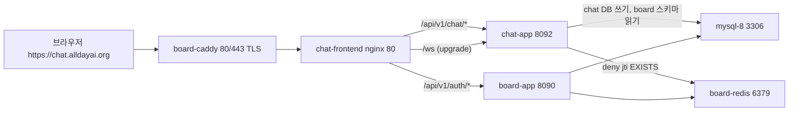
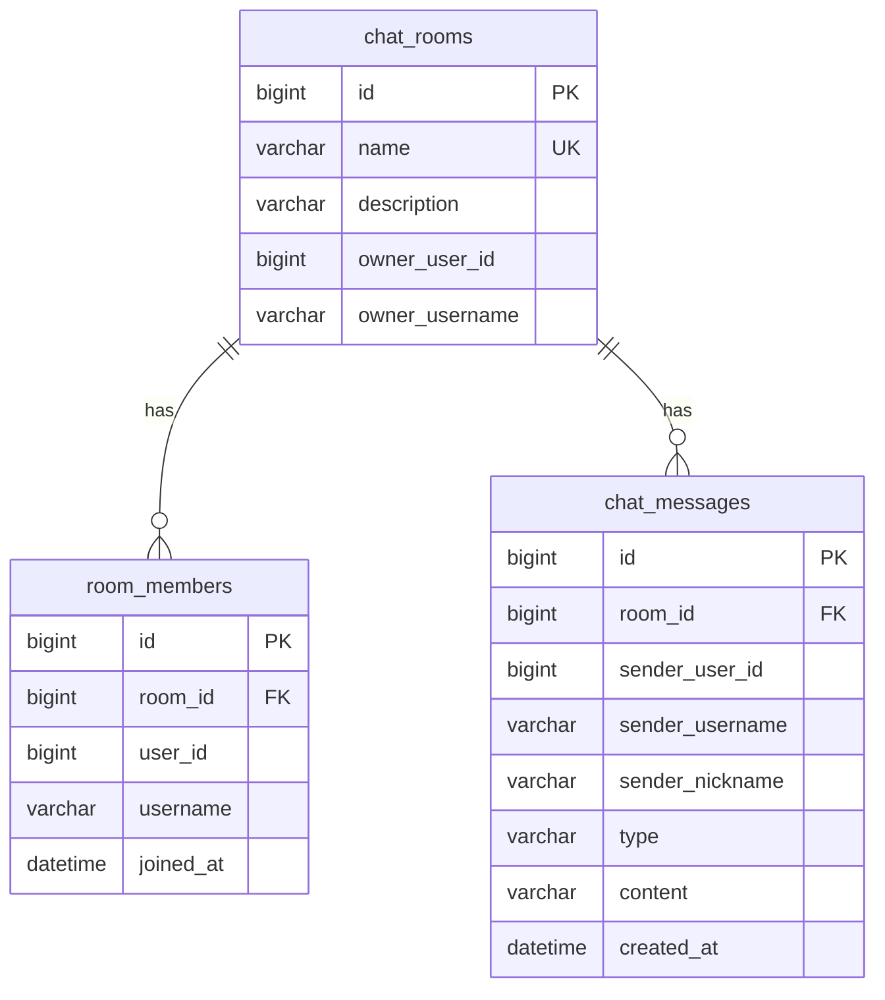
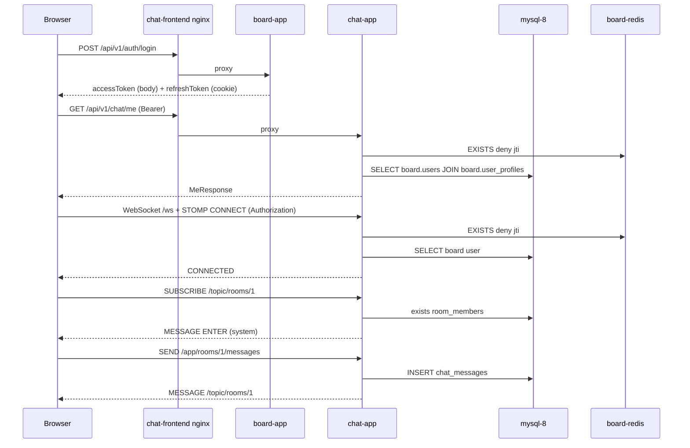
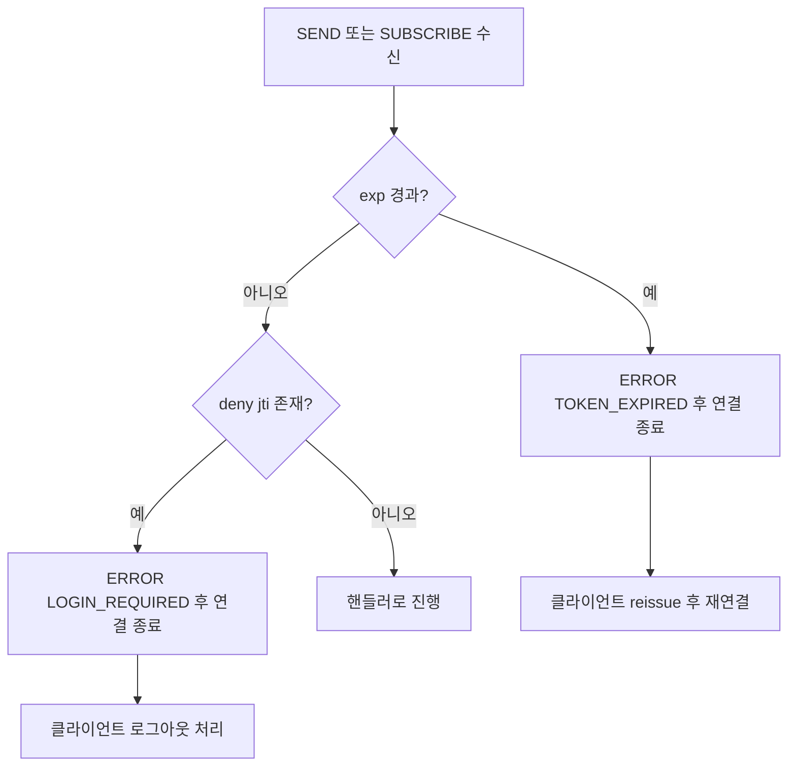

# STOMP 채팅 서비스 설계 문서

> 기준 시점: 2026-09-12. 메인 프로젝트 `../board`(Spring Boot 3.5.15, GitHub icesnake72/boards)는 **읽기 전용**이며 이 프로젝트에서 절대 수정하지 않는다. board 분석 원문은 `docs/reference/board-analysis.md` 참조.

board의 인증(JWT + refresh 쿠키 + Redis denylist)을 그대로 재사용하는 공개 채팅방 서비스다. 백엔드는 Spring Boot 4.1.1 STOMP 서버, 프론트는 React 19 + Vite 채팅 클라이언트이며, 기존 Lightsail 서버의 `board-db-net` 네트워크에 합류해 배포한다.

---

## 1. 핵심 요약

| 항목 | 결정 | 근거 |
|---|---|---|
| 채팅 범위 | 공개 채팅방 (로비, 방 생성/입장/퇴장, 그룹 채팅) | 1:1 DM, 게시글 연동은 범위 밖 |
| 백엔드 | Spring Boot 4.1.1, Java 21, `spring-boot-starter-websocket` simple broker | 단일 인스턴스, 2GB 무스왑 서버에 브로커 추가 부담 없음 |
| 인증 | board JWT(HS256, `sub`=username)를 같은 `JWT_SECRET`으로 독립 검증, `deny:{jti}` Redis 읽기 | board 서버 호출 없이 검증 가능, 로그아웃 즉시 반영 |
| WebSocket 인증 | CONNECT 프레임 `Authorization` 헤더 + SEND/SUBSCRIBE마다 exp·denylist 재검사 | refresh 쿠키 path가 `/api/v1/auth`라 핸드셰이크에 실리지 않음 |
| 사용자 정보 | `board.users` ⋈ `board.user_profiles`를 `JdbcClient`로 읽기 전용 조회 | 토큰에 userId·nickname이 없고 board 수정 불가 |
| 저장소 | 같은 `mysql-8`에 `chat` DB 신설, board 스키마 무변경 | 이력 보존, board DB 격리 |
| 프론트 | React 19 + Vite + JavaScript, `@stomp/stompjs`, axios | `../board-frontend`의 인증 클라이언트 이식 |
| 배포 | chat 전용 compose(chat-app, chat-frontend) + GHCR + 같은 Lightsail, `chat.alldayai.org` | board Caddyfile에 사이트 블록 1개는 사용자가 직접 추가 |
| CORS | 없음. chat-frontend nginx가 `/api/v1/auth`를 board-app으로, `/api/v1/chat`·`/ws`를 chat-app으로 프록시 | board와 같은 same-origin 전략 |

> [!IMPORTANT]
> board 프로젝트를 수정해야만 되는 항목은 운영 caddy 라우팅 하나뿐이며, 이는 문서(`docs/deploy/caddy_patch.md`)로 안내하고 사용자가 board 쪽에서 직접 반영한다.

---

## 2. 아키텍처

### 2.1 운영 토폴로지



| 컴포넌트 | 소속 | 역할 |
|---|---|---|
| board-caddy | board compose | TLS 종료. `chat.alldayai.org` 블록을 사용자가 추가 |
| chat-frontend | chat compose | React dist 정적 서빙 + 경로별 프록시 (WebSocket upgrade 포함) |
| chat-app | chat compose | STOMP 서버 + REST. 포트 8092 (8091은 board `verify.sh`가 임시 사용) |
| board-app | board compose | 로그인·reissue·로그아웃만 담당. chat이 호출하지 않고 브라우저가 프록시 경유로 호출 |
| mysql-8 | compose 외부 컨테이너 | `board` DB(읽기), `chat` DB(읽기/쓰기) |
| board-redis | board compose | `deny:{jti}` 읽기 전용. chat은 **쓰기 금지** (64MB noeviction 정책 보호) |

모든 브라우저 요청이 chat 오리진으로 향하므로 refresh 쿠키(`HttpOnly; SameSite=Strict; Path=/api/v1/auth`)는 chat 오리진에 별도로 저장되고 reissue/logout에 자동 동봉된다.

### 2.2 로컬 개발

| 구성 | 방법 |
|---|---|
| 인프라 | board compose가 띄운 `mysql-8`, `board-redis`를 그대로 사용. `chat` DB는 `scripts/init_db.sh`가 `CREATE DATABASE IF NOT EXISTS chat` |
| 백엔드 | `./gradlew bootRun` (포트 8092) 또는 `docker compose up --build` |
| 프론트 | `npm run dev`. Vite 프록시: `/api/v1/auth` → `http://localhost`(caddy 경유 board. 8090은 호스트에 열려 있지 않다), `/api/v1/chat` → `http://localhost:8092`, `/ws` → `ws://localhost:8092` |
| 비밀값 | `.env`(gitignore)에 `JWT_SECRET`(board와 동일 값), `DB_*`. `.env.example`에 키 이름만 |

> 주의: board는 운영에서도 `application.yaml`의 `jwt.secret` 기본값을 쓴다. chat은 기본값을 두지 않으므로 그 값을 `.env`와 GitHub Secret `JWT_SECRET`에 옮겨야 한다. 값이 다르면 모든 CONNECT가 401로 거부된다.

### 2.3 백엔드 패키지 구조

```
com.example.chat
├── ChatApplication
├── auth
│   ├── JwtTokenProvider              검증 전용 (발급 메서드 없음)
│   ├── TokenDenylist / RedisTokenDenylist
│   ├── BoardUserReader               JdbcClient로 board.users ⋈ board.user_profiles
│   ├── ChatPrincipal                 Principal 구현 (userId, username, nickname, jti, exp)
│   ├── JwtAuthenticationFilter       REST용, board 필터의 3분기 예외 처리 이식
│   ├── SubscriptionAuthorizer        SUBSCRIBE 인가 인터페이스 (구현은 room.RoomSubscriptionAuthorizer)
│   └── StompAuthChannelInterceptor   CONNECT 인증, SEND/SUBSCRIBE 재검사, SUBSCRIBE 인가
├── room
│   ├── ChatRoom, RoomMember          엔티티
│   ├── ChatRoomRepository, RoomMemberRepository
│   ├── ChatRoomService, ChatRoomController (REST)
│   ├── RoomSecurity                  @PreAuthorize용 소유자 판정 빈
│   ├── RoomSubscriptionAuthorizer    /topic/rooms/{id} 멤버십 (리포지토리 직접 사용 — 빈 순환 회피)
│   └── dto
├── message
│   ├── ChatMessage, MessageType      엔티티, enum(TALK, ENTER, LEAVE)
│   ├── ChatMessageRepository
│   ├── ChatMessageService
│   ├── ChatMessageController         @MessageMapping + @MessageExceptionHandler(/user/queue/errors)
│   ├── MessageHistoryController      GET /rooms/{id}/messages (keyset 이력 REST)
│   ├── ChatMessagePublisher          브로커 접근 단일 지점 (SimpMessagingTemplate 래핑)
│   └── dto
├── presence
│   ├── RoomPresenceTracker           방별 접속자 집합 (세션·구독 단위, 메모리)
│   └── RoomPresenceListener          SessionSubscribe/Unsubscribe/Disconnect 이벤트 → tracker + ENTER/LEAVE
└── global
    ├── config    SecurityConfig, WebSocketConfig, JpaAuditingConfig, RestAuthenticationEntryPoint, RestAccessDeniedHandler
    ├── entity    BaseTimeEntity
    └── exception ErrorCode, ErrorResponse, BusinessException 계열, GlobalExceptionHandler, StompErrorHandler
```

board와 같은 도메인별 수직 분할이며, 브로커 교체(향후 Redis 백플레인)는 `ChatMessagePublisher`와 `WebSocketConfig`만 바꾸면 되도록 격리한다.

### 2.4 프론트엔드 구조

```
frontend/
├── src
│   ├── api          client.js (메모리 토큰 + 401 reissue 인터셉터), auth.js, chat.js
│   ├── auth         AuthContext.jsx, authContext.js
│   ├── ws           chatSocket.js(stompjs 래퍼), SocketProvider.jsx, socketContext.js, useSubscription.js
│   ├── pages        LoginPage, LobbyPage, RoomPage
│   ├── components   Layout, RoomList, CreateRoomForm, MessageList, MessageInput, MemberList
│   ├── routes       ProtectedRoute.jsx
│   └── main.jsx, App.jsx
├── vite.config.js
├── Dockerfile       node:20-alpine build → nginx:1.27-alpine
└── nginx.conf
```

회원가입 화면은 두지 않고 board 사이트 링크로 안내한다.

---

## 3. DB 스키마 (`chat` 데이터베이스)

### 3.1 테이블: chat_rooms

| 컬럼 | 타입 | 제약 | 설명 |
|---|---|---|---|
| id | BIGINT | PK, AUTO_INCREMENT | |
| name | VARCHAR(50) | NOT NULL, UNIQUE | 방 이름 |
| description | VARCHAR(200) | NULL | 방 설명 |
| owner_user_id | BIGINT | NOT NULL | board `users.id` (FK 없음) |
| owner_username | VARCHAR(50) | NOT NULL | 표시용 스냅샷 |
| created_at | DATETIME(6) | NOT NULL | Auditing |
| updated_at | DATETIME(6) | NOT NULL | Auditing |

### 3.2 테이블: room_members

| 컬럼 | 타입 | 제약 | 설명 |
|---|---|---|---|
| id | BIGINT | PK, AUTO_INCREMENT | |
| room_id | BIGINT | NOT NULL, FK → chat_rooms.id | |
| user_id | BIGINT | NOT NULL | board `users.id` |
| username | VARCHAR(50) | NOT NULL | 표시용 스냅샷 |
| joined_at | DATETIME(6) | NOT NULL | |
| | | UNIQUE(room_id, user_id) | 중복 입장 방지, 입장 멱등 |

### 3.3 테이블: chat_messages

| 컬럼 | 타입 | 제약 | 설명 |
|---|---|---|---|
| id | BIGINT | PK, AUTO_INCREMENT | keyset 커서로 사용 |
| room_id | BIGINT | NOT NULL, FK → chat_rooms.id | |
| sender_user_id | BIGINT | NULL | 시스템 메시지(ENTER/LEAVE)도 대상 사용자의 id를 저장 (누가 입장·퇴장했는지) |
| sender_username | VARCHAR(50) | NOT NULL | 스냅샷 |
| sender_nickname | VARCHAR(50) | NOT NULL | 발신 당시 `user_profiles.nickname` 스냅샷 |
| type | VARCHAR(10) | NOT NULL | TALK, ENTER, LEAVE |
| content | VARCHAR(1000) | NOT NULL | |
| created_at | DATETIME(6) | NOT NULL | |
| | | INDEX(room_id, id) | `WHERE room_id = ? AND id < ? ORDER BY id DESC LIMIT n` |

### 3.4 관계



board의 `users`, `user_profiles`는 `chat` DB에 FK를 걸지 않는다. 같은 MySQL 인스턴스의 다른 데이터베이스라 물리 FK가 가능하긴 하지만, board 스키마 변경(ddl-auto)에 chat이 끌려가지 않도록 논리 참조만 둔다.

### 3.5 board 스키마 읽기 쿼리

```sql
SELECT u.id, u.username, p.nickname
FROM board.users u
JOIN board.user_profiles p ON p.user_id = u.id
WHERE u.username = ?
```

스키마 이름은 `app.board.schema`(기본 `board`)로 설정한다. 테스트에서는 H2에 같은 이름의 스키마와 두 테이블을 `schema-board.sql`로 만든다.

---

## 4. Entity 및 JPA 관계

| Entity | 필드 요약 | 관계 |
|---|---|---|
| `ChatRoom` | id, name, description, ownerUserId, ownerUsername + `BaseTimeEntity` | 없음 (단방향 참조의 대상) |
| `RoomMember` | id, room, userId, username, joinedAt | `@ManyToOne(fetch = LAZY) ChatRoom room` |
| `ChatMessage` | id, room, senderUserId, senderUsername, senderNickname, type, content, createdAt | `@ManyToOne(fetch = LAZY) ChatRoom room` |

| 결정 | 이유 |
|---|---|
| 모두 단방향 `@ManyToOne` | board 초기 설계와 같은 원칙. `ChatRoom`에 컬렉션을 두면 멤버·메시지 수가 커질 때 로딩 위험 |
| cascade 없음 | 방 삭제 시 서비스가 메시지·멤버를 명시적으로 벌크 삭제 (`deleteByRoomId`) |
| `ChatMessage`는 `createdAt`만 | 수정이 없으므로 `updatedAt` 불필요. `@CreatedDate`만 사용 |
| Auditing 시각 마이크로초 절단 | board의 keyset 커서 중복 버그 재현 방지. 다만 커서는 `id`라 영향은 표시 정밀도뿐 |
| `type`은 `@Enumerated(STRING)` | MySQL ENUM 컬럼 대신 VARCHAR (board `AuthProvider`와 같은 이유) |

---

## 5. STOMP 프로토콜 명세

### 5.1 엔드포인트와 prefix

| 항목 | 값 |
|---|---|
| WebSocket 엔드포인트 | `/ws` (네이티브 WebSocket, SockJS 미사용) |
| application prefix | `/app` |
| broker prefix | `/topic`, `/queue` |
| user destination prefix | `/user` |
| heartbeat | 서버 10s / 클라이언트 10s |

### 5.2 프레임

| 방향 | 프레임 | destination | 본문 |
|---|---|---|---|
| C → S | CONNECT | | 헤더 `Authorization: Bearer {access}` |
| C → S | SUBSCRIBE | `/topic/rooms` | 로비 이벤트 |
| C → S | SUBSCRIBE | `/topic/rooms/{roomId}` | 멤버만 허용 |
| C → S | SUBSCRIBE | `/user/queue/errors` | 개인 에러 |
| C → S | SEND | `/app/rooms/{roomId}/messages` | `SendMessageRequest {content}` |
| S → C | MESSAGE | `/topic/rooms/{roomId}` | `MessageResponse` |
| S → C | MESSAGE | `/topic/rooms` | `RoomEvent` |
| S → C | MESSAGE | `/user/queue/errors` | `ErrorResponse` |
| S → C | ERROR | | 헤더 `code`, `message`. 이후 연결 종료 |

### 5.3 페이로드

| DTO | 필드 |
|---|---|
| `SendMessageRequest` | content: String (NotBlank, max 1000) |
| `MessageResponse` | id, roomId, type(TALK/ENTER/LEAVE), senderUserId, senderUsername, senderNickname, content, createdAt |
| `RoomEvent` | type(ROOM_CREATED/ROOM_DELETED/MEMBER_COUNT), room: `RoomResponse` |

### 5.4 인증·인가 규칙 (`StompAuthChannelInterceptor.preSend`)

| 프레임 | 검사 | 실패 시 |
|---|---|---|
| CONNECT | 헤더 파싱 → 서명·만료 → `deny:{jti}` → `BoardUserReader` 조회 → `ChatPrincipal` 부착, 세션 속성에 jti·exp 저장 | ERROR `LOGIN_REQUIRED` (사용자 없음 포함), `TOKEN_EXPIRED` |
| SUBSCRIBE `/topic/rooms/{id}` | exp·denylist 재검사 + `SubscriptionAuthorizer`로 멤버십 확인 | ERROR `TOKEN_EXPIRED` / `LOGIN_REQUIRED` / `NOT_ROOM_MEMBER` |
| SUBSCRIBE 그 외 | exp·denylist 재검사 | 위와 동일 |
| SEND | exp·denylist 재검사 (멤버십은 서비스에서) | ERROR `TOKEN_EXPIRED` / `LOGIN_REQUIRED` |
| 내부 오류 (Redis·DB) | 삼키지 않음 | ERROR `INTERNAL_ERROR` + `log.error`, fail-closed |

> 중요: board의 HTTP 필터는 "막지 않는다"가 원칙이지만 STOMP에는 공개 엔드포인트가 없으므로 CONNECT를 **거부**한다. 이것이 board 패턴 이식 시 유일한 의도적 차이다.

### 5.5 세션 이벤트와 presence

| Spring 이벤트 | 처리 |
|---|---|
| `SessionSubscribeEvent` (`/topic/rooms/{id}`) | `RoomPresenceTracker.enter(roomId, principal)` → 처음 입장이면 ENTER 시스템 메시지 저장·발행 |
| `SessionUnsubscribeEvent` | `leave` → 마지막 세션이면 LEAVE 시스템 메시지 |
| `SessionDisconnectEvent` | 해당 세션이 있던 모든 방에서 `leave` |

같은 사용자가 탭 두 개로 접속하면 세션 단위로 집계하고, 시스템 메시지는 사용자 단위로 처음 입장·마지막 퇴장에만 낸다.

---

## 6. REST API 명세

### 6.1 기본 규칙

| 항목 | 값 |
|---|---|
| Base URL | `/api/v1/chat` |
| 인증 | 전부 `Authorization: Bearer {access}` 필수 (`anyRequest().authenticated()`) |
| 성공 응답 | DTO 그대로 (래퍼 없음, board 규약) |
| 실패 응답 | `ErrorResponse {code, message, timestamp, errors?}` |
| 페이징 | 방 목록은 `?page=&size=`(offset, `PagedModel`), 메시지는 keyset |

### 6.2 엔드포인트

| Method | Path | 설명 | Request | Response |
|---|---|---|---|---|
| GET | `/me` | 내 정보 | - | `MeResponse` |
| GET | `/rooms` | 방 목록 (최신순) | `?page=0&size=20` | `PagedModel<RoomResponse>` |
| POST | `/rooms` | 방 생성 (생성자 자동 입장) | `RoomCreateRequest` | 201 `RoomResponse` |
| GET | `/rooms/{id}` | 방 상세 | - | `RoomResponse` |
| DELETE | `/rooms/{id}` | 방 삭제 (소유자만) | - | 204 |
| POST | `/rooms/{id}/join` | 입장 (멱등) | - | 200 `RoomResponse` |
| DELETE | `/rooms/{id}/leave` | 퇴장 (멱등) | - | 204 |
| GET | `/rooms/{id}/members` | 멤버 목록 + 접속 여부 (멤버만) | - | `List<MemberResponse>` |
| GET | `/rooms/{id}/messages` | 이력 (멤버만, 최신부터 역순) | `?before={messageId}&size=50` | `MessagePageResponse` |

### 6.3 DTO

| DTO | 필드 | 검증 |
|---|---|---|
| `MeResponse` | userId, username, nickname | |
| `RoomCreateRequest` | name, description | name NotBlank max 50, description max 200 |
| `RoomResponse` | id, name, description, ownerUsername, memberCount, onlineCount, createdAt | |
| `MemberResponse` | userId, username, online, joinedAt | |
| `MessagePageResponse` | messages: `List<MessageResponse>` (오래된 순 정렬), hasMore, nextBefore | size+1 조회로 hasMore 판정 |

### 6.4 인가

| 규칙 | 구현 |
|---|---|
| 소유자만 삭제 | `@PreAuthorize("@roomSecurity.isOwner(#id, principal)")` (`-parameters` 필요) |
| 멤버만 이력·멤버 조회 | 서비스에서 `RoomMemberRepository.existsByRoomIdAndUserId` 확인, 아니면 `NOT_ROOM_MEMBER` 403 |

---

## 7. 예외 처리 전략

### 7.1 예외 계층

board와 동일하게 `BusinessException(ErrorCode)`를 루트로 두고 하위 4종(`NotFoundException`, `DuplicateException`, `UnauthorizedException`, `ForbiddenException`)은 라벨 역할만 한다. HTTP 상태는 `ErrorCode`가 단독으로 결정한다.

### 7.2 ErrorCode

| 코드 | 상태 | 발생 |
|---|---|---|
| LOGIN_REQUIRED | 401 | 토큰 없음·무효·denylist·사용자 없음 |
| TOKEN_EXPIRED | 401 | STOMP 재검사에서 exp 경과 (클라이언트가 reissue 후 재연결) |
| ACCESS_DENIED | 403 | `@PreAuthorize` 거부 (소유자 아닌 사용자의 방 삭제 포함) |
| NOT_ROOM_MEMBER | 403 | 멤버 아닌 사용자의 구독·전송·이력 조회 |
| ROOM_NOT_FOUND | 404 | |
| USER_NOT_FOUND | 404 | `BoardUserReader` 조회 실패 (REST 경로) |
| RESOURCE_NOT_FOUND | 404 | 매핑 없는 URL |
| DUPLICATE_ROOM_NAME | 409 | |
| INVALID_INPUT | 400 | `@Valid` 실패, `errors[]` 동봉 |
| MESSAGE_TOO_LONG | 400 | STOMP 본문 1000자 초과 |
| MALFORMED_REQUEST, TYPE_MISMATCH, MISSING_PARAMETER, METHOD_NOT_ALLOWED, UNSUPPORTED_MEDIA_TYPE | 400/405/415 | board와 동일 |
| INTERNAL_ERROR | 500 | 그 외 전부. 스택은 서버 로그만 |

### 7.3 처리 경로

| 경로 | 처리기 | 출력 |
|---|---|---|
| REST 컨트롤러·서비스 | `GlobalExceptionHandler` (`@RestControllerAdvice`) | HTTP 상태 + `ErrorResponse` |
| REST 필터 (JWT) | 인증 실패는 컨텍스트 비우고 통과 → `RestAuthenticationEntryPoint` 401. 내부 오류는 `HandlerExceptionResolver` 위임 → 500 | board 3분기 그대로 |
| STOMP 인터셉터 | `MessagingException` 계열 throw → `StompErrorHandler`(`StompSubProtocolErrorHandler` 확장)가 ERROR 프레임에 `code`·`message` 헤더 | 연결 종료 |
| `@MessageMapping` 핸들러 | `@MessageExceptionHandler(BusinessException.class)` → `/user/queue/errors`로 `ErrorResponse` | 연결 유지 |
| `@MessageMapping` 예상 외 예외 | `@MessageExceptionHandler(Exception.class)` → `INTERNAL_ERROR` + `log.error` | 연결 유지 |

### 7.4 프론트엔드 규칙

| 상황 | 처리 |
|---|---|
| REST 401 | axios 인터셉터가 reissue 1회 후 원요청 재시도. 동시 401은 하나의 reissue 공유. 실패 시 로그인 페이지 |
| REST 500 | 재시도 안내 메시지. reissue 트리거 아님 (board 규칙) |
| STOMP ERROR `TOKEN_EXPIRED` | reissue → 새 토큰으로 재연결 → 구독 복구 |
| STOMP ERROR `LOGIN_REQUIRED` | 재시도 없이 로그아웃 처리 |
| STOMP ERROR 그 외, 네트워크 단절 | 지수 백오프 재연결 (1s → 2s → … 최대 30s) |
| 선제 갱신 | access 만료 60초 전에 reissue 후 재연결 |

---

## 8. 데이터 흐름

### 8.1 로그인부터 메시지 전송까지



### 8.2 로그아웃과 만료



사용자가 chat에서 로그아웃하면 `POST /api/v1/auth/logout`(board가 refresh 삭제 + access denylist 등록)과 STOMP DISCONNECT를 함께 수행한다.

---

## 9. 배포

> 2026-09-20 갱신: 프론트가 board에 통합되면서 chat은 **이미지 하나**만 배포한다. 별도 서브도메인·chat-frontend 컨테이너·caddy 블록은 없다. 실행 계획은 `docs/plans/2026-09-20-day4-deploy.md`, 서버 검증은 `docs/deploy/server_checklist.md`.

### 9.1 구성

| 구성요소 | 위치 | 역할 |
|---|---|---|
| chat CI (`.github/workflows/build.yml`) | chat 저장소 | main push 시 `./gradlew test` → 이미지 빌드 → `ghcr.io/icesnake72/chat-app:latest`(+sha) push. 배포 잡 없음 |
| board compose `include` | board 저장소 | `include: [../chat/docker-compose.yml]` + `env_file: ../chat/.env`. `chat-app` 서비스에 `DB_NAME: chat`, `APP_WS_ALLOWED_ORIGINS`, `depends_on: redis` 오버라이드 |
| board `deploy.sh` | board 저장소 | `~/chat` clone/reset, `~/chat/.env` 생성(`JWT_SECRET`, `DB_*`), `chat` DB 생성, `docker compose pull && up` |
| board nginx | board 저장소 | `/api/v1/chat/` → `chat-app:8092`, `/ws` → 같은 곳 + Upgrade 헤더 |

| 환경변수 (`~/chat/.env` 또는 compose) | 출처 | 비고 |
|---|---|---|
| JWT_SECRET | GitHub Secret → board `deploy.sh` | board와 동일 값 필수. board `.env`에도 같은 값을 넣어 두 서비스가 같은 Secret을 읽게 한다 |
| DB_NAME=chat, DB_USERNAME, DB_PASSWORD | Secret + `deploy.sh` | `DB_HOST=mysql-8`은 chat compose가 고정 |
| REDIS_HOST=board-redis | chat compose 고정 | 컨테이너명. 같은 프로젝트라 `redis`도 되지만 단독 실행 호환을 위해 컨테이너명 |
| APP_WS_ALLOWED_ORIGINS | board compose 오버라이드 | `https://sbs.alldayai.org,http://localhost,http://localhost:*` |

헬스체크: `curl -fsS http://localhost:8092/actuator/health` (컨테이너 내부).

### 9.2 트래픽 경로

```
브라우저 (https://sbs.alldayai.org)
  → board-caddy (TLS)
    → board-frontend nginx
        ├ /api/v1/chat/*  → chat-app:8092
        ├ /ws             → chat-app:8092 (WebSocket upgrade)
        └ 그 외           → board-app:8090 / 정적
```

### 9.3 배포 순서

1. chat main push → CI가 이미지 push (먼저)
2. board main push → board deploy가 `~/chat` 준비 + `docker compose pull`(chat-app 포함) + `up --wait`
3. `docs/deploy/server_checklist.md`로 검증

## 10. 테스트 전략

### 10.1 백엔드

| 계층 | 도구 | 대상 |
|---|---|---|
| 단위 | JUnit 5, Mockito | `JwtTokenProvider` (정상·만료·위조·빈 토큰), `StompAuthChannelInterceptor` (CONNECT 성공/거부, SEND 재검사, SUBSCRIBE 멤버십), `RoomPresenceTracker` (다중 세션 집계) |
| 서비스 | `@SpringBootTest` + H2 | 방 생성 중복 409, 입장 멱등, 소유자 삭제 시 멤버·메시지 정리, keyset 페이징 hasMore |
| REST | MockMvc + `spring-security-test` | 무인증 401 포맷, 타인 삭제 403, `@Valid` 400 `errors[]` |
| WebSocket | `@SpringBootTest(RANDOM_PORT)` + `WebSocketStompClient` | CONNECT 인증, 메시지 왕복, denylist 등록 후 SEND 거부 ERROR |

| 테스트 지원 | 내용 |
|---|---|
| `src/test/resources/application.yaml` | H2 `MODE=MySQL`, `ddl-auto: create-drop`, 테스트 전용 `jwt.secret` |
| `schema-board.sql` | H2에 `board` 스키마 + `users`, `user_profiles` 생성, 시드 사용자 |
| `TestTokenStoreConfig` | `InMemoryTokenDenylist`를 `@Primary`로 대체, `@BeforeEach clear()` |
| `TestJwtFactory` | 테스트 secret으로 access 발급 (board `createToken`과 같은 claims 구조) |

### 10.2 프론트엔드

| 도구 | 대상 |
|---|---|
| Vitest | `client.js` (401 → reissue 1회 → 재시도, 동시 401 공유, `/auth/` 호출 제외), `stompClient.js` (TOKEN_EXPIRED 재연결, LOGIN_REQUIRED 중단, 백오프 상한) |
| oxlint + `vite build` | CI 게이트 |

---

## 11. 설계 결정사항 및 근거

| 결정 | 대안 | 선택 이유 |
|---|---|---|
| simple broker | Redis pub/sub, RabbitMQ relay | 단일 인스턴스이고 2GB 무스왑 서버. `board-redis`는 64MB noeviction이라 쓰기 공유 금지 |
| 프레임마다 exp·denylist 재검사 | CONNECT 1회 검사 | board가 denylist를 구현한 취지(로그아웃 즉시 반영) 유지. 비용은 파싱 1회 + EXISTS 1회 |
| CONNECT 헤더로 토큰 전달 | 쿼리 파라미터, 쿠키 | refresh 쿠키 path 제한, 쿼리는 접근 로그 노출 |
| `board.users` 직접 읽기 | Redis 캐시, 토큰 claim 추가 | claim 추가는 board 수정. 같은 MySQL이라 조인 한 번이면 충분 |
| `chat` DB 분리 | board DB에 테이블 추가 | chat `ddl-auto`가 board DB를 건드리지 않게 |
| 네이티브 WebSocket (SockJS 미사용) | SockJS fallback | 대상 브라우저가 모두 지원, nginx 설정 단순화 |
| 멤버십 영속 + presence 메모리 | 구독 = 입장 | "내가 들어간 방"과 이력 접근 제어에 영속 멤버십 필요. 접속 여부는 휘발 |
| 회원가입 화면 없음 | 프록시로 signup 제공 | 계정 관리는 board의 책임 |
| Spring Boot 4.1.1 유지 | 3.5.15로 통일 | initializr 선택 존중. jjwt-jackson(Jackson 2)과의 호환은 첫 작업에서 빌드로 검증, 실패 시 jjwt 상향 또는 3.5.15 하향 |

---

## 12. 구현 순서 (마일스톤)

| 순서 | 범위 | 완료 기준 |
|---|---|---|
| M0 | 빌드 기반: 의존성 정리(actuator 추가), `application.yaml`, H2 테스트 설정, `.env.example`, jjwt 호환 검증 | `./gradlew test` green |
| M1 | 인증 이식: `JwtTokenProvider`, `TokenDenylist`, `BoardUserReader`, `ChatPrincipal`, `JwtAuthenticationFilter`, `SecurityConfig`, 예외 계층, `GET /me` | REST 401/200 테스트 |
| M2 | 방 도메인: 엔티티, REST 전부, `RoomSecurity` | 서비스·REST 테스트 |
| M3 | STOMP: `WebSocketConfig`, 인터셉터, `StompErrorHandler`, 메시지 컨트롤러·서비스·Publisher, presence, 이력 API | WebSocket 통합 테스트 |
| M4 | 프론트: 인증 클라이언트 이식, 로그인·로비·방 화면, STOMP 클라이언트, Vitest | 로컬 E2E (board 백엔드 기동 상태) |
| M5 | 배포: Dockerfile 2종, compose, nginx.conf, scripts, workflow, `docs/deploy/caddy_patch.md` | 로컬 `docker compose up` 통과, 서버 배포 |
