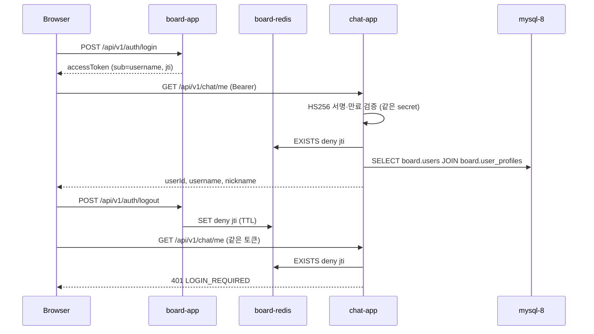
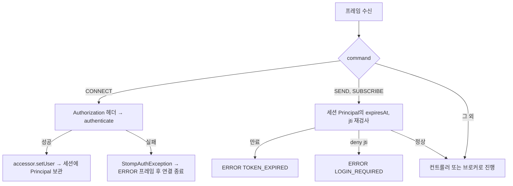

# 1일차 따라하기 — board 인증 연동 + STOMP CONNECT

> 전제: board 프로젝트(`../board`)가 로컬 도커로 떠 있다(`mysql-8`, `board-redis`, `board-app`, `board-caddy`, 네트워크 `board-db-net`). board 강의 단계 2(JWT), 5(httpOnly 쿠키), 15(Redis denylist)를 마친 상태를 가정한다. 기준 코드: 이 저장소 `main`의 1일차 커밋(`244c6b3`~`531a21e`, 2026-09-12). **이 문서의 절 순서 = 실제 파일을 만든 순서 = 커밋 순서**다. 각 절이 끝날 때마다 컴파일과 테스트가 통과한다.

board가 발급한 access token을 chat 서버가 **board 서버를 호출하지 않고** 독립 검증하고, 같은 검증 로직으로 WebSocket(STOMP) 연결까지 인증하는 4시간 과정이다. 설계 전체는 `docs/design/2026-09-12-stomp-chat-design.md`, 작업 단위는 `docs/plans/2026-09-12-day1-auth-stomp.md`.

---

## 1. 핵심 요약

| 항목 | 내용 |
|---|---|
| 만드는 것 | `GET /api/v1/chat/me`(REST 인증) + `ws://.../ws` STOMP CONNECT 인증 + `/app/echo` 브로드캐스트 + 로컬 도커 실행 |
| 재사용하는 것 | board의 JWT(HS256, `sub`=username, `jti`), Redis `deny:{jti}`, `board.users`·`board.user_profiles` |
| 새로 만드는 것 | 예외 계층, `JwtTokenProvider`(검증 전용), `TokenDenylist`, `BoardUserReader`, `ChatPrincipal`, `BearerTokenAuthenticator`, `JwtAuthenticationFilter`, `SecurityConfig`, `StompAuthChannelInterceptor`, `StompErrorHandler`, `WebSocketConfig`, echo |
| 검증 | JUnit 43개(H2 + InMemory denylist) → 도커 기동 → curl `/me` → 콘솔에서 CONNECT/SEND |
| 스택 | Spring Boot 4.1.1, Java 21, jjwt 0.12.6, Spring Security 7, Jackson 3 |

**작업 순서 (= 이 문서의 절 순서)**

| 절 | 만드는 파일 | 그 시점에 가능해지는 것 |
|---|---|---|
| 4 | `build.gradle`, `application.yaml`(main/test), `schema-board.sql`, `TestJwtFactory`, `.env.example`, `scripts/init_db.sh` | 빌드·테스트 기반 |
| 5 | `ErrorCode`, `ErrorResponse`, `BusinessException` + 하위 4종, `GlobalExceptionHandler` | 에러 응답 포맷 |
| 6 | `TokenClaims`, `JwtTokenProvider` | 토큰 서명·만료 검증 |
| 7 | `TokenDenylist`, `RedisTokenDenylist`, 테스트용 `InMemoryTokenDenylist`, `TestTokenStoreConfig` | 로그아웃 반영 |
| 8 | `BoardUser`, `BoardUserReader` | userId·nickname 조회 |
| 9 | `ChatPrincipal`, `BearerTokenAuthenticator` | 토큰 → 사용자 |
| 10 | `RestAuthenticationEntryPoint`, `RestAccessDeniedHandler`, `JwtAuthenticationFilter`, `SecurityConfig`, `MeResponse`, `MeController` | REST 인증, `/me` |
| 11 | `StompAuthException`, `StompAuthChannelInterceptor` | STOMP CONNECT 인증 |
| 12 | `StompErrorHandler`, `WebSocketConfig`, `EchoRequest`, `EchoResponse`, `EchoController` | `/ws` 엔드포인트, echo |
| 13 | `static/index.html` | 브라우저 콘솔 |
| 14 | `Dockerfile`, `docker-compose.yml`, `docker-compose.local.yml`, `scripts/dev_redis_proxy.sh`, `README.md` | 로컬 도커 실행, E2E |

순서의 원칙은 **의존 방향**이다. 아무것도 의존하지 않는 것(예외 계층, 토큰 파서)부터 만들고, 그것들을 조합하는 것(인증기, 필터, 인터셉터)을 나중에 만든다. 어느 절에서 멈춰도 컴파일이 된다.

**클래스 출처 범례** (각 절의 표에서 쓰는 값)

| 출처 | 뜻 |
|---|---|
| Spring Framework | `spring-context`, `spring-web`, `spring-webmvc`, `spring-messaging`, `spring-jdbc` 등 프레임워크 코어 |
| Spring Security | 필터 체인, `AuthenticationEntryPoint`, `UsernamePasswordAuthenticationToken` 등 |
| Spring WebSocket | `StompSubProtocolErrorHandler`, `WebSocketMessageBrokerConfigurer` 등 |
| Spring Data Redis | `StringRedisTemplate` |
| Spring Boot | `@SpringBootTest`, `@AutoConfigureMockMvc` 등 부트 자동 구성·테스트 |
| jjwt | `Jwts`, `Keys`, `Claims` (io.jsonwebtoken) |
| Jackson 3 | `tools.jackson.databind.ObjectMapper` |
| Jakarta Servlet / Jakarta Validation | `HttpServletRequest`, `@Valid` 등 표준 API |
| Lombok | `@Getter`, `@RequiredArgsConstructor`, `@Slf4j` |
| JDK | `java.*`, `javax.crypto.*` |
| 테스트 라이브러리 | JUnit, AssertJ, Mockito, Spring Test |
| N절 | 이 문서의 N절에서 만든 클래스 |
| 이 절 | 지금 만드는 클래스 |

**4시간 배분**

| 시간 | 절 | 확인 |
|---|---|---|
| 0:00–0:30 | 2~4 (준비, board 복습, 빌드 기반) | `./gradlew test` 1개 통과 |
| 0:30–1:30 | 5~7 (예외 계층, 토큰 파서, denylist) | 단위 테스트 9개 |
| 1:30–2:15 | 8~10 (사용자 조회, 인증기, REST 보안, `/me`) | curl 401/200, 로그아웃 후 401 |
| 2:15–2:45 | 11 (STOMP 인터셉터) | 단위 테스트 9개 |
| 2:45–4:00 | 12~14 (WebSocket 설정, echo, 콘솔, 도커) | 콘솔 CONNECT/SEND |

> [!IMPORTANT]
> `JWT_SECRET`은 board의 `application.yaml`에 있는 `jwt.secret` 값과 **바이트 단위로 같아야** 한다. 값이 다르면 chat의 모든 요청이 401이며, 로그에는 `invalid jwt: JWT signature does not match`만 남는다.

---

## 2. 사전 준비

**시작 상태**: Spring Initializr로 만든 빈 프로젝트. Boot 4.1.1, Java 21, Gradle(Groovy), 의존성은 Web MVC, WebSocket, Security, Validation, Data JPA, Data Redis, MySQL Driver, Lombok, H2(test). `src/main/java/com/example/chat/ChatApplication.java`와 `ChatApplicationTests.java`만 있다.

| 준비 | 명령 / 위치 | 이유 |
|---|---|---|
| board 스택 확인 | `docker ps` 에 `mysql-8`, `board-redis`, `board-app`, `board-caddy` | chat이 붙을 인프라 |
| `chat` DB | 4절의 `scripts/init_db.sh`가 만든다 | Hibernate `ddl-auto: update`는 DB 자체는 만들지 못한다 |
| `.env` | 4절의 `.env.example`을 복사해 `JWT_SECRET`, `DB_PASSWORD` 채움 | 비밀값은 yaml 기본값을 두지 않는다 |
| Redis 경로 | 14절 참고 | `board-redis`는 호스트 포트를 열지 않는다 |

**Boot 4에서 이동한 패키지** (컴파일 오류의 대부분이 여기서 난다)

| 클래스 | Boot 3.x | Boot 4.1 |
|---|---|---|
| `@AutoConfigureMockMvc` | `org.springframework.boot.test.autoconfigure.web.servlet` | `org.springframework.boot.webmvc.test.autoconfigure` |
| `ObjectMapper` | `com.fasterxml.jackson.databind` | `tools.jackson.databind` (Jackson 3) |
| JSON 메시지 컨버터 | `MappingJackson2MessageConverter` | `JacksonJsonMessageConverter` |
| `@JsonInclude` | `com.fasterxml.jackson.annotation` | 그대로 (annotations 모듈은 2.x 패키지 유지) |
| 테스트 스타터 | `spring-boot-starter-test` 하나 | `spring-boot-starter-webmvc-test` 등 모듈별 |
| `@LocalServerPort` | `org.springframework.boot.test.web.server` | 그대로 |

---

## 3. board 인증 복습

chat이 의존하는 사실만 추린다. 원문은 `docs/reference/board-analysis.md` 2절.

| 사실 | chat에 미치는 영향 |
|---|---|
| access token claims = `sub`(username), `jti`, `iat`, `exp` | userId·nickname이 없다 → board 스키마를 읽어야 한다 (8절) |
| 서명 = HS256, Base64 secret | secret만 공유하면 chat이 독립 검증 (6절) |
| 로그아웃 시 Redis `deny:{jti}` 등록(TTL = 잔여 수명) | chat도 이 키를 읽으면 로그아웃이 즉시 반영된다 (7절) |
| refresh 쿠키 `Path=/api/v1/auth` | WebSocket 핸드셰이크에 쿠키가 안 실린다 → CONNECT 헤더로 access 전달 (11절) |
| board-app은 CORS 없음, nginx same-origin | chat도 프록시 전략을 따른다 (3일차) |



로컬 board는 호스트 8090을 열지 않는다. 토큰은 caddy 경유 `http://localhost`에서 받는다.

```bash
curl -s -X POST http://localhost/api/v1/auth/login \
  -H 'Content-Type: application/json' \
  -d '{"username":"admin","password":"admin1234"}'
```

---

## 4. 빌드 기반 — 설정, 테스트 픽스처, 스크립트

**왜 지금**: 이후 모든 절이 같은 설정(포트, DB, Redis, `jwt.secret`)과 같은 테스트 도구(H2, board 스키마 흉내, 테스트 토큰)를 쓴다. 코드보다 먼저 굳혀 둔다.

**`build.gradle`** (initializr가 만든 것을 2-space로 다시 쓰고 `actuator`를 추가한다. 탭은 쓰지 않는다)

```gradle
plugins {
  id 'java'
  id 'org.springframework.boot' version '4.1.1'
  id 'io.spring.dependency-management' version '1.1.7'
}

group = 'com.example'
version = '0.0.1-SNAPSHOT'

java {
  toolchain {
    languageVersion = JavaLanguageVersion.of(21)
  }
}

// @PreAuthorize SpEL의 #id 바인딩과 record 프로퍼티 바인딩에 필요 (board와 동일)
tasks.named('compileJava') {
  options.compilerArgs << '-parameters'
}

repositories {
  mavenCentral()
}

dependencies {
  implementation 'org.springframework.boot:spring-boot-starter-webmvc'
  implementation 'org.springframework.boot:spring-boot-starter-websocket'
  implementation 'org.springframework.boot:spring-boot-starter-security'
  implementation 'org.springframework.boot:spring-boot-starter-validation'
  implementation 'org.springframework.boot:spring-boot-starter-data-jpa'
  implementation 'org.springframework.boot:spring-boot-starter-data-redis'
  implementation 'org.springframework.boot:spring-boot-starter-actuator'

  implementation 'io.jsonwebtoken:jjwt-api:0.12.6'
  runtimeOnly 'io.jsonwebtoken:jjwt-impl:0.12.6'
  runtimeOnly 'io.jsonwebtoken:jjwt-jackson:0.12.6'

  runtimeOnly 'com.mysql:mysql-connector-j'

  compileOnly 'org.projectlombok:lombok'
  annotationProcessor 'org.projectlombok:lombok'

  testImplementation 'org.springframework.boot:spring-boot-starter-webmvc-test'
  testImplementation 'org.springframework.boot:spring-boot-starter-websocket-test'
  testImplementation 'org.springframework.boot:spring-boot-starter-security-test'
  testImplementation 'org.springframework.boot:spring-boot-starter-data-jpa-test'
  testImplementation 'org.springframework.boot:spring-boot-starter-validation-test'
  testRuntimeOnly 'com.h2database:h2'
  testRuntimeOnly 'org.junit.platform:junit-platform-launcher'
  testCompileOnly 'org.projectlombok:lombok'
  testAnnotationProcessor 'org.projectlombok:lombok'
}

tasks.named('test') {
  useJUnitPlatform()
}
```

| 항목 | 출처 | 역할 |
|---|---|---|
| `spring-boot-starter-actuator` | Spring Boot | `/actuator/health` — 14절 도커 헬스체크가 쓴다 |
| `jjwt-api/impl/jackson` | jjwt | board와 같은 버전. `jjwt-jackson`은 Jackson 2를 쓰지만 Boot 4(Jackson 3)와 공존한다 (실측) |
| `spring-boot-starter-*-test` | Spring Boot | Boot 4는 테스트 스타터가 모듈별. JUnit·AssertJ·Mockito는 이들이 끌어온다 |
| `-parameters` | javac | 메서드 파라미터 이름을 클래스 파일에 남긴다. 2일차 `@PreAuthorize("... #id ...")`가 의존 |

**`src/main/resources/application.yaml`**

```yaml
server:
  port: 8092
  # nginx/caddy 뒤에서 X-Forwarded-*로 원래 scheme/host를 복원 (WebSocket origin 검사에 필요)
  forward-headers-strategy: framework

spring:
  application:
    name: chat
  config:
    import: optional:file:.env[.properties]
  datasource:
    url: jdbc:mysql://${DB_HOST:localhost}:${DB_PORT:3306}/${DB_NAME:chat}?serverTimezone=Asia/Seoul&characterEncoding=UTF-8
    username: ${DB_USERNAME:root}
    password: ${DB_PASSWORD}
    driver-class-name: com.mysql.cj.jdbc.Driver
  jpa:
    hibernate:
      ddl-auto: update
    open-in-view: false
  data:
    redis:
      host: ${REDIS_HOST:localhost}
      port: ${REDIS_PORT:6379}

jwt:
  # board와 동일한 Base64 secret. 기본값 없음 — .env 또는 환경변수 필수
  secret: ${JWT_SECRET}

app:
  board:
    schema: ${APP_BOARD_SCHEMA:board}
  ws:
    allowed-origin-patterns: ${APP_WS_ALLOWED_ORIGINS:http://localhost:*}

management:
  endpoints:
    web:
      exposure:
        include: health

logging:
  level:
    com.example.chat: debug
```

| 키 | 누가 읽나 | 비고 |
|---|---|---|
| `server.port` 8092 | Tomcat | 8091은 board `verify.sh`가 임시로 쓴다 |
| `spring.config.import: optional:file:.env[.properties]` | Spring Boot | `.env`를 properties로 읽는다. OS 환경변수가 우선 |
| `spring.datasource.password: ${DB_PASSWORD}` | HikariCP | 기본값 없음 → 비면 기동 실패 (의도한 fail-fast) |
| `jwt.secret` | 6절 `JwtTokenProvider` | 기본값 없음 |
| `app.board.schema` | 8절 `BoardUserReader` | 읽을 스키마 이름 |
| `app.ws.allowed-origin-patterns` | 12절 `WebSocketConfig` | 핸드셰이크 Origin 허용 |
| `management.endpoints.web.exposure.include: health` | Actuator | health만 노출 |

**`src/test/resources/application.yaml`** (같은 이름의 파일이 테스트 클래스패스에 있으면 main 것 대신 이것이 로딩된다)

```yaml
spring:
  datasource:
    url: jdbc:h2:mem:chat;MODE=MySQL;DB_CLOSE_DELAY=-1
    driver-class-name: org.h2.Driver
    username: sa
    password:
  sql:
    init:
      mode: always
      schema-locations: classpath:schema-board.sql
  jpa:
    hibernate:
      ddl-auto: create-drop
    open-in-view: false
  data:
    redis:
      host: localhost
      port: 6379

jwt:
  secret: dGVzdC1zZWNyZXQtZm9yLWNoYXQtdW5pdC10ZXN0cy1vbmx5LTEyMzQ1Njc4OTA=

app:
  board:
    schema: board
  ws:
    allowed-origin-patterns: "*"

management:
  endpoints:
    web:
      exposure:
        include: health
```

`jwt.secret` 값은 `"test-secret-for-chat-unit-tests-only-1234567890"`의 Base64다(HS256은 32바이트 이상 필요). 테스트 리소스라 커밋해도 된다. `spring.sql.init.schema-locations`가 다음 파일을 기동 시 실행한다.

**`src/test/resources/schema-board.sql`** (board의 `users`·`user_profiles`를 H2에 흉내낸다)

```sql
-- board 프로젝트의 users / user_profiles 를 H2에 흉내낸 픽스처 (읽기 전용 조회 검증용)
CREATE SCHEMA IF NOT EXISTS board;

CREATE TABLE IF NOT EXISTS board.users (
  id BIGINT AUTO_INCREMENT PRIMARY KEY,
  username VARCHAR(50) NOT NULL UNIQUE,
  email VARCHAR(100) NOT NULL UNIQUE,
  password VARCHAR(255) NOT NULL,
  role VARCHAR(20) NOT NULL,
  provider VARCHAR(20) NOT NULL,
  provider_id VARCHAR(100),
  created_at TIMESTAMP NOT NULL,
  updated_at TIMESTAMP NOT NULL
);

CREATE TABLE IF NOT EXISTS board.user_profiles (
  id BIGINT AUTO_INCREMENT PRIMARY KEY,
  user_id BIGINT NOT NULL UNIQUE,
  nickname VARCHAR(50) NOT NULL UNIQUE,
  bio VARCHAR(500),
  phone_number VARCHAR(20),
  birth_date DATE,
  profile_image_url VARCHAR(500),
  created_at TIMESTAMP NOT NULL,
  updated_at TIMESTAMP NOT NULL
);

MERGE INTO board.users (id, username, email, password, role, provider, created_at, updated_at)
  KEY (id) VALUES
  (1, 'alice', 'alice@example.com', 'x', 'USER', 'LOCAL', NOW(), NOW()),
  (2, 'noprofile', 'noprofile@example.com', 'x', 'USER', 'LOCAL', NOW(), NOW());

MERGE INTO board.user_profiles (id, user_id, nickname, created_at, updated_at)
  KEY (id) VALUES
  (1, 1, '앨리스', NOW(), NOW());
```

`MERGE INTO ... KEY (id)`는 H2 문법으로, 같은 id가 있으면 덮어쓴다. `DB_CLOSE_DELAY=-1` 때문에 Spring 컨텍스트가 여러 번 떠도 시드가 중복되지 않는다. 시드는 `alice`(id 1, 닉네임 앨리스)와 프로필이 없는 `noprofile`(id 2) 두 명이다.

**`src/test/java/com/example/chat/support/TestJwtFactory.java`** (board의 `createToken`과 같은 claims로 테스트 토큰을 만든다)

```java
package com.example.chat.support;

import io.jsonwebtoken.Jwts;
import io.jsonwebtoken.io.Decoders;
import io.jsonwebtoken.security.Keys;
import java.time.Duration;
import java.time.Instant;
import java.util.Date;
import java.util.UUID;
import javax.crypto.SecretKey;

// board의 JwtTokenProvider.createToken과 같은 claims(sub, jti, iat, exp)로 테스트 토큰을 만든다.
public final class TestJwtFactory {

  public static final String SECRET_BASE64 =
      "dGVzdC1zZWNyZXQtZm9yLWNoYXQtdW5pdC10ZXN0cy1vbmx5LTEyMzQ1Njc4OTA=";
  private static final String OTHER_SECRET_BASE64 =
      "b3RoZXItc2VjcmV0LWZvci1jaGF0LXVuaXQtdGVzdHMtb25seS0wOTg3NjU0MzIx";

  private static final SecretKey KEY = Keys.hmacShaKeyFor(Decoders.BASE64.decode(SECRET_BASE64));
  private static final SecretKey OTHER_KEY =
      Keys.hmacShaKeyFor(Decoders.BASE64.decode(OTHER_SECRET_BASE64));

  private TestJwtFactory() {
  }

  public static String token(String username) {
    return token(username, Duration.ofHours(1));
  }

  public static String token(String username, Duration ttl) {
    return tokenWithJti(username, UUID.randomUUID().toString(), ttl);
  }

  public static String tokenWithJti(String username, String jti, Duration ttl) {
    return build(KEY, username, jti, ttl);
  }

  public static String expiredToken(String username) {
    return token(username, Duration.ofMinutes(-1));
  }

  public static String tokenSignedWithOtherKey(String username) {
    return build(OTHER_KEY, username, UUID.randomUUID().toString(), Duration.ofHours(1));
  }

  private static String build(SecretKey key, String username, String jti, Duration ttl) {
    Instant now = Instant.now();
    return Jwts.builder()
        .subject(username)
        .id(jti)
        .issuedAt(Date.from(now))
        .expiration(Date.from(now.plus(ttl)))
        .signWith(key)
        .compact();
  }
}
```

| 클래스 | 출처 | 역할 |
|---|---|---|
| `Jwts`, `Keys`, `Decoders` | jjwt | 빌더로 토큰 생성, Base64 secret → `SecretKey` |
| `SecretKey` | JDK (javax.crypto) | HMAC 키 |
| `Duration`, `Instant`, `Date`, `UUID` | JDK | 만료 계산, jti |

이 클래스는 **발급**을 한다. 6절에서 만들 `JwtTokenProvider`는 **검증만** 한다. chat 서버 코드에 발급 로직을 두지 않는 것이 이번 설계의 핵심이라, 발급은 테스트 폴더에만 있다.

**`.env.example`** (저장소에 커밋. 실제 `.env`는 `.gitignore`)

```bash
# cp .env.example .env 후 값을 채운다. application.yaml의 spring.config.import가 이 파일을 읽는다.
# docker compose도 env_file로 같은 파일을 컨테이너에 주입한다.

# board와 동일한 Base64 secret (board/src/main/resources/application.yaml의 jwt.secret 값을 복사)
JWT_SECRET=

# MySQL (compose 실행 시 DB_HOST는 mysql-8 로 자동 설정된다)
DB_HOST=localhost
DB_PORT=3306
DB_NAME=chat
DB_USERNAME=root
DB_PASSWORD=

# Redis — board-redis는 호스트 포트를 열지 않는다.
#   docker compose 실행: compose가 REDIS_HOST=board-redis 로 덮어쓴다.
#   ./gradlew bootRun 실행: scripts/dev_redis_proxy.sh 로 127.0.0.1:6379 → board-redis 터널을 열고 아래 값 사용
REDIS_HOST=localhost
REDIS_PORT=6379

# WebSocket handshake Origin 허용 패턴 (운영: https://chat.alldayai.org)
# APP_WS_ALLOWED_ORIGINS=http://localhost:*
```

**`scripts/init_db.sh`**

```bash
#!/usr/bin/env bash
# chat 데이터베이스를 mysql-8 컨테이너에 만든다 (없을 때만). board DB는 건드리지 않는다.
set -euo pipefail

: "${DB_USERNAME:=root}"
: "${DB_PASSWORD:?DB_PASSWORD 환경변수가 필요합니다 (.env 참고)}"
: "${DB_NAME:=chat}"

docker exec mysql-8 mysql -u"${DB_USERNAME}" -p"${DB_PASSWORD}" \
  -e "CREATE DATABASE IF NOT EXISTS \`${DB_NAME}\` CHARACTER SET utf8mb4 COLLATE utf8mb4_unicode_ci;"
echo "database '${DB_NAME}' ready"
```

`.gitignore`에 `.env`가 있는지 확인한다(initializr 기본 `.gitignore`에는 없다).

```bash
printf '\n### env / secrets ###\n.env\n' >> .gitignore
chmod +x scripts/init_db.sh
cp .env.example .env            # JWT_SECRET, DB_PASSWORD 채우기
set -a; source .env; set +a; scripts/init_db.sh
./gradlew --no-daemon -q test   # ChatApplicationTests.contextLoads 1개 통과 (H2 + schema-board.sql 로딩)
git add -A && git commit -m "feat: 빌드 기반 — actuator 추가, 환경변수 기반 설정, H2 board 스키마 픽스처, 테스트 JWT 팩토리"
```

> 팁: 이 시점에 `./gradlew bootRun`을 하면 Spring Security 기본 설정 때문에 모든 경로가 Boot가 생성한 임시 비밀번호의 Basic 인증으로 막힌다. 10절 `SecurityConfig`를 만들면 사라진다.

---

## 5. 예외 계층 — `ErrorCode`, `ErrorResponse`, `BusinessException`, `GlobalExceptionHandler`

**왜 지금**: 이후 모든 클래스가 실패를 `ErrorCode`로 표현하고 응답은 `ErrorResponse` 한 가지 모양으로 나간다. board와 같은 규약을 그대로 옮긴다. 수업에서는 이 절을 "board와 같다"로 빠르게 지나가도 된다.

`src/main/java/com/example/chat/global/exception/ErrorCode.java`

```java
package com.example.chat.global.exception;

import lombok.Getter;
import lombok.RequiredArgsConstructor;
import org.springframework.http.HttpStatus;

// HTTP 상태의 단일 권위. 하위 예외 클래스는 라벨일 뿐 상태는 여기서만 정한다 (board와 동일).
@Getter
@RequiredArgsConstructor
public enum ErrorCode {

  LOGIN_REQUIRED(HttpStatus.UNAUTHORIZED, "로그인이 필요합니다."),
  TOKEN_EXPIRED(HttpStatus.UNAUTHORIZED, "access token이 만료되었습니다. 재발급 후 다시 연결하세요."),
  ACCESS_DENIED(HttpStatus.FORBIDDEN, "접근 권한이 없습니다."),

  USER_NOT_FOUND(HttpStatus.NOT_FOUND, "사용자를 찾을 수 없습니다."),
  RESOURCE_NOT_FOUND(HttpStatus.NOT_FOUND, "요청한 경로를 찾을 수 없습니다."),

  INVALID_INPUT(HttpStatus.BAD_REQUEST, "입력값이 올바르지 않습니다."),
  MALFORMED_REQUEST(HttpStatus.BAD_REQUEST, "요청 본문(JSON)을 읽을 수 없습니다."),

  INTERNAL_ERROR(HttpStatus.INTERNAL_SERVER_ERROR, "서버 내부 오류가 발생했습니다.");

  private final HttpStatus status;
  private final String message;
}
```

`src/main/java/com/example/chat/global/exception/ErrorResponse.java`

```java
package com.example.chat.global.exception;

import com.fasterxml.jackson.annotation.JsonInclude;
import java.time.LocalDateTime;
import java.util.List;

@JsonInclude(JsonInclude.Include.NON_NULL)
public record ErrorResponse(
    String code,
    String message,
    LocalDateTime timestamp,
    List<FieldErrorDetail> errors
) {

  public record FieldErrorDetail(String field, String reason) {
  }

  public static ErrorResponse of(ErrorCode errorCode) {
    return new ErrorResponse(errorCode.name(), errorCode.getMessage(), LocalDateTime.now(), null);
  }

  public static ErrorResponse of(ErrorCode errorCode, List<FieldErrorDetail> errors) {
    return new ErrorResponse(errorCode.name(), errorCode.getMessage(), LocalDateTime.now(), errors);
  }
}
```

`src/main/java/com/example/chat/global/exception/BusinessException.java`

```java
package com.example.chat.global.exception;

import lombok.Getter;

@Getter
public class BusinessException extends RuntimeException {

  private final ErrorCode errorCode;

  public BusinessException(ErrorCode errorCode) {
    super(errorCode.getMessage());
    this.errorCode = errorCode;
  }
}
```

하위 4종 (`NotFoundException`, `DuplicateException`, `UnauthorizedException`, `ForbiddenException`)은 이름만 다르고 내용이 같다. `NotFoundException.java`를 보이고 나머지는 클래스 이름만 바꾼다.

```java
package com.example.chat.global.exception;

public class NotFoundException extends BusinessException {

  public NotFoundException(ErrorCode errorCode) {
    super(errorCode);
  }
}
```

`src/main/java/com/example/chat/global/exception/GlobalExceptionHandler.java`

```java
package com.example.chat.global.exception;

import java.util.List;
import lombok.extern.slf4j.Slf4j;
import org.springframework.http.ResponseEntity;
import org.springframework.http.converter.HttpMessageNotReadableException;
import org.springframework.security.access.AccessDeniedException;
import org.springframework.web.bind.MethodArgumentNotValidException;
import org.springframework.web.bind.annotation.ExceptionHandler;
import org.springframework.web.bind.annotation.RestControllerAdvice;
import org.springframework.web.servlet.resource.NoResourceFoundException;

// REST 경로의 예외를 ErrorResponse로 바꾸는 한 곳. STOMP 경로는 여기를 거치지 않는다 (StompErrorHandler 참고).
@Slf4j
@RestControllerAdvice
public class GlobalExceptionHandler {

  @ExceptionHandler(BusinessException.class)
  public ResponseEntity<ErrorResponse> handleBusinessException(BusinessException e) {
    ErrorCode errorCode = e.getErrorCode();
    log.warn("BusinessException: code={}, message={}", errorCode.name(), e.getMessage());
    return ResponseEntity.status(errorCode.getStatus()).body(ErrorResponse.of(errorCode));
  }

  @ExceptionHandler(MethodArgumentNotValidException.class)
  public ResponseEntity<ErrorResponse> handleValidationException(MethodArgumentNotValidException e) {
    List<ErrorResponse.FieldErrorDetail> errors = e.getBindingResult().getFieldErrors().stream()
        .map(error -> new ErrorResponse.FieldErrorDetail(error.getField(), error.getDefaultMessage()))
        .toList();
    log.warn("Validation failed: {}", errors);
    return ResponseEntity.status(ErrorCode.INVALID_INPUT.getStatus())
        .body(ErrorResponse.of(ErrorCode.INVALID_INPUT, errors));
  }

  @ExceptionHandler(HttpMessageNotReadableException.class)
  public ResponseEntity<ErrorResponse> handleNotReadable(HttpMessageNotReadableException e) {
    log.warn("Malformed request: {}", e.getMessage());
    return ResponseEntity.status(ErrorCode.MALFORMED_REQUEST.getStatus())
        .body(ErrorResponse.of(ErrorCode.MALFORMED_REQUEST));
  }

  @ExceptionHandler(AccessDeniedException.class)
  public ResponseEntity<ErrorResponse> handleAccessDenied(AccessDeniedException e) {
    log.warn("Access denied: {}", e.getMessage());
    return ResponseEntity.status(ErrorCode.ACCESS_DENIED.getStatus())
        .body(ErrorResponse.of(ErrorCode.ACCESS_DENIED));
  }

  @ExceptionHandler(NoResourceFoundException.class)
  public ResponseEntity<ErrorResponse> handleNoResource(NoResourceFoundException e) {
    return ResponseEntity.status(ErrorCode.RESOURCE_NOT_FOUND.getStatus())
        .body(ErrorResponse.of(ErrorCode.RESOURCE_NOT_FOUND));
  }

  @ExceptionHandler(Exception.class)
  public ResponseEntity<ErrorResponse> handleException(Exception e) {
    log.error("Unexpected exception", e);
    return ResponseEntity.status(ErrorCode.INTERNAL_ERROR.getStatus())
        .body(ErrorResponse.of(ErrorCode.INTERNAL_ERROR));
  }
}
```

| 클래스 | 출처 | 역할 |
|---|---|---|
| `HttpStatus`, `ResponseEntity` | Spring Framework | 상태 코드, 응답 |
| `@JsonInclude(NON_NULL)` | Jackson annotations (2.x 패키지, Jackson 3에서도 그대로) | `errors`가 null이면 JSON에서 생략 |
| `@RestControllerAdvice`, `@ExceptionHandler` | Spring Framework | 모든 컨트롤러의 예외를 한 곳에서 응답으로 변환 |
| `MethodArgumentNotValidException` | Spring Framework | `@Valid` 실패 |
| `HttpMessageNotReadableException` | Spring Framework | JSON 본문 파싱 실패 |
| `AccessDeniedException` | Spring Security | `@PreAuthorize` 거부 (2일차에서 실제로 쓰인다) |
| `NoResourceFoundException` | Spring Framework (spring-webmvc) | 매핑 없는 URL |
| `@Slf4j` | Lombok | `log` 필드 |

> 주의: `@RestControllerAdvice`는 **컨트롤러에 도달한 뒤** 난 예외만 본다. 서블릿 필터(10절)와 STOMP 프레임 처리(11·12절)는 별도 장치가 필요하다.

**테스트** `src/test/java/com/example/chat/global/exception/GlobalExceptionHandlerTest.java` (Spring 없이 핸들러 메서드를 직접 호출)

```java
package com.example.chat.global.exception;

import static org.assertj.core.api.Assertions.assertThat;

import org.junit.jupiter.api.Test;
import org.springframework.http.HttpStatus;
import org.springframework.http.ResponseEntity;
import org.springframework.security.access.AccessDeniedException;

class GlobalExceptionHandlerTest {

  private final GlobalExceptionHandler handler = new GlobalExceptionHandler();

  @Test
  void businessExceptionUsesErrorCodeStatusAndBody() {
    ResponseEntity<ErrorResponse> response =
        handler.handleBusinessException(new UnauthorizedException(ErrorCode.LOGIN_REQUIRED));

    assertThat(response.getStatusCode()).isEqualTo(HttpStatus.UNAUTHORIZED);
    assertThat(response.getBody().code()).isEqualTo("LOGIN_REQUIRED");
    assertThat(response.getBody().message()).isEqualTo(ErrorCode.LOGIN_REQUIRED.getMessage());
    assertThat(response.getBody().timestamp()).isNotNull();
    assertThat(response.getBody().errors()).isNull();
  }

  @Test
  void accessDeniedBecomes403() {
    ResponseEntity<ErrorResponse> response =
        handler.handleAccessDenied(new AccessDeniedException("denied"));

    assertThat(response.getStatusCode()).isEqualTo(HttpStatus.FORBIDDEN);
    assertThat(response.getBody().code()).isEqualTo("ACCESS_DENIED");
  }

  @Test
  void unexpectedExceptionHidesDetails() {
    ResponseEntity<ErrorResponse> response =
        handler.handleException(new IllegalStateException("db down: secret detail"));

    assertThat(response.getStatusCode()).isEqualTo(HttpStatus.INTERNAL_SERVER_ERROR);
    assertThat(response.getBody().code()).isEqualTo("INTERNAL_ERROR");
    assertThat(response.getBody().message()).doesNotContain("secret detail");
  }
}
```

```bash
./gradlew --no-daemon -q test --tests 'com.example.chat.global.exception.*'   # 3개
git add src/main/java/com/example/chat/global/exception src/test/java/com/example/chat/global/exception
git commit -m "feat: 예외 계층 — ErrorCode 단일 권위 + ErrorResponse + GlobalExceptionHandler (board 규약 이식)"
```

---

## 6. `TokenClaims`, `JwtTokenProvider` — 검증 전용 파서

**왜 지금**: 인증의 첫 단계는 "이 문자열이 board가 서명한 토큰인가"다. Spring Security도 DB도 필요 없는 순수 클래스라 먼저 만들고 단위 테스트로 굳힌다.

`src/main/java/com/example/chat/auth/TokenClaims.java`

```java
package com.example.chat.auth;

import java.time.Instant;

// board 토큰의 claims 중 chat이 쓰는 것만: sub(username), jti(denylist 키), exp
public record TokenClaims(String username, String jti, Instant expiresAt) {
}
```

`src/main/java/com/example/chat/auth/JwtTokenProvider.java`

```java
package com.example.chat.auth;

import io.jsonwebtoken.Claims;
import io.jsonwebtoken.ExpiredJwtException;
import io.jsonwebtoken.JwtException;
import io.jsonwebtoken.Jwts;
import io.jsonwebtoken.io.Decoders;
import io.jsonwebtoken.security.Keys;
import java.util.Optional;
import javax.crypto.SecretKey;
import lombok.extern.slf4j.Slf4j;
import org.springframework.beans.factory.annotation.Value;
import org.springframework.stereotype.Component;

// board의 JwtTokenProvider에서 "검증" 부분만 이식했다. 발급(createToken)은 board의 책임이라 없다.
// 같은 Base64 secret을 공유하면 서버 간 호출 없이 서명을 검증할 수 있다.
@Slf4j
@Component
public class JwtTokenProvider {

  private final SecretKey key;

  public JwtTokenProvider(@Value("${jwt.secret}") String base64Secret) {
    this.key = Keys.hmacShaKeyFor(Decoders.BASE64.decode(base64Secret));
  }

  // 서명·만료·형식이 모두 유효할 때만 claims를 돌려준다. jti가 없는 토큰은 denylist를 적용할 수 없어 무효로 본다.
  public Optional<TokenClaims> parse(String token) {
    try {
      Claims claims = Jwts.parser().verifyWith(key).build().parseSignedClaims(token).getPayload();
      if (claims.getId() == null || claims.getSubject() == null || claims.getExpiration() == null) {
        log.debug("jwt missing required claims");
        return Optional.empty();
      }
      return Optional.of(new TokenClaims(
          claims.getSubject(), claims.getId(), claims.getExpiration().toInstant()));
    } catch (JwtException | IllegalArgumentException e) {
      log.debug("invalid jwt: {}", e.getMessage());
      return Optional.empty();
    }
  }

  // "만료라서 실패했는가"만 답한다 — 클라이언트에 TOKEN_EXPIRED(재발급 유도)와 LOGIN_REQUIRED를 구분해 주기 위함.
  public boolean isExpired(String token) {
    try {
      Jwts.parser().verifyWith(key).build().parseSignedClaims(token);
      return false;
    } catch (ExpiredJwtException e) {
      return true;
    } catch (JwtException | IllegalArgumentException e) {
      return false;
    }
  }
}
```

| 클래스 | 출처 | 역할 |
|---|---|---|
| `TokenClaims` | 이 절 | 파싱 결과 |
| `Jwts`, `Claims`, `JwtException`, `ExpiredJwtException`, `Keys`, `Decoders` | jjwt | 파서 빌드, 서명 검증(`verifyWith`), 예외 |
| `@Value("${jwt.secret}")` | Spring Framework | 4절 yaml의 값 주입 |
| `@Component` | Spring Framework | 빈 등록 |

**board와 다른 점**: board는 `getUsername`, `getJti`, `getRemainingSeconds`가 각각 파싱을 반복했다. chat은 한 번 파싱한 결과를 `TokenClaims`로 묶어 돌려준다. `catch`가 `JwtException | IllegalArgumentException`으로 좁은 이유는 board 단계 2와 같다. 키 로딩 실패 같은 내부 오류를 "인증 실패"로 둔갑시키지 않는다.

**테스트** `src/test/java/com/example/chat/auth/JwtTokenProviderTest.java`

```java
package com.example.chat.auth;

import static org.assertj.core.api.Assertions.assertThat;

import com.example.chat.support.TestJwtFactory;
import java.time.Duration;
import java.time.Instant;
import java.util.Optional;
import org.junit.jupiter.api.Test;

class JwtTokenProviderTest {

  private final JwtTokenProvider provider = new JwtTokenProvider(TestJwtFactory.SECRET_BASE64);

  @Test
  void parsesValidToken() {
    String token = TestJwtFactory.tokenWithJti("alice", "jti-1", Duration.ofMinutes(10));

    Optional<TokenClaims> claims = provider.parse(token);

    assertThat(claims).isPresent();
    assertThat(claims.get().username()).isEqualTo("alice");
    assertThat(claims.get().jti()).isEqualTo("jti-1");
    assertThat(claims.get().expiresAt()).isAfter(Instant.now());
  }

  @Test
  void rejectsExpiredToken() {
    String token = TestJwtFactory.expiredToken("alice");

    assertThat(provider.parse(token)).isEmpty();
    assertThat(provider.isExpired(token)).isTrue();
  }

  @Test
  void rejectsTokenSignedWithOtherKey() {
    String token = TestJwtFactory.tokenSignedWithOtherKey("alice");

    assertThat(provider.parse(token)).isEmpty();
    assertThat(provider.isExpired(token)).isFalse();
  }

  @Test
  void rejectsGarbageAndBlank() {
    assertThat(provider.parse("not.a.jwt")).isEmpty();
    assertThat(provider.parse("")).isEmpty();
    assertThat(provider.parse(null)).isEmpty();
    assertThat(provider.isExpired(null)).isFalse();
  }
}
```

`new JwtTokenProvider(TestJwtFactory.SECRET_BASE64)`처럼 Spring 없이 직접 생성한다. `@Value`는 Spring이 주입할 때만 동작하고, 직접 `new` 하면 생성자 인자로 넘기면 된다.

```bash
./gradlew --no-daemon -q test --tests 'com.example.chat.auth.JwtTokenProviderTest'   # 4개
git add src/main/java/com/example/chat/auth src/test/java/com/example/chat/auth
git commit -m "feat: JwtTokenProvider — board 토큰 검증 전용 이식 (parse, isExpired)"
```

---

## 7. `TokenDenylist` — 로그아웃 반영 (Redis 읽기 + 테스트 대체)

**왜 지금**: 서명이 유효해도 로그아웃된 토큰은 거부해야 한다. board가 로그아웃 시 Redis에 `deny:{jti}`를 쓰므로 chat은 읽기만 한다. 인터페이스로 두어 테스트에서는 메모리 구현으로 바꿔 끼운다.

`src/main/java/com/example/chat/auth/TokenDenylist.java`

```java
package com.example.chat.auth;

// board가 로그아웃 시 등록하는 deny:{jti} 를 읽기만 한다. chat은 이 키를 쓰지 않는다.
public interface TokenDenylist {

  boolean isDenied(String jti);
}
```

`src/main/java/com/example/chat/auth/RedisTokenDenylist.java`

```java
package com.example.chat.auth;

import lombok.RequiredArgsConstructor;
import org.springframework.data.redis.core.StringRedisTemplate;
import org.springframework.stereotype.Component;

// board의 RedisTokenDenylist와 같은 키 스키마(deny:{jti}). Redis 장애는 예외를 삼키지 않는다 — fail-closed.
@Component
@RequiredArgsConstructor
public class RedisTokenDenylist implements TokenDenylist {

  private static final String KEY_PREFIX = "deny:";

  private final StringRedisTemplate redis;

  @Override
  public boolean isDenied(String jti) {
    return Boolean.TRUE.equals(redis.hasKey(KEY_PREFIX + jti));
  }
}
```

| 클래스 | 출처 | 역할 |
|---|---|---|
| `TokenDenylist` | 이 절 | "폐기됐는가" 질문 |
| `StringRedisTemplate` | Spring Data Redis | Boot가 `spring.data.redis.*`로 자동 구성한 빈. `hasKey` = Redis `EXISTS` |
| `@RequiredArgsConstructor` | Lombok | `final` 필드 생성자 → Spring이 주입 |

board의 `deny(jti, ttl)`는 없다. chat은 `board-redis`에 **쓰지 않는다**. `board-redis`는 `maxmemory 64mb` + `noeviction`이라, chat이 키를 쌓으면 board의 refresh token 저장이 거부되어 로그인이 깨진다.

**테스트 대체 구현** `src/test/java/com/example/chat/support/InMemoryTokenDenylist.java`

```java
package com.example.chat.support;

import com.example.chat.auth.TokenDenylist;
import java.util.Set;
import java.util.concurrent.ConcurrentHashMap;

// Redis 없이 membership만 흉내낸다. @Transactional 롤백이 되돌리지 못하므로 @BeforeEach clear() 필요.
public class InMemoryTokenDenylist implements TokenDenylist {

  private final Set<String> denied = ConcurrentHashMap.newKeySet();

  public void deny(String jti) {
    denied.add(jti);
  }

  public void clear() {
    denied.clear();
  }

  @Override
  public boolean isDenied(String jti) {
    return denied.contains(jti);
  }
}
```

`src/test/java/com/example/chat/support/TestTokenStoreConfig.java`

```java
package com.example.chat.support;

import org.springframework.context.annotation.Bean;
import org.springframework.context.annotation.Configuration;
import org.springframework.context.annotation.Primary;

// 테스트 클래스패스의 @Configuration은 ChatApplication 컴포넌트 스캔 범위(com.example.chat)라 자동 적용된다.
@Configuration
public class TestTokenStoreConfig {

  @Bean
  @Primary
  public InMemoryTokenDenylist inMemoryTokenDenylist() {
    return new InMemoryTokenDenylist();
  }
}
```

| 클래스 | 출처 | 역할 |
|---|---|---|
| `@Configuration`, `@Bean`, `@Primary` | Spring Framework | `TokenDenylist` 타입 빈이 둘(`RedisTokenDenylist`, InMemory)일 때 InMemory를 우선 주입 |

이 두 파일이 `src/test`에 있지만 `com.example.chat.support` 패키지라 `@SpringBootTest`의 컴포넌트 스캔에 잡힌다. 그래서 모든 `@SpringBootTest`가 Redis 없이 돈다(board 단계 15와 같은 수법).

**테스트** `src/test/java/com/example/chat/auth/RedisTokenDenylistTest.java`

```java
package com.example.chat.auth;

import static org.assertj.core.api.Assertions.assertThat;
import static org.mockito.BDDMockito.given;

import org.junit.jupiter.api.Test;
import org.junit.jupiter.api.extension.ExtendWith;
import org.mockito.Mock;
import org.mockito.junit.jupiter.MockitoExtension;
import org.springframework.data.redis.core.StringRedisTemplate;

@ExtendWith(MockitoExtension.class)
class RedisTokenDenylistTest {

  @Mock StringRedisTemplate redis;

  @Test
  void deniedWhenKeyExists() {
    given(redis.hasKey("deny:jti-1")).willReturn(true);

    assertThat(new RedisTokenDenylist(redis).isDenied("jti-1")).isTrue();
  }

  @Test
  void notDeniedWhenKeyMissing() {
    given(redis.hasKey("deny:jti-2")).willReturn(false);

    assertThat(new RedisTokenDenylist(redis).isDenied("jti-2")).isFalse();
  }
}
```

| 클래스 | 출처 | 역할 |
|---|---|---|
| `@ExtendWith(MockitoExtension.class)`, `@Mock`, `given` | Mockito | Redis 없이 `StringRedisTemplate`을 가짜로 |

```bash
./gradlew --no-daemon -q test      # 전체 10개 (contextLoads가 InMemory 주입으로 통과)
git add src/main/java/com/example/chat/auth src/test/java/com/example/chat
git commit -m "feat: TokenDenylist — board-redis deny:{jti} 읽기 전용 + 테스트용 InMemory 대체"
```

---

## 8. `BoardUser`, `BoardUserReader` — board 스키마 읽기

**왜 지금**: 토큰에는 username뿐이다. userId와 nickname은 board의 테이블에서 읽어야 하는데, JPA 엔티티로 매핑하지 않고 SQL로 읽는다. chat의 `ddl-auto: update`가 board 테이블을 검증·변경하려 드는 것을 막기 위해서다.

`src/main/java/com/example/chat/auth/BoardUser.java`

```java
package com.example.chat.auth;

public record BoardUser(Long id, String username, String nickname) {
}
```

`src/main/java/com/example/chat/auth/BoardUserReader.java`

```java
package com.example.chat.auth;

import java.util.Optional;
import java.util.regex.Pattern;
import org.springframework.beans.factory.annotation.Value;
import org.springframework.jdbc.core.simple.JdbcClient;
import org.springframework.stereotype.Component;

// 토큰에는 username뿐이라 userId·nickname은 board 스키마에서 읽는다. JPA 엔티티로 매핑하지 않는 이유:
// board의 ddl-auto가 관리하는 테이블을 chat의 Hibernate가 검증·변경하지 않게 하기 위함 (읽기 전용 경계).
@Component
public class BoardUserReader {

  private static final Pattern SAFE_SCHEMA = Pattern.compile("[A-Za-z0-9_]+");

  private final JdbcClient jdbcClient;
  private final String sql;

  public BoardUserReader(JdbcClient jdbcClient, @Value("${app.board.schema}") String schema) {
    if (!SAFE_SCHEMA.matcher(schema).matches()) {
      throw new IllegalArgumentException("invalid board schema name: " + schema);
    }
    this.jdbcClient = jdbcClient;
    this.sql = """
        SELECT u.id, u.username, p.nickname
        FROM %1$s.users u
        JOIN %1$s.user_profiles p ON p.user_id = u.id
        WHERE u.username = :username
        """.formatted(schema);
  }

  public Optional<BoardUser> findByUsername(String username) {
    return jdbcClient.sql(sql)
        .param("username", username)
        .query((rs, rowNum) -> new BoardUser(
            rs.getLong("id"), rs.getString("username"), rs.getString("nickname")))
        .optional();
  }
}
```

| 클래스 | 출처 | 역할 |
|---|---|---|
| `BoardUser` | 이 절 | 조회 결과 |
| `JdbcClient` | Spring Framework (spring-jdbc) | Boot가 `DataSource`로 자동 구성한 빈. 이름 있는 파라미터(`:username`)와 row mapper로 SQL 실행 |
| `@Value("${app.board.schema}")` | Spring Framework | 4절 yaml의 `board` |
| `Pattern` | JDK | 스키마 이름 검사 (SQL 문자열에 끼워 넣으므로) |

| 질문 | 답 |
|---|---|
| 왜 `board.users`처럼 스키마를 붙이나 | chat 커넥션은 `chat` DB에 붙어 있다. 같은 MySQL 인스턴스라 스키마 한정으로 조인이 된다 |
| 프로필이 없는 사용자는 | `JOIN`이라 empty → 401. board는 가입 시 프로필을 반드시 만들므로 정상 데이터엔 없다 |
| 테스트에서는 | 4절 `schema-board.sql`이 H2에 `board` 스키마를 만든다 |

**테스트** `src/test/java/com/example/chat/auth/BoardUserReaderTest.java`

```java
package com.example.chat.auth;

import static org.assertj.core.api.Assertions.assertThat;
import static org.assertj.core.api.Assertions.assertThatThrownBy;

import java.util.Optional;
import org.junit.jupiter.api.Test;
import org.springframework.beans.factory.annotation.Autowired;
import org.springframework.boot.test.context.SpringBootTest;
import org.springframework.jdbc.core.simple.JdbcClient;

@SpringBootTest
class BoardUserReaderTest {

  @Autowired BoardUserReader reader;
  @Autowired JdbcClient jdbcClient;

  @Test
  void findsUserWithProfile() {
    Optional<BoardUser> user = reader.findByUsername("alice");

    assertThat(user).isPresent();
    assertThat(user.get().id()).isEqualTo(1L);
    assertThat(user.get().nickname()).isEqualTo("앨리스");
  }

  @Test
  void emptyWhenUnknownUsername() {
    assertThat(reader.findByUsername("nobody")).isEmpty();
  }

  @Test
  void emptyWhenProfileMissing() {
    assertThat(reader.findByUsername("noprofile")).isEmpty();
  }

  @Test
  void rejectsUnsafeSchemaName() {
    assertThatThrownBy(() -> new BoardUserReader(jdbcClient, "board; DROP TABLE x"))
        .isInstanceOf(IllegalArgumentException.class);
  }
}
```

```bash
./gradlew --no-daemon -q test --tests 'com.example.chat.auth.BoardUserReaderTest'   # 4개
git add src/main/java/com/example/chat/auth src/test/java/com/example/chat/auth
git commit -m "feat: BoardUserReader — JdbcClient로 board.users/user_profiles 읽기 전용 조회"
```

---

## 9. `ChatPrincipal`, `BearerTokenAuthenticator` — 토큰에서 사용자로

**왜 지금**: 6·7·8절의 세 부품(서명 검증, denylist, 사용자 조회)을 한 줄로 잇는다. 이 조합을 10절 HTTP 필터와 11절 STOMP 인터셉터가 **똑같이** 쓴다. 두 곳에 같은 코드를 복사하지 않기 위해 여기서 한 번 만든다.

`src/main/java/com/example/chat/auth/ChatPrincipal.java`

```java
package com.example.chat.auth;

import java.security.Principal;
import java.time.Instant;
import java.util.List;
import java.util.Optional;
import org.springframework.security.authentication.UsernamePasswordAuthenticationToken;
import org.springframework.security.core.Authentication;
import org.springframework.security.core.authority.SimpleGrantedAuthority;

// REST(@AuthenticationPrincipal)와 STOMP(accessor.getUser()) 양쪽에서 같은 타입으로 사용자를 본다.
// jti·expiresAt을 함께 들고 있어 장수명 WebSocket 세션에서 프레임마다 재검사할 수 있다.
public record ChatPrincipal(
    Long userId,
    String username,
    String nickname,
    String jti,
    Instant expiresAt
) implements Principal {

  @Override
  public String getName() {
    return username;
  }

  public boolean isExpired(Instant now) {
    return !now.isBefore(expiresAt);
  }

  public Authentication toAuthentication() {
    return UsernamePasswordAuthenticationToken.authenticated(
        this, null, List.of(new SimpleGrantedAuthority("ROLE_USER")));
  }

  // STOMP 세션의 Principal(=Authentication)에서 ChatPrincipal을 꺼낸다
  public static Optional<ChatPrincipal> from(Principal user) {
    if (user instanceof Authentication authentication
        && authentication.getPrincipal() instanceof ChatPrincipal principal) {
      return Optional.of(principal);
    }
    return Optional.empty();
  }
}
```

| 클래스 | 출처 | 역할 |
|---|---|---|
| `Principal` (java.security) | JDK | "이름을 가진 주체". Spring의 `Authentication`도 이것을 상속한다 |
| `Authentication` | Spring Security | 인증된 주체 + 권한 묶음. `SecurityContext`와 STOMP 세션에 저장되는 타입 |
| `UsernamePasswordAuthenticationToken.authenticated(principal, credentials, authorities)` | Spring Security | 이미 인증이 끝난 `Authentication` 생성. principal 자리에 `ChatPrincipal`을 넣는다 |
| `SimpleGrantedAuthority("ROLE_USER")` | Spring Security | 권한. `hasRole("USER")`와 대응 |

**`Authentication`과 `ChatPrincipal`의 관계**: Spring Security는 `Authentication`이라는 봉투만 이해한다. 그 안의 `getPrincipal()`이 우리 `ChatPrincipal`이다. `toAuthentication()`이 봉투에 넣고, `from()`이 봉투에서 꺼낸다. 10절 `@AuthenticationPrincipal`은 Spring이 `from()`과 같은 일을 대신해 주는 애노테이션이다.

`src/main/java/com/example/chat/auth/BearerTokenAuthenticator.java`

```java
package com.example.chat.auth;

import java.util.Optional;
import lombok.RequiredArgsConstructor;
import lombok.extern.slf4j.Slf4j;
import org.springframework.stereotype.Component;
import org.springframework.util.StringUtils;

// "토큰 문자열 → 사용자" 한 단계를 HTTP 필터와 STOMP 인터셉터가 공유한다.
// 인증 실패(서명·만료·denylist·사용자 없음)는 empty, 인프라 오류(Redis·DB)는 예외로 전파한다 (fail-closed).
@Slf4j
@Component
@RequiredArgsConstructor
public class BearerTokenAuthenticator {

  private static final String BEARER_PREFIX = "Bearer ";

  private final JwtTokenProvider tokenProvider;
  private final TokenDenylist tokenDenylist;
  private final BoardUserReader boardUserReader;

  public static Optional<String> extractToken(String authorizationHeader) {
    if (StringUtils.hasText(authorizationHeader) && authorizationHeader.startsWith(BEARER_PREFIX)) {
      return Optional.of(authorizationHeader.substring(BEARER_PREFIX.length()));
    }
    return Optional.empty();
  }

  public Optional<ChatPrincipal> authenticate(String token) {
    Optional<TokenClaims> parsed = tokenProvider.parse(token);
    if (parsed.isEmpty()) {
      return Optional.empty();
    }
    TokenClaims claims = parsed.get();
    if (tokenDenylist.isDenied(claims.jti())) {
      log.debug("denied jti: {}", claims.jti());
      return Optional.empty();
    }
    return boardUserReader.findByUsername(claims.username())
        .map(user -> new ChatPrincipal(
            user.id(), user.username(), user.nickname(), claims.jti(), claims.expiresAt()));
  }
}
```

| 클래스 | 출처 | 역할 |
|---|---|---|
| `JwtTokenProvider`, `TokenClaims` | 6절 | 서명·만료 |
| `TokenDenylist` | 7절 | 로그아웃 여부 |
| `BoardUserReader` | 8절 | userId·nickname |
| `ChatPrincipal` | 이 절 | 결과 |
| `StringUtils.hasText` | Spring Framework | null·공백 검사 |

검사 순서가 비용 순서다. 서명 검증(CPU) → Redis `EXISTS`(네트워크 1회) → DB 조인(가장 비쌈). 위조 토큰은 첫 단계에서 떨어져 DB에 닿지 않는다.

**테스트** `src/test/java/com/example/chat/auth/ChatPrincipalTest.java`

```java
package com.example.chat.auth;

import static org.assertj.core.api.Assertions.assertThat;

import java.time.Instant;
import org.junit.jupiter.api.Test;
import org.springframework.security.core.Authentication;

class ChatPrincipalTest {

  private final ChatPrincipal principal =
      new ChatPrincipal(1L, "alice", "앨리스", "jti-1", Instant.parse("2030-01-01T00:00:00Z"));

  @Test
  void nameIsUsername() {
    assertThat(principal.getName()).isEqualTo("alice");
  }

  @Test
  void expiryComparesAgainstGivenInstant() {
    assertThat(principal.isExpired(Instant.parse("2029-12-31T23:59:59Z"))).isFalse();
    assertThat(principal.isExpired(Instant.parse("2030-01-01T00:00:00Z"))).isTrue();
  }

  @Test
  void roundTripsThroughAuthentication() {
    Authentication auth = principal.toAuthentication();

    assertThat(auth.isAuthenticated()).isTrue();
    assertThat(auth.getName()).isEqualTo("alice");
    assertThat(auth.getAuthorities()).extracting("authority").containsExactly("ROLE_USER");
    assertThat(ChatPrincipal.from(auth)).contains(principal);
    assertThat(ChatPrincipal.from(null)).isEmpty();
    assertThat(ChatPrincipal.from(() -> "other")).isEmpty();
  }
}
```

**테스트** `src/test/java/com/example/chat/auth/BearerTokenAuthenticatorTest.java`

```java
package com.example.chat.auth;

import static org.assertj.core.api.Assertions.assertThat;
import static org.mockito.ArgumentMatchers.anyString;
import static org.mockito.BDDMockito.given;
import static org.mockito.Mockito.never;
import static org.mockito.Mockito.verify;

import java.time.Instant;
import java.util.Optional;
import org.junit.jupiter.api.Test;
import org.junit.jupiter.api.extension.ExtendWith;
import org.mockito.InjectMocks;
import org.mockito.Mock;
import org.mockito.junit.jupiter.MockitoExtension;

@ExtendWith(MockitoExtension.class)
class BearerTokenAuthenticatorTest {

  @Mock JwtTokenProvider tokenProvider;
  @Mock TokenDenylist tokenDenylist;
  @Mock BoardUserReader boardUserReader;
  @InjectMocks BearerTokenAuthenticator authenticator;

  private final TokenClaims claims =
      new TokenClaims("alice", "jti-1", Instant.parse("2030-01-01T00:00:00Z"));

  @Test
  void extractsBearerToken() {
    assertThat(BearerTokenAuthenticator.extractToken("Bearer abc")).contains("abc");
    assertThat(BearerTokenAuthenticator.extractToken("Basic abc")).isEmpty();
    assertThat(BearerTokenAuthenticator.extractToken(null)).isEmpty();
    assertThat(BearerTokenAuthenticator.extractToken("")).isEmpty();
  }

  @Test
  void authenticatesValidTokenOfKnownUser() {
    given(tokenProvider.parse("t")).willReturn(Optional.of(claims));
    given(tokenDenylist.isDenied("jti-1")).willReturn(false);
    given(boardUserReader.findByUsername("alice"))
        .willReturn(Optional.of(new BoardUser(1L, "alice", "앨리스")));

    Optional<ChatPrincipal> principal = authenticator.authenticate("t");

    assertThat(principal).contains(
        new ChatPrincipal(1L, "alice", "앨리스", "jti-1", claims.expiresAt()));
  }

  @Test
  void emptyWhenTokenInvalid() {
    given(tokenProvider.parse("bad")).willReturn(Optional.empty());

    assertThat(authenticator.authenticate("bad")).isEmpty();
    verify(tokenDenylist, never()).isDenied(anyString());
    verify(boardUserReader, never()).findByUsername(anyString());
  }

  @Test
  void emptyWhenDenied() {
    given(tokenProvider.parse("t")).willReturn(Optional.of(claims));
    given(tokenDenylist.isDenied("jti-1")).willReturn(true);

    assertThat(authenticator.authenticate("t")).isEmpty();
    verify(boardUserReader, never()).findByUsername(anyString());
  }

  @Test
  void emptyWhenUserMissing() {
    given(tokenProvider.parse("t")).willReturn(Optional.of(claims));
    given(tokenDenylist.isDenied("jti-1")).willReturn(false);
    given(boardUserReader.findByUsername("alice")).willReturn(Optional.empty());

    assertThat(authenticator.authenticate("t")).isEmpty();
  }
}
```

| 클래스 | 출처 | 역할 |
|---|---|---|
| `@InjectMocks` | Mockito | `@Mock` 들을 생성자에 넣어 대상 객체 생성 |
| `verify(..., never())` | Mockito | 앞 단계에서 떨어지면 뒤 단계를 호출하지 않는지 검증 |

```bash
./gradlew --no-daemon -q test --tests 'com.example.chat.auth.*'   # 18개
git add src/main/java/com/example/chat/auth src/test/java/com/example/chat/auth
git commit -m "feat: ChatPrincipal + BearerTokenAuthenticator — 토큰→사용자 변환을 필터/인터셉터 공용으로"
```

---

## 10. REST 보안 체인 + `GET /api/v1/chat/me`

**왜 지금**: 9절의 인증기를 HTTP에 연결한다. 만드는 순서는 의존 방향대로 401/403 응답기 → 필터 → 보안 설정 → 컨트롤러다.

### 10.1 `RestAuthenticationEntryPoint`, `RestAccessDeniedHandler` — 401/403을 JSON으로

`src/main/java/com/example/chat/global/config/RestAuthenticationEntryPoint.java`

```java
package com.example.chat.global.config;

import com.example.chat.global.exception.ErrorCode;
import com.example.chat.global.exception.ErrorResponse;
import jakarta.servlet.http.HttpServletRequest;
import jakarta.servlet.http.HttpServletResponse;
import java.io.IOException;
import lombok.RequiredArgsConstructor;
import org.springframework.http.MediaType;
import org.springframework.security.core.AuthenticationException;
import org.springframework.security.web.AuthenticationEntryPoint;
import org.springframework.stereotype.Component;
import tools.jackson.databind.ObjectMapper;

// 미인증 접근(401)을 ErrorResponse JSON으로. 필터 단계라 @RestControllerAdvice가 닿지 않는다.
@Component
@RequiredArgsConstructor
public class RestAuthenticationEntryPoint implements AuthenticationEntryPoint {

  private final ObjectMapper objectMapper;

  @Override
  public void commence(
      HttpServletRequest request,
      HttpServletResponse response,
      AuthenticationException authException) throws IOException {
    ErrorCode errorCode = ErrorCode.LOGIN_REQUIRED;
    response.setStatus(errorCode.getStatus().value());
    response.setContentType(MediaType.APPLICATION_JSON_VALUE + ";charset=UTF-8");
    objectMapper.writeValue(response.getWriter(), ErrorResponse.of(errorCode));
  }
}
```

`src/main/java/com/example/chat/global/config/RestAccessDeniedHandler.java`

```java
package com.example.chat.global.config;

import com.example.chat.global.exception.ErrorCode;
import com.example.chat.global.exception.ErrorResponse;
import jakarta.servlet.http.HttpServletRequest;
import jakarta.servlet.http.HttpServletResponse;
import java.io.IOException;
import lombok.RequiredArgsConstructor;
import org.springframework.http.MediaType;
import org.springframework.security.access.AccessDeniedException;
import org.springframework.security.web.access.AccessDeniedHandler;
import org.springframework.stereotype.Component;
import tools.jackson.databind.ObjectMapper;

@Component
@RequiredArgsConstructor
public class RestAccessDeniedHandler implements AccessDeniedHandler {

  private final ObjectMapper objectMapper;

  @Override
  public void handle(
      HttpServletRequest request,
      HttpServletResponse response,
      AccessDeniedException accessDeniedException) throws IOException {
    ErrorCode errorCode = ErrorCode.ACCESS_DENIED;
    response.setStatus(errorCode.getStatus().value());
    response.setContentType(MediaType.APPLICATION_JSON_VALUE + ";charset=UTF-8");
    objectMapper.writeValue(response.getWriter(), ErrorResponse.of(errorCode));
  }
}
```

| 클래스 | 출처 | 역할 |
|---|---|---|
| `AuthenticationEntryPoint` | Spring Security | 인증 없이 보호 자원에 오면 호출 (401) |
| `AccessDeniedHandler` | Spring Security | 인증은 됐지만 권한이 없으면 호출 (403) |
| `ObjectMapper` (`tools.jackson.databind`) | Jackson 3 | Boot 4가 자동 구성한 빈. `writeValue`에 checked 예외가 없다 |
| `HttpServletRequest/Response` | Jakarta Servlet | 응답 직접 작성 |
| `ErrorCode`, `ErrorResponse` | 5절 | 응답 본문 |

### 10.2 `JwtAuthenticationFilter` — 심기만 하고 막지 않는다

`src/main/java/com/example/chat/auth/JwtAuthenticationFilter.java`

```java
package com.example.chat.auth;

import jakarta.servlet.FilterChain;
import jakarta.servlet.ServletException;
import jakarta.servlet.http.HttpServletRequest;
import jakarta.servlet.http.HttpServletResponse;
import java.io.IOException;
import java.util.Optional;
import org.springframework.beans.factory.annotation.Qualifier;
import org.springframework.http.HttpHeaders;
import org.springframework.security.authentication.UsernamePasswordAuthenticationToken;
import org.springframework.security.core.context.SecurityContextHolder;
import org.springframework.security.web.authentication.WebAuthenticationDetailsSource;
import org.springframework.stereotype.Component;
import org.springframework.web.filter.OncePerRequestFilter;
import org.springframework.web.servlet.HandlerExceptionResolver;

// board의 JwtAuthenticationFilter와 같은 원칙: 인증 정보를 "심기"만 하고 막지 않는다.
// 토큰이 없거나 무효면 컨텍스트를 비운 채 통과 → AuthorizationFilter가 401(entryPoint)로 응답한다.
// 내부 오류(Redis·DB)는 401로 둔갑시키지 않고 HandlerExceptionResolver로 위임해 500이 되게 한다.
@Component
public class JwtAuthenticationFilter extends OncePerRequestFilter {

  private final BearerTokenAuthenticator authenticator;
  private final HandlerExceptionResolver handlerExceptionResolver;

  public JwtAuthenticationFilter(
      BearerTokenAuthenticator authenticator,
      @Qualifier("handlerExceptionResolver") HandlerExceptionResolver handlerExceptionResolver) {
    this.authenticator = authenticator;
    this.handlerExceptionResolver = handlerExceptionResolver;
  }

  @Override
  protected void doFilterInternal(
      HttpServletRequest request,
      HttpServletResponse response,
      FilterChain filterChain) throws ServletException, IOException {
    try {
      Optional<String> token =
          BearerTokenAuthenticator.extractToken(request.getHeader(HttpHeaders.AUTHORIZATION));
      if (token.isPresent()) {
        authenticator.authenticate(token.get()).ifPresent(principal -> {
          UsernamePasswordAuthenticationToken authentication =
              (UsernamePasswordAuthenticationToken) principal.toAuthentication();
          authentication.setDetails(new WebAuthenticationDetailsSource().buildDetails(request));
          SecurityContextHolder.getContext().setAuthentication(authentication);
        });
      }
    } catch (Exception e) {
      SecurityContextHolder.clearContext();
      handlerExceptionResolver.resolveException(request, response, null, e);
      return;
    }
    filterChain.doFilter(request, response);
  }
}
```

| 클래스 | 출처 | 역할 |
|---|---|---|
| `OncePerRequestFilter` | Spring Framework (spring-web) | 요청당 한 번 실행되는 서블릿 필터 부모 |
| `BearerTokenAuthenticator`, `ChatPrincipal` | 9절 | 헤더 → 사용자 |
| `SecurityContextHolder` | Spring Security | 현재 스레드의 인증 정보 저장소. 여기에 넣으면 뒤의 `AuthorizationFilter`와 컨트롤러가 본다 |
| `WebAuthenticationDetailsSource` | Spring Security | 요청 IP·세션 id 같은 부가 정보 |
| `HandlerExceptionResolver` (`@Qualifier("handlerExceptionResolver")`) | Spring Framework (spring-webmvc) | 필터에서 난 예외를 `GlobalExceptionHandler`가 처리하게 위임. 같은 타입 빈이 여러 개라 이름으로 특정 |
| `HttpHeaders.AUTHORIZATION` | Spring Framework | `"Authorization"` 상수 |

board의 3분기(인증 실패 / 내부 오류 / 정상)가 2분기가 된 이유: `authenticator.authenticate`가 실패를 예외가 아니라 `Optional.empty()`로 돌려주므로 "인증 실패" 분기가 `ifPresent`에 흡수된다. 내부 오류 분기(500)는 그대로 남는다.

### 10.3 `SecurityConfig`

`src/main/java/com/example/chat/global/config/SecurityConfig.java`

```java
package com.example.chat.global.config;

import com.example.chat.auth.JwtAuthenticationFilter;
import lombok.RequiredArgsConstructor;
import org.springframework.context.annotation.Bean;
import org.springframework.context.annotation.Configuration;
import org.springframework.http.HttpMethod;
import org.springframework.security.config.annotation.method.configuration.EnableMethodSecurity;
import org.springframework.security.config.annotation.web.builders.HttpSecurity;
import org.springframework.security.config.annotation.web.configuration.EnableWebSecurity;
import org.springframework.security.config.annotation.web.configurers.AbstractHttpConfigurer;
import org.springframework.security.config.http.SessionCreationPolicy;
import org.springframework.security.web.SecurityFilterChain;
import org.springframework.security.web.authentication.UsernamePasswordAuthenticationFilter;

// STATELESS + Bearer. 로그인/회원가입은 board의 책임이라 여기엔 없다.
// /ws/** 핸드셰이크는 공개 — 인증은 STOMP CONNECT 프레임에서 한다 (refresh 쿠키 path 제한 때문에 헤더로 전달).
@Configuration
@EnableWebSecurity
@EnableMethodSecurity
@RequiredArgsConstructor
public class SecurityConfig {

  private final JwtAuthenticationFilter jwtAuthenticationFilter;
  private final RestAuthenticationEntryPoint authenticationEntryPoint;
  private final RestAccessDeniedHandler accessDeniedHandler;

  @Bean
  public SecurityFilterChain securityFilterChain(HttpSecurity http) throws Exception {
    http
        .csrf(AbstractHttpConfigurer::disable)
        .formLogin(AbstractHttpConfigurer::disable)
        .httpBasic(AbstractHttpConfigurer::disable)
        .sessionManagement(session ->
            session.sessionCreationPolicy(SessionCreationPolicy.STATELESS))
        .authorizeHttpRequests(auth -> auth
            .requestMatchers("/ws/**").permitAll()
            .requestMatchers("/actuator/health").permitAll()
            .requestMatchers(HttpMethod.GET, "/", "/index.html").permitAll()
            .anyRequest().authenticated())
        .exceptionHandling(e -> e
            .authenticationEntryPoint(authenticationEntryPoint)
            .accessDeniedHandler(accessDeniedHandler))
        .addFilterBefore(jwtAuthenticationFilter, UsernamePasswordAuthenticationFilter.class);
    return http.build();
  }
}
```

| 클래스 | 출처 | 역할 |
|---|---|---|
| `@EnableWebSecurity`, `HttpSecurity`, `SecurityFilterChain` | Spring Security | 필터 체인 정의 |
| `@EnableMethodSecurity` | Spring Security | `@PreAuthorize` 활성화 (2일차에서 사용) |
| `SessionCreationPolicy.STATELESS` | Spring Security | 세션을 만들지 않는다 (토큰이 상태를 들고 다닌다) |
| `AbstractHttpConfigurer::disable` | Spring Security | csrf·formLogin·httpBasic 끄기 |
| `UsernamePasswordAuthenticationFilter` | Spring Security | 우리 필터를 끼울 위치 기준 (formLogin을 껐으므로 실제로는 체인에 없고 순서 기준으로만 쓰인다) |
| `JwtAuthenticationFilter` | 10.2 | 우리 필터 |
| `RestAuthenticationEntryPoint`, `RestAccessDeniedHandler` | 10.1 | 401/403 |

`/ws/**`가 공개인 것이 처음엔 이상해 보인다. WebSocket 핸드셰이크는 브라우저 `WebSocket` API가 보내는 GET 요청이라 `Authorization` 헤더를 붙일 수 없다. 그래서 핸드셰이크는 통과시키고 **STOMP CONNECT 프레임**에서 인증한다(11절). `/`, `/index.html`은 13절 콘솔 페이지다.

### 10.4 `MeResponse`, `MeController`

`src/main/java/com/example/chat/auth/dto/MeResponse.java`

```java
package com.example.chat.auth.dto;

import com.example.chat.auth.ChatPrincipal;

public record MeResponse(Long userId, String username, String nickname) {

  public static MeResponse from(ChatPrincipal principal) {
    return new MeResponse(principal.userId(), principal.username(), principal.nickname());
  }
}
```

`src/main/java/com/example/chat/auth/MeController.java`

```java
package com.example.chat.auth;

import com.example.chat.auth.dto.MeResponse;
import org.springframework.security.core.annotation.AuthenticationPrincipal;
import org.springframework.web.bind.annotation.GetMapping;
import org.springframework.web.bind.annotation.RequestMapping;
import org.springframework.web.bind.annotation.RestController;

@RestController
@RequestMapping("/api/v1/chat")
public class MeController {

  @GetMapping("/me")
  public MeResponse me(@AuthenticationPrincipal ChatPrincipal principal) {
    return MeResponse.from(principal);
  }
}
```

| 클래스 | 출처 | 역할 |
|---|---|---|
| `@AuthenticationPrincipal` | Spring Security | `SecurityContext`의 `Authentication.getPrincipal()`을 인자로. 10.2가 심은 `ChatPrincipal`이 들어온다 |
| `@RestController`, `@GetMapping` | Spring Framework | REST 매핑 |

### 10.5 테스트와 확인

`src/test/java/com/example/chat/auth/MeControllerTest.java`

```java
package com.example.chat.auth;

import static org.springframework.test.web.servlet.request.MockMvcRequestBuilders.get;
import static org.springframework.test.web.servlet.result.MockMvcResultMatchers.jsonPath;
import static org.springframework.test.web.servlet.result.MockMvcResultMatchers.status;

import com.example.chat.support.InMemoryTokenDenylist;
import com.example.chat.support.TestJwtFactory;
import java.time.Duration;
import org.junit.jupiter.api.BeforeEach;
import org.junit.jupiter.api.Test;
import org.springframework.beans.factory.annotation.Autowired;
import org.springframework.boot.test.context.SpringBootTest;
import org.springframework.boot.webmvc.test.autoconfigure.AutoConfigureMockMvc;
import org.springframework.http.HttpHeaders;
import org.springframework.test.web.servlet.MockMvc;

@SpringBootTest
@AutoConfigureMockMvc
class MeControllerTest {

  @Autowired MockMvc mockMvc;
  @Autowired InMemoryTokenDenylist denylist;

  @BeforeEach
  void clearDenylist() {
    denylist.clear();
  }

  @Test
  void returns401WithoutToken() throws Exception {
    mockMvc.perform(get("/api/v1/chat/me"))
        .andExpect(status().isUnauthorized())
        .andExpect(jsonPath("$.code").value("LOGIN_REQUIRED"))
        .andExpect(jsonPath("$.message").exists())
        .andExpect(jsonPath("$.timestamp").exists());
  }

  @Test
  void returnsMeWithValidToken() throws Exception {
    mockMvc.perform(get("/api/v1/chat/me")
            .header(HttpHeaders.AUTHORIZATION, "Bearer " + TestJwtFactory.token("alice")))
        .andExpect(status().isOk())
        .andExpect(jsonPath("$.userId").value(1))
        .andExpect(jsonPath("$.username").value("alice"))
        .andExpect(jsonPath("$.nickname").value("앨리스"));
  }

  @Test
  void returns401WhenTokenExpired() throws Exception {
    mockMvc.perform(get("/api/v1/chat/me")
            .header(HttpHeaders.AUTHORIZATION, "Bearer " + TestJwtFactory.expiredToken("alice")))
        .andExpect(status().isUnauthorized())
        .andExpect(jsonPath("$.code").value("LOGIN_REQUIRED"));
  }

  @Test
  void returns401WhenTokenDenied() throws Exception {
    String token = TestJwtFactory.tokenWithJti("alice", "jti-logout", Duration.ofHours(1));
    denylist.deny("jti-logout");

    mockMvc.perform(get("/api/v1/chat/me").header(HttpHeaders.AUTHORIZATION, "Bearer " + token))
        .andExpect(status().isUnauthorized());
  }

  @Test
  void returns401WhenUserUnknownInBoard() throws Exception {
    mockMvc.perform(get("/api/v1/chat/me")
            .header(HttpHeaders.AUTHORIZATION, "Bearer " + TestJwtFactory.token("ghost")))
        .andExpect(status().isUnauthorized());
  }

  @Test
  void healthIsPublic() throws Exception {
    mockMvc.perform(get("/actuator/health")).andExpect(status().isOk());
  }
}
```

| 클래스 | 출처 | 역할 |
|---|---|---|
| `@AutoConfigureMockMvc` (`org.springframework.boot.webmvc.test.autoconfigure`) | Spring Boot | Boot 4 위치 주의 |
| `MockMvc`, `MockMvcRequestBuilders`, `MockMvcResultMatchers` | Spring Test | 서버 없이 필터 체인부터 컨트롤러까지 |
| `InMemoryTokenDenylist`, `TestJwtFactory` | 7절, 4절 | 로그아웃 흉내, 토큰 |

**curl로 확인** (앱을 띄운 뒤. 실행 방법은 14절. 지금 당장은 `.env`의 `REDIS_HOST`가 닿는 Redis가 있어야 기동된다)

```bash
curl -s -w "\nHTTP %{http_code}\n" http://localhost:8092/api/v1/chat/me
# {"code":"LOGIN_REQUIRED","message":"로그인이 필요합니다.","timestamp":"..."} HTTP 401

TOKEN=$(curl -s -X POST http://localhost/api/v1/auth/login -H 'Content-Type: application/json' \
  -d '{"username":"admin","password":"admin1234"}' | python3 -c 'import json,sys;print(json.load(sys.stdin)["accessToken"])')
curl -s http://localhost:8092/api/v1/chat/me -H "Authorization: Bearer $TOKEN"
# {"userId":1,"username":"admin","nickname":"관리자"}

curl -s -X POST http://localhost/api/v1/auth/logout -H "Authorization: Bearer $TOKEN"
curl -s -w "\nHTTP %{http_code}\n" http://localhost:8092/api/v1/chat/me -H "Authorization: Bearer $TOKEN"
# {"code":"LOGIN_REQUIRED",...} HTTP 401
```

`docker exec board-redis redis-cli keys 'deny:*'`로 키가 생긴 것을 함께 보여주면 "서버 간 호출 없이 로그아웃이 전파된다"는 문장이 실감난다.

```bash
./gradlew --no-daemon -q test      # 28개
git add src/main/java/com/example/chat src/test/java/com/example/chat
git commit -m "feat: REST 인증 — JwtAuthenticationFilter + SecurityConfig + 401/403 JSON + GET /api/v1/chat/me"
```

---

## 11. `StompAuthException`, `StompAuthChannelInterceptor` — STOMP CONNECT 인증

**왜 지금**: REST가 끝났으니 같은 인증기(9절)를 WebSocket에 붙인다. 12절 `WebSocketConfig`가 이 인터셉터를 등록하므로 인터셉터가 먼저다. 이 절만 만들어도 컴파일·단위 테스트는 된다(아직 어디에도 등록되지 않았을 뿐).

`src/main/java/com/example/chat/auth/StompAuthException.java`

```java
package com.example.chat.auth;

import com.example.chat.global.exception.ErrorCode;
import lombok.Getter;
import org.springframework.messaging.MessagingException;

// 인터셉터에서 던지면 StompSubProtocolHandler가 잡아 ERROR 프레임으로 바꾼다 (StompErrorHandler가 code 헤더를 붙임).
@Getter
public class StompAuthException extends MessagingException {

  private final ErrorCode errorCode;

  public StompAuthException(ErrorCode errorCode) {
    super(errorCode.getMessage());
    this.errorCode = errorCode;
  }
}
```

`src/main/java/com/example/chat/auth/StompAuthChannelInterceptor.java`

```java
package com.example.chat.auth;

import com.example.chat.global.exception.ErrorCode;
import java.time.Instant;
import lombok.RequiredArgsConstructor;
import lombok.extern.slf4j.Slf4j;
import org.springframework.http.HttpHeaders;
import org.springframework.messaging.Message;
import org.springframework.messaging.MessageChannel;
import org.springframework.messaging.simp.stomp.StompHeaderAccessor;
import org.springframework.messaging.support.ChannelInterceptor;
import org.springframework.messaging.support.MessageHeaderAccessor;
import org.springframework.stereotype.Component;

// HTTP 필터와 달리 STOMP에는 공개 엔드포인트가 없으므로 CONNECT를 "막는다" — board 패턴 이식의 유일한 의도적 차이.
// 이후 SEND/SUBSCRIBE마다 만료·denylist를 재검사해 로그아웃·만료가 장수명 연결에도 반영되게 한다.
@Slf4j
@Component
@RequiredArgsConstructor
public class StompAuthChannelInterceptor implements ChannelInterceptor {

  private final BearerTokenAuthenticator authenticator;
  private final JwtTokenProvider tokenProvider;
  private final TokenDenylist tokenDenylist;

  @Override
  public Message<?> preSend(Message<?> message, MessageChannel channel) {
    StompHeaderAccessor accessor =
        MessageHeaderAccessor.getAccessor(message, StompHeaderAccessor.class);
    if (accessor == null || accessor.getCommand() == null) {
      return message;
    }
    switch (accessor.getCommand()) {
      case CONNECT -> authenticateConnect(accessor);
      case SEND, SUBSCRIBE -> requireLivePrincipal(accessor);
      default -> {
      }
    }
    return message;
  }

  private void authenticateConnect(StompHeaderAccessor accessor) {
    String token = BearerTokenAuthenticator
        .extractToken(accessor.getFirstNativeHeader(HttpHeaders.AUTHORIZATION))
        .orElseThrow(() -> new StompAuthException(ErrorCode.LOGIN_REQUIRED));
    ChatPrincipal principal = authenticator.authenticate(token)
        .orElseThrow(() -> new StompAuthException(
            tokenProvider.isExpired(token) ? ErrorCode.TOKEN_EXPIRED : ErrorCode.LOGIN_REQUIRED));
    accessor.setUser(principal.toAuthentication());
    log.debug("STOMP CONNECT authenticated: username={}", principal.username());
  }

  private void requireLivePrincipal(StompHeaderAccessor accessor) {
    ChatPrincipal principal = ChatPrincipal.from(accessor.getUser())
        .orElseThrow(() -> new StompAuthException(ErrorCode.LOGIN_REQUIRED));
    if (principal.isExpired(Instant.now())) {
      throw new StompAuthException(ErrorCode.TOKEN_EXPIRED);
    }
    if (tokenDenylist.isDenied(principal.jti())) {
      throw new StompAuthException(ErrorCode.LOGIN_REQUIRED);
    }
  }
}
```

| 클래스 | 출처 | 역할 |
|---|---|---|
| `ChannelInterceptor.preSend` | Spring Framework (spring-messaging) | 메시지 채널에 프레임이 들어가기 직전 호출. 예외를 던지면 그 프레임은 처리되지 않는다 |
| `StompHeaderAccessor`, `MessageHeaderAccessor.getAccessor` | Spring Framework | 프레임의 command·헤더·user를 읽고 쓰는 뷰 |
| `accessor.getFirstNativeHeader("Authorization")` | Spring Framework | 클라이언트가 CONNECT 프레임에 넣은 헤더 |
| `accessor.setUser(...)` | Spring Framework | 이 세션의 사용자. 이후 프레임에서 `accessor.getUser()`로 다시 나온다 |
| `MessagingException` | Spring Framework | STOMP 처리 예외의 부모. `StompAuthException`이 상속 |
| `BearerTokenAuthenticator`, `JwtTokenProvider`, `TokenDenylist`, `ChatPrincipal` | 9·6·7·9절 | 인증 부품 |
| `ErrorCode` | 5절 | 거부 사유 |



| 질문 | 답 |
|---|---|
| 왜 HTTP 필터는 통과시키고 여기선 막나 | HTTP에는 공개 엔드포인트가 있어 뒤의 `AuthorizationFilter`가 판단한다. STOMP에는 그런 뒷단이 없다 |
| `accessor.setUser`가 왜 세션에 남나 | `StompSubProtocolHandler`(Spring WebSocket)가 CONNECT 처리 후 user를 세션에 저장하고, 이후 프레임에 자동으로 붙여 준다 |
| SEND마다 Redis를 보는 비용은 | `EXISTS` 1회. 메시지 한 건당 DB 저장(2일차)보다 훨씬 싸다 |
| 왜 SEND 재검사에서 토큰을 다시 파싱하지 않나 | `ChatPrincipal`이 `expiresAt`·`jti`를 들고 있어 파싱 없이 답한다 |

**테스트** `src/test/java/com/example/chat/auth/StompAuthChannelInterceptorTest.java`

```java
package com.example.chat.auth;

import static org.assertj.core.api.Assertions.assertThat;
import static org.assertj.core.api.Assertions.assertThatThrownBy;
import static org.mockito.BDDMockito.given;

import com.example.chat.global.exception.ErrorCode;
import java.time.Duration;
import java.time.Instant;
import java.util.Optional;
import org.junit.jupiter.api.Test;
import org.junit.jupiter.api.extension.ExtendWith;
import org.mockito.InjectMocks;
import org.mockito.Mock;
import org.mockito.junit.jupiter.MockitoExtension;
import org.springframework.messaging.Message;
import org.springframework.messaging.MessageChannel;
import org.springframework.messaging.simp.stomp.StompCommand;
import org.springframework.messaging.simp.stomp.StompHeaderAccessor;
import org.springframework.messaging.support.MessageBuilder;

@ExtendWith(MockitoExtension.class)
class StompAuthChannelInterceptorTest {

  @Mock BearerTokenAuthenticator authenticator;
  @Mock JwtTokenProvider tokenProvider;
  @Mock TokenDenylist tokenDenylist;
  @Mock MessageChannel channel;
  @InjectMocks StompAuthChannelInterceptor interceptor;

  private static ChatPrincipal principal(Instant expiresAt) {
    return new ChatPrincipal(1L, "alice", "앨리스", "jti-1", expiresAt);
  }

  private static StompHeaderAccessor accessor(StompCommand command) {
    StompHeaderAccessor accessor = StompHeaderAccessor.create(command);
    accessor.setLeaveMutable(true);
    return accessor;
  }

  private static Message<byte[]> message(StompHeaderAccessor accessor) {
    return MessageBuilder.createMessage(new byte[0], accessor.getMessageHeaders());
  }

  @Test
  void connectWithValidTokenSetsUser() {
    ChatPrincipal alice = principal(Instant.now().plus(Duration.ofHours(1)));
    given(authenticator.authenticate("good")).willReturn(Optional.of(alice));
    StompHeaderAccessor accessor = accessor(StompCommand.CONNECT);
    accessor.setNativeHeader("Authorization", "Bearer good");

    interceptor.preSend(message(accessor), channel);

    assertThat(ChatPrincipal.from(accessor.getUser())).contains(alice);
  }

  @Test
  void connectWithoutHeaderIsRejected() {
    StompHeaderAccessor accessor = accessor(StompCommand.CONNECT);

    assertThatThrownBy(() -> interceptor.preSend(message(accessor), channel))
        .isInstanceOf(StompAuthException.class)
        .extracting("errorCode").isEqualTo(ErrorCode.LOGIN_REQUIRED);
  }

  @Test
  void connectWithExpiredTokenIsRejectedAsExpired() {
    given(authenticator.authenticate("old")).willReturn(Optional.empty());
    given(tokenProvider.isExpired("old")).willReturn(true);
    StompHeaderAccessor accessor = accessor(StompCommand.CONNECT);
    accessor.setNativeHeader("Authorization", "Bearer old");

    assertThatThrownBy(() -> interceptor.preSend(message(accessor), channel))
        .isInstanceOf(StompAuthException.class)
        .extracting("errorCode").isEqualTo(ErrorCode.TOKEN_EXPIRED);
  }

  @Test
  void connectWithInvalidTokenIsRejectedAsLoginRequired() {
    given(authenticator.authenticate("bad")).willReturn(Optional.empty());
    given(tokenProvider.isExpired("bad")).willReturn(false);
    StompHeaderAccessor accessor = accessor(StompCommand.CONNECT);
    accessor.setNativeHeader("Authorization", "Bearer bad");

    assertThatThrownBy(() -> interceptor.preSend(message(accessor), channel))
        .isInstanceOf(StompAuthException.class)
        .extracting("errorCode").isEqualTo(ErrorCode.LOGIN_REQUIRED);
  }

  @Test
  void sendWithLivePrincipalPasses() {
    given(tokenDenylist.isDenied("jti-1")).willReturn(false);
    StompHeaderAccessor accessor = accessor(StompCommand.SEND);
    accessor.setUser(principal(Instant.now().plus(Duration.ofHours(1))).toAuthentication());

    Message<?> result = interceptor.preSend(message(accessor), channel);

    assertThat(result).isNotNull();
  }

  @Test
  void sendWithExpiredPrincipalIsRejected() {
    StompHeaderAccessor accessor = accessor(StompCommand.SEND);
    accessor.setUser(principal(Instant.now().minus(Duration.ofSeconds(1))).toAuthentication());

    assertThatThrownBy(() -> interceptor.preSend(message(accessor), channel))
        .isInstanceOf(StompAuthException.class)
        .extracting("errorCode").isEqualTo(ErrorCode.TOKEN_EXPIRED);
  }

  @Test
  void subscribeWithDeniedJtiIsRejected() {
    given(tokenDenylist.isDenied("jti-1")).willReturn(true);
    StompHeaderAccessor accessor = accessor(StompCommand.SUBSCRIBE);
    accessor.setUser(principal(Instant.now().plus(Duration.ofHours(1))).toAuthentication());

    assertThatThrownBy(() -> interceptor.preSend(message(accessor), channel))
        .isInstanceOf(StompAuthException.class)
        .extracting("errorCode").isEqualTo(ErrorCode.LOGIN_REQUIRED);
  }

  @Test
  void sendWithoutUserIsRejected() {
    StompHeaderAccessor accessor = accessor(StompCommand.SEND);

    assertThatThrownBy(() -> interceptor.preSend(message(accessor), channel))
        .isInstanceOf(StompAuthException.class)
        .extracting("errorCode").isEqualTo(ErrorCode.LOGIN_REQUIRED);
  }

  @Test
  void disconnectIsNotChecked() {
    StompHeaderAccessor accessor = accessor(StompCommand.DISCONNECT);

    assertThat(interceptor.preSend(message(accessor), channel)).isNotNull();
  }
}
```

| 클래스 | 출처 | 역할 |
|---|---|---|
| `StompHeaderAccessor.create(command)`, `setLeaveMutable(true)`, `MessageBuilder.createMessage` | Spring Framework | 테스트용 프레임 조립. `setLeaveMutable(true)`여야 인터셉터의 `setUser`가 같은 accessor에 반영된다 |
| `StompCommand` | Spring Framework | CONNECT/SEND/SUBSCRIBE/DISCONNECT |

```bash
./gradlew --no-daemon -q test --tests 'com.example.chat.auth.StompAuthChannelInterceptorTest'   # 9개
git add src/main/java/com/example/chat/auth src/test/java/com/example/chat/auth
git commit -m "feat: StompAuthChannelInterceptor — CONNECT 인증 + SEND/SUBSCRIBE 만료·denylist 재검사"
```

---

## 12. `StompErrorHandler`, `WebSocketConfig`, echo — `/ws` 엔드포인트 개통

**왜 지금**: 11절 인터셉터를 실제 채널에 등록하고, 인터셉터가 던진 예외를 클라이언트가 읽을 수 있는 ERROR 프레임으로 바꾸고, 왕복을 확인할 echo를 만든다. 순서는 에러 핸들러 → 설정(둘 다 참조) → echo → 통합 테스트.

### 12.1 `StompErrorHandler`

`src/main/java/com/example/chat/global/config/StompErrorHandler.java`

```java
package com.example.chat.global.config;

import com.example.chat.auth.StompAuthException;
import com.example.chat.global.exception.ErrorCode;
import java.nio.charset.StandardCharsets;
import lombok.extern.slf4j.Slf4j;
import org.springframework.messaging.Message;
import org.springframework.messaging.simp.stomp.StompCommand;
import org.springframework.messaging.simp.stomp.StompHeaderAccessor;
import org.springframework.messaging.support.MessageHeaderAccessor;
import org.springframework.stereotype.Component;
import org.springframework.util.MimeTypeUtils;
import org.springframework.web.socket.messaging.StompSubProtocolErrorHandler;

// @RestControllerAdvice는 STOMP 경로를 못 본다. 인터셉터에서 던진 예외를 ERROR 프레임(code 헤더)으로 바꾼다.
// 예상 외 예외는 INTERNAL_ERROR로 숨기고 서버 로그에만 남긴다 (REST의 GlobalExceptionHandler와 같은 원칙).
@Slf4j
@Component
public class StompErrorHandler extends StompSubProtocolErrorHandler {

  @Override
  public Message<byte[]> handleClientMessageProcessingError(
      Message<byte[]> clientMessage, Throwable ex) {
    ErrorCode errorCode = findErrorCode(ex);
    if (errorCode == ErrorCode.INTERNAL_ERROR) {
      log.error("STOMP 처리 중 예상치 못한 오류", ex);
    } else {
      log.warn("STOMP 거부: code={}", errorCode.name());
    }

    StompHeaderAccessor accessor = StompHeaderAccessor.create(StompCommand.ERROR);
    accessor.setMessage(errorCode.getMessage());
    accessor.setNativeHeader("code", errorCode.name());
    accessor.setContentType(MimeTypeUtils.TEXT_PLAIN);
    accessor.setLeaveMutable(true);

    StompHeaderAccessor clientAccessor = clientMessage == null ? null
        : MessageHeaderAccessor.getAccessor(clientMessage, StompHeaderAccessor.class);
    byte[] payload = errorCode.getMessage().getBytes(StandardCharsets.UTF_8);
    return handleInternal(accessor, payload, ex, clientAccessor);
  }

  private static ErrorCode findErrorCode(Throwable ex) {
    for (Throwable t = ex; t != null; t = t.getCause()) {
      if (t instanceof StompAuthException authException) {
        return authException.getErrorCode();
      }
    }
    return ErrorCode.INTERNAL_ERROR;
  }
}
```

| 클래스 | 출처 | 역할 |
|---|---|---|
| `StompSubProtocolErrorHandler` | Spring WebSocket | 클라이언트 프레임 처리 중 난 예외를 ERROR 프레임으로 만드는 기본 구현. `handleClientMessageProcessingError`를 오버라이드하고 `handleInternal`로 마무리(receipt 헤더 처리) |
| `StompAuthException` | 11절 | cause 체인에서 찾아 `code` 헤더로 |
| `MimeTypeUtils.TEXT_PLAIN` | Spring Framework | ERROR 본문 타입 |

인터셉터가 던진 예외는 Spring이 `MessageDeliveryException`으로 감싸서 넘긴다. 그래서 `findErrorCode`가 `getCause()`를 따라 내려가며 `StompAuthException`을 찾는다.

### 12.2 `WebSocketConfig`

`src/main/java/com/example/chat/global/config/WebSocketConfig.java`

```java
package com.example.chat.global.config;

import com.example.chat.auth.StompAuthChannelInterceptor;
import org.springframework.beans.factory.annotation.Value;
import org.springframework.context.annotation.Configuration;
import org.springframework.messaging.simp.config.ChannelRegistration;
import org.springframework.messaging.simp.config.MessageBrokerRegistry;
import org.springframework.web.socket.config.annotation.EnableWebSocketMessageBroker;
import org.springframework.web.socket.config.annotation.StompEndpointRegistry;
import org.springframework.web.socket.config.annotation.WebSocketMessageBrokerConfigurer;

// 내장 simple broker (단일 인스턴스). 브로커 교체가 필요하면 이 클래스와 ChatMessagePublisher만 바꾼다.
@Configuration
@EnableWebSocketMessageBroker
public class WebSocketConfig implements WebSocketMessageBrokerConfigurer {

  private final StompAuthChannelInterceptor authInterceptor;
  private final StompErrorHandler errorHandler;
  private final String[] allowedOriginPatterns;

  public WebSocketConfig(
      StompAuthChannelInterceptor authInterceptor,
      StompErrorHandler errorHandler,
      @Value("${app.ws.allowed-origin-patterns}") String[] allowedOriginPatterns) {
    this.authInterceptor = authInterceptor;
    this.errorHandler = errorHandler;
    this.allowedOriginPatterns = allowedOriginPatterns;
  }

  @Override
  public void registerStompEndpoints(StompEndpointRegistry registry) {
    registry.setErrorHandler(errorHandler);
    // 네이티브 WebSocket만 (SockJS 없음). 핸드셰이크는 공개, 인증은 CONNECT 프레임에서.
    registry.addEndpoint("/ws").setAllowedOriginPatterns(allowedOriginPatterns);
  }

  @Override
  public void configureMessageBroker(MessageBrokerRegistry registry) {
    registry.enableSimpleBroker("/topic", "/queue");
    registry.setApplicationDestinationPrefixes("/app");
    registry.setUserDestinationPrefix("/user");
  }

  @Override
  public void configureClientInboundChannel(ChannelRegistration registration) {
    registration.interceptors(authInterceptor);
  }
}
```

| 클래스 | 출처 | 역할 |
|---|---|---|
| `@EnableWebSocketMessageBroker`, `WebSocketMessageBrokerConfigurer` | Spring WebSocket | STOMP over WebSocket 활성화와 설정 훅. 이 애노테이션이 `SimpMessagingTemplate` 빈도 만든다 (2일차에서 씀) |
| `StompEndpointRegistry.addEndpoint("/ws")` | Spring WebSocket | 핸드셰이크 URL. 10절 `SecurityConfig`가 `/ws/**`를 permitAll 했다 |
| `setAllowedOriginPatterns` | Spring WebSocket | 핸드셰이크 Origin 검사. 4절 yaml `app.ws.allowed-origin-patterns` |
| `MessageBrokerRegistry.enableSimpleBroker` | Spring Framework | 메모리 브로커. `/topic`, `/queue`로 시작하는 destination 구독을 관리 |
| `setApplicationDestinationPrefixes("/app")` | Spring Framework | 클라이언트 SEND 중 `/app/**`는 `@MessageMapping` 컨트롤러로 |
| `setUserDestinationPrefix("/user")` | Spring Framework | `/user/queue/...` 개인 큐 (2일차에서 씀) |
| `ChannelRegistration.interceptors` | Spring Framework | 인바운드 채널에 11절 인터셉터 등록 |
| `StompAuthChannelInterceptor`, `StompErrorHandler` | 11절, 12.1 | |

| prefix | 방향 | 누가 처리 |
|---|---|---|
| `/app/**` | 클라이언트 → 서버 | `@MessageMapping` 컨트롤러 |
| `/topic/**`, `/queue/**` | 서버 → 클라이언트 | simple broker가 구독자에게 배달 |
| `/user/**` | 서버 → 특정 사용자 | `convertAndSendToUser(username, ...)` (2일차) |

### 12.3 echo

`src/main/java/com/example/chat/message/dto/EchoRequest.java`

```java
package com.example.chat.message.dto;

public record EchoRequest(String content) {
}
```

`src/main/java/com/example/chat/message/dto/EchoResponse.java`

```java
package com.example.chat.message.dto;

import java.time.Instant;

public record EchoResponse(String sender, String content, Instant sentAt) {
}
```

`src/main/java/com/example/chat/message/EchoController.java`

```java
package com.example.chat.message;

import com.example.chat.message.dto.EchoRequest;
import com.example.chat.message.dto.EchoResponse;
import java.security.Principal;
import java.time.Instant;
import org.springframework.messaging.handler.annotation.MessageMapping;
import org.springframework.messaging.handler.annotation.SendTo;
import org.springframework.stereotype.Controller;

// 1일차 검증용. Principal은 CONNECT에서 accessor.setUser로 심은 Authentication이라 getName()=username.
// 2일차에 방 단위 메시지(ChatMessageController)로 대체된다.
@Controller
public class EchoController {

  @MessageMapping("/echo")
  @SendTo("/topic/echo")
  public EchoResponse echo(EchoRequest request, Principal principal) {
    return new EchoResponse(principal.getName(), request.content(), Instant.now());
  }
}
```

| 클래스 | 출처 | 역할 |
|---|---|---|
| `@Controller` | Spring Framework | STOMP 핸들러는 HTTP 응답 본문이 없으므로 `@RestController`가 아니다 |
| `@MessageMapping("/echo")` | Spring Framework (spring-messaging) | `SEND /app/echo`와 매칭 (`/app`은 12.2에서 뗀다) |
| `@SendTo("/topic/echo")` | Spring Framework | 반환값을 이 destination의 구독자 전원에게 |
| `Principal` | JDK | 11절 인터셉터가 심은 `Authentication`. `getName()`은 9절 `ChatPrincipal.getName()` = username |
| `EchoRequest`, `EchoResponse` | 이 절 | 프레임 본문 JSON ↔ record (Jackson 3 컨버터 자동) |

### 12.4 통합 테스트

`src/test/java/com/example/chat/message/StompAuthIntegrationTest.java` (진짜 서버를 띄우고 STOMP 클라이언트로 접속)

```java
package com.example.chat.message;

import static org.assertj.core.api.Assertions.assertThat;

import com.example.chat.message.dto.EchoRequest;
import com.example.chat.message.dto.EchoResponse;
import com.example.chat.support.InMemoryTokenDenylist;
import com.example.chat.support.TestJwtFactory;
import java.lang.reflect.Type;
import java.time.Duration;
import java.util.List;
import java.util.concurrent.CompletableFuture;
import java.util.concurrent.TimeUnit;
import org.junit.jupiter.api.AfterEach;
import org.junit.jupiter.api.BeforeEach;
import org.junit.jupiter.api.Test;
import org.springframework.beans.factory.annotation.Autowired;
import org.springframework.boot.test.context.SpringBootTest;
import org.springframework.boot.test.web.server.LocalServerPort;
import org.springframework.messaging.converter.CompositeMessageConverter;
import org.springframework.messaging.converter.JacksonJsonMessageConverter;
import org.springframework.messaging.converter.StringMessageConverter;
import org.springframework.messaging.simp.stomp.StompFrameHandler;
import org.springframework.messaging.simp.stomp.StompHeaders;
import org.springframework.messaging.simp.stomp.StompSession;
import org.springframework.messaging.simp.stomp.StompSessionHandlerAdapter;
import org.springframework.web.socket.WebSocketHttpHeaders;
import org.springframework.web.socket.client.standard.StandardWebSocketClient;
import org.springframework.web.socket.messaging.WebSocketStompClient;

@SpringBootTest(webEnvironment = SpringBootTest.WebEnvironment.RANDOM_PORT)
class StompAuthIntegrationTest {

  @LocalServerPort int port;
  @Autowired InMemoryTokenDenylist denylist;

  private WebSocketStompClient client;
  private StompSession session;

  @BeforeEach
  void setUp() {
    denylist.clear();
    client = new WebSocketStompClient(new StandardWebSocketClient());
    // ERROR 프레임은 text/plain, 데이터 프레임은 JSON — 둘 다 받으려고 composite
    client.setMessageConverter(new CompositeMessageConverter(
        List.of(new StringMessageConverter(), new JacksonJsonMessageConverter())));
  }

  @AfterEach
  void tearDown() {
    if (session != null && session.isConnected()) {
      try {
        session.disconnect();
      } catch (RuntimeException e) {
        // 서버가 ERROR 후 먼저 닫은 세션 — 정리 목적이므로 무시
      }
    }
  }

  private String url() {
    return "ws://localhost:" + port + "/ws";
  }

  private StompHeaders bearer(String token) {
    StompHeaders headers = new StompHeaders();
    headers.add("Authorization", "Bearer " + token);
    return headers;
  }

  // CONNECTED 전에 오는 ERROR 프레임을 잡는다 (DefaultStompSession이 handleFrame으로 넘겨준다)
  static class ErrorCapture extends StompSessionHandlerAdapter {
    final CompletableFuture<StompHeaders> error = new CompletableFuture<>();

    @Override
    public void handleFrame(StompHeaders headers, Object payload) {
      error.complete(headers);
    }

    @Override
    public void handleTransportError(StompSession session, Throwable exception) {
      // 서버가 ERROR 후 연결을 닫으면 여기로도 온다 — ERROR 캡처가 우선이므로 무시
    }
  }

  @Test
  void connectsWithValidTokenAndReceivesEcho() throws Exception {
    session = client.connectAsync(url(), new WebSocketHttpHeaders(),
        bearer(TestJwtFactory.token("alice")), new StompSessionHandlerAdapter() {})
        .get(5, TimeUnit.SECONDS);

    CompletableFuture<EchoResponse> received = new CompletableFuture<>();
    session.subscribe("/topic/echo", new StompFrameHandler() {
      @Override
      public Type getPayloadType(StompHeaders headers) {
        return EchoResponse.class;
      }

      @Override
      public void handleFrame(StompHeaders headers, Object payload) {
        received.complete((EchoResponse) payload);
      }
    });
    Thread.sleep(300); // 인바운드 채널이 SUBSCRIBE를 처리할 시간 (simple broker는 receipt를 보내지 않는다)
    session.send("/app/echo", new EchoRequest("hello"));

    EchoResponse response = received.get(5, TimeUnit.SECONDS);
    assertThat(response.sender()).isEqualTo("alice");
    assertThat(response.content()).isEqualTo("hello");
    assertThat(response.sentAt()).isNotNull();
  }

  @Test
  void rejectsConnectWithoutToken() throws Exception {
    ErrorCapture capture = new ErrorCapture();

    client.connectAsync(url(), new WebSocketHttpHeaders(), new StompHeaders(), capture);

    StompHeaders error = capture.error.get(5, TimeUnit.SECONDS);
    assertThat(error.getFirst("code")).isEqualTo("LOGIN_REQUIRED");
  }

  @Test
  void rejectsConnectWithExpiredTokenAsTokenExpired() throws Exception {
    ErrorCapture capture = new ErrorCapture();

    client.connectAsync(url(), new WebSocketHttpHeaders(),
        bearer(TestJwtFactory.expiredToken("alice")), capture);

    StompHeaders error = capture.error.get(5, TimeUnit.SECONDS);
    assertThat(error.getFirst("code")).isEqualTo("TOKEN_EXPIRED");
  }

  @Test
  void rejectsConnectWhenJtiDenied() throws Exception {
    String token = TestJwtFactory.tokenWithJti("alice", "jti-ws-logout", Duration.ofHours(1));
    denylist.deny("jti-ws-logout");
    ErrorCapture capture = new ErrorCapture();

    client.connectAsync(url(), new WebSocketHttpHeaders(), bearer(token), capture);

    StompHeaders error = capture.error.get(5, TimeUnit.SECONDS);
    assertThat(error.getFirst("code")).isEqualTo("LOGIN_REQUIRED");
  }

  @Test
  void rejectsSendAfterLogout() throws Exception {
    String token = TestJwtFactory.tokenWithJti("alice", "jti-live", Duration.ofHours(1));
    ErrorCapture capture = new ErrorCapture();
    session = client.connectAsync(url(), new WebSocketHttpHeaders(), bearer(token), capture)
        .get(5, TimeUnit.SECONDS);

    denylist.deny("jti-live"); // board 로그아웃을 흉내낸다
    session.send("/app/echo", new EchoRequest("after logout"));

    StompHeaders error = capture.error.get(5, TimeUnit.SECONDS);
    assertThat(error.getFirst("code")).isEqualTo("LOGIN_REQUIRED");
  }
}
```

| 클래스 | 출처 | 역할 |
|---|---|---|
| `@SpringBootTest(RANDOM_PORT)`, `@LocalServerPort` | Spring Boot | 진짜 Tomcat을 임의 포트로 띄운다 (MockMvc로는 WebSocket을 못 한다) |
| `WebSocketStompClient`, `StandardWebSocketClient` | Spring WebSocket | 테스트용 STOMP 클라이언트 |
| `CompositeMessageConverter`, `StringMessageConverter`, `JacksonJsonMessageConverter` | Spring Framework (spring-messaging) | ERROR 프레임(text/plain)과 데이터(JSON)를 둘 다 받기 위한 조합. Boot 4에서는 `MappingJackson2MessageConverter`가 아니라 `JacksonJsonMessageConverter` |
| `StompFrameHandler`, `StompSessionHandlerAdapter`, `StompHeaders`, `StompSession` | Spring Framework | 구독 콜백·세션. ERROR 프레임은 `StompSessionHandlerAdapter.handleFrame`으로 온다 |
| `InMemoryTokenDenylist`, `TestJwtFactory` | 7절, 4절 | |

`tearDown`의 try/catch: `rejectsSendAfterLogout`에서는 서버가 ERROR 후 소켓을 먼저 닫는다. 그 뒤 `disconnect()`를 부르면 "closed session" 예외가 나므로 정리 단계에서는 삼킨다.

```bash
./gradlew --no-daemon -q test      # 42개
git add src/main/java/com/example/chat src/test/java/com/example/chat
git commit -m "feat: STOMP 엔드포인트 /ws + simple broker + ERROR 프레임 code 헤더 + echo 브로드캐스트"
```

---

## 13. 콘솔 페이지 — 브라우저에서 CONNECT/SEND

**왜 지금**: curl로는 WebSocket을 다루기 어렵다. 프론트(3일차) 전에 브라우저에서 눈으로 확인할 최소 페이지를 둔다. 10절 `SecurityConfig`가 `/`, `/index.html`을 이미 공개했다.

`src/main/resources/static/index.html`

```html
<!doctype html>
<html lang="ko">
<head>
  <meta charset="utf-8">
  <title>chat STOMP console</title>
  <style>
    body { font-family: system-ui, sans-serif; max-width: 760px; margin: 2rem auto; padding: 0 1rem; }
    label { display: block; margin-top: .75rem; font-weight: 600; }
    input, textarea { width: 100%; box-sizing: border-box; padding: .4rem; }
    button { margin: .5rem .25rem 0 0; padding: .4rem .8rem; }
    #log { background: #111; color: #ddd; padding: .75rem; height: 260px; overflow: auto; white-space: pre-wrap; font-family: ui-monospace, monospace; font-size: .85rem; }
  </style>
</head>
<body>
  <h1>chat STOMP console</h1>
  <p>board에서 로그인해 받은 access token을 붙여 넣고 CONNECT를 누른다. 로그아웃 후 SEND 하면 ERROR(LOGIN_REQUIRED)가 온다.</p>

  <label for="token">access token</label>
  <input id="token" placeholder="eyJhbGciOi...">

  <div>
    <button id="connect">CONNECT</button>
    <button id="subscribe" disabled>SUBSCRIBE /topic/echo</button>
    <button id="disconnect" disabled>DISCONNECT</button>
  </div>

  <label for="content">message</label>
  <input id="content" value="hello">
  <button id="send" disabled>SEND /app/echo</button>

  <label>log</label>
  <div id="log"></div>

  <script src="https://cdn.jsdelivr.net/npm/@stomp/stompjs@7.1.1/bundles/stomp.umd.min.js"></script>
  <script>
    const $ = (id) => document.getElementById(id);
    const log = (line) => { $('log').textContent += `[${new Date().toLocaleTimeString()}] ${line}\n`; $('log').scrollTop = $('log').scrollHeight; };
    const setConnected = (on) => { $('subscribe').disabled = !on; $('send').disabled = !on; $('disconnect').disabled = !on; $('connect').disabled = on; };

    let client = null;

    $('connect').onclick = () => {
      const wsUrl = (location.protocol === 'https:' ? 'wss://' : 'ws://') + location.host + '/ws';
      client = new StompJs.Client({
        brokerURL: wsUrl,
        connectHeaders: { Authorization: 'Bearer ' + $('token').value.trim() },
        reconnectDelay: 0,
        onConnect: () => { log('CONNECTED'); setConnected(true); },
        onStompError: (frame) => { log(`ERROR code=${frame.headers.code} message=${frame.headers.message}`); setConnected(false); },
        onWebSocketClose: () => { log('websocket closed'); setConnected(false); },
        debug: (msg) => { if (msg.startsWith('>>>') || msg.startsWith('<<<')) log(msg.trim()); },
      });
      client.activate();
    };

    $('subscribe').onclick = () => {
      client.subscribe('/topic/echo', (message) => log('MESSAGE ' + message.body));
      log('subscribed /topic/echo');
    };

    $('send').onclick = () => {
      client.publish({ destination: '/app/echo', body: JSON.stringify({ content: $('content').value }) });
    };

    $('disconnect').onclick = () => { client.deactivate(); setConnected(false); log('DISCONNECT'); };
  </script>
</body>
</html>
```

| 항목 | 출처 | 역할 |
|---|---|---|
| `@stomp/stompjs` 7.1.1 (CDN) | 외부 라이브러리 | 브라우저 STOMP 클라이언트. `connectHeaders`가 CONNECT 프레임 헤더가 된다 |
| `onStompError` | @stomp/stompjs | 서버 ERROR 프레임 콜백. 12.1이 붙인 `code` 헤더를 읽는다 |

**테스트** `src/test/java/com/example/chat/StaticConsoleTest.java`

```java
package com.example.chat;

import static org.hamcrest.Matchers.containsString;
import static org.springframework.test.web.servlet.request.MockMvcRequestBuilders.get;
import static org.springframework.test.web.servlet.result.MockMvcResultMatchers.content;
import static org.springframework.test.web.servlet.result.MockMvcResultMatchers.status;

import org.junit.jupiter.api.Test;
import org.springframework.beans.factory.annotation.Autowired;
import org.springframework.boot.test.context.SpringBootTest;
import org.springframework.boot.webmvc.test.autoconfigure.AutoConfigureMockMvc;
import org.springframework.test.web.servlet.MockMvc;

@SpringBootTest
@AutoConfigureMockMvc
class StaticConsoleTest {

  @Autowired MockMvc mockMvc;

  @Test
  void consolePageIsPublic() throws Exception {
    mockMvc.perform(get("/index.html"))
        .andExpect(status().isOk())
        .andExpect(content().string(containsString("STOMP")));
  }
}
```

```bash
./gradlew --no-daemon -q test      # 43개
git add src/main/resources/static/index.html src/test/java/com/example/chat/StaticConsoleTest.java
git commit -m "feat: STOMP 수동 검증 콘솔 페이지 (/index.html, 공개)"
```

---

## 14. 로컬 도커 실행과 E2E

**왜 지금**: `board-redis`는 호스트 포트를 열지 않는다. 호스트 JVM(`bootRun`)에서 chat을 띄우면 denylist를 읽을 Redis가 없다. 그래서 chat 컨테이너를 `board-db-net`에 합류시켜 컨테이너명(`mysql-8`, `board-redis`)으로 접근한다. `bootRun`용 우회(socat 터널)도 함께 둔다.

**`Dockerfile`** (board 것을 chat에 맞게 축소)

```dockerfile
# syntax=docker/dockerfile:1

# ── 1) build stage ── Gradle 래퍼로 bootJar만 만든다. 테스트는 CI에서 별도 수행 (-x test).
FROM eclipse-temurin:21-jdk AS build
WORKDIR /workspace

COPY gradlew settings.gradle build.gradle ./
COPY gradle ./gradle
RUN chmod +x gradlew && ./gradlew --no-daemon dependencies > /dev/null 2>&1 || true

COPY src ./src
RUN ./gradlew --no-daemon clean bootJar -x test

# ── 2) runtime stage ── JRE + 비루트 사용자. 헬스체크용 curl만 설치.
FROM eclipse-temurin:21-jre AS runtime
WORKDIR /app

RUN apt-get update \
    && apt-get install -y --no-install-recommends curl \
    && rm -rf /var/lib/apt/lists/* \
    && groupadd --system spring \
    && useradd --system --gid spring --home-dir /app spring

COPY --from=build /workspace/build/libs/*.jar app.jar
RUN chown -R spring:spring /app
USER spring

EXPOSE 8092
ENTRYPOINT ["java", "-jar", "/app/app.jar"]
```

**`.dockerignore`**

```
.git
.gitignore
.gradle/
build/
!gradle/wrapper/gradle-wrapper.jar
.env
*.log
.idea/
*.iml
.vscode/
.DS_Store
docs/
scripts/
frontend/
```

**`docker-compose.yml`**

```yaml
# chat 스택 — board compose가 만든 external 네트워크(board-db-net)에 합류해
# mysql-8 / board-redis 에 컨테이너명으로 접근한다. board 쪽 파일은 건드리지 않는다.
#
#   로컬:   docker compose -f docker-compose.yml -f docker-compose.local.yml up --build
#   서버:   docker compose up -d --no-build --wait   (이미지는 CI가 GHCR에 push)
name: chat

services:
  app:
    build:
      context: .
      dockerfile: Dockerfile
    image: ghcr.io/icesnake72/chat-app:latest
    container_name: chat-app
    env_file:
      - .env                       # JWT_SECRET, DB_PASSWORD 등
    environment:
      DB_HOST: mysql-8
      DB_PORT: "3306"
      DB_NAME: ${DB_NAME:-chat}
      REDIS_HOST: board-redis      # 컨테이너명 (board compose의 서비스명 redis 대신)
      REDIS_PORT: "6379"
      TZ: Asia/Seoul
    networks:
      - board-db-net
    healthcheck:
      test: ["CMD", "curl", "-fsS", "http://localhost:8092/actuator/health"]
      interval: 10s
      timeout: 5s
      retries: 12
      start_period: 40s
    restart: unless-stopped

networks:
  board-db-net:
    external: true
```

**`docker-compose.local.yml`** (로컬에서만 호스트 포트를 연다)

```yaml
# 로컬 개발 전용 오버라이드 — 호스트에서 http://localhost:8092 로 접근할 수 있게 포트만 연다.
services:
  app:
    ports:
      - "127.0.0.1:8092:8092"
```

**`scripts/dev_redis_proxy.sh`** (`bootRun`용 터널)

```bash
#!/usr/bin/env bash
# board-redis는 호스트 포트를 열지 않는다. bootRun(호스트 JVM)에서 denylist를 읽으려면
# board-db-net 안의 socat 컨테이너로 127.0.0.1:6379 → board-redis:6379 터널을 연다.
#   start: scripts/dev_redis_proxy.sh
#   stop:  scripts/dev_redis_proxy.sh stop
set -euo pipefail

NAME=chat-dev-redis-proxy
if [[ "${1:-start}" == "stop" ]]; then
  docker rm -f "$NAME" >/dev/null 2>&1 || true
  echo "stopped $NAME"
  exit 0
fi

docker rm -f "$NAME" >/dev/null 2>&1 || true
docker run -d --name "$NAME" --network board-db-net -p 127.0.0.1:6379:6379 \
  alpine/socat TCP-LISTEN:6379,fork,reuseaddr TCP:board-redis:6379 >/dev/null
echo "127.0.0.1:6379 -> board-redis:6379 (container $NAME)"
```

**`README.md`**

```markdown
# chat

board(`../board`) 인증을 재사용하는 STOMP 채팅 서버. 설계: `docs/design/2026-09-12-stomp-chat-design.md`, 1일차 따라하기: `docs/lecture/day1_auth_stomp_walkthrough.md`.

## 로컬 실행

전제: board compose가 떠 있어 `mysql-8`, `board-redis`, `board-app`이 `board-db-net`에 있다.

1. `cp .env.example .env` 후 `JWT_SECRET`(board와 동일 값), `DB_PASSWORD`를 채운다.
2. `set -a; source .env; set +a; scripts/init_db.sh` — `chat` DB 생성 (1회)
3. 실행 방법 중 하나
   - 도커: `docker compose -f docker-compose.yml -f docker-compose.local.yml up --build`
   - bootRun: `scripts/dev_redis_proxy.sh && ./gradlew bootRun` (`.env`의 `REDIS_PORT=6379`)
4. `http://localhost:8092/index.html` 에서 board 토큰으로 CONNECT

board 토큰 얻기 (로컬 board는 caddy 경유 `http://localhost`):

    curl -s -X POST http://localhost/api/v1/auth/login \
      -H 'Content-Type: application/json' \
      -d '{"username":"admin","password":"admin1234"}'

## 테스트

    ./gradlew test
```

| 항목 | 역할 |
|---|---|
| `networks.board-db-net.external: true` | board compose가 만든 네트워크를 만들지도 지우지도 않고 참여만 |
| `REDIS_HOST: board-redis` | 컨테이너명 DNS. board compose의 서비스명 `redis`는 그 프로젝트 안에서만 별칭이다 |
| `env_file: .env` + `environment` | `.env`의 `JWT_SECRET`·`DB_PASSWORD`를 넣고, 호스트용 값(`DB_HOST=localhost`, `REDIS_HOST=localhost`)은 `environment`가 컨테이너명으로 덮어쓴다 |
| healthcheck `/actuator/health` | 4절에서 추가한 actuator. UP이면 MySQL과 Redis 연결이 모두 성공한 것 |

**기동과 확인**

```bash
chmod +x scripts/dev_redis_proxy.sh
docker compose -f docker-compose.yml -f docker-compose.local.yml up --build -d --wait
curl -s http://localhost:8092/actuator/health          # {"groups":["liveness","readiness"],"status":"UP"}
curl -s -o /dev/null -w "%{http_code}\n" http://localhost:8092/api/v1/chat/me   # 401
```

이어서 10.5절의 curl(`/me` 200 → 로그아웃 → 401)을 다시 하고, 브라우저 `http://localhost:8092/index.html`에서:

1. board 토큰을 붙여 넣고 CONNECT → 로그에 `CONNECTED`
2. SUBSCRIBE → SEND → `MESSAGE {"sender":"admin","content":"hello",...}`
3. 다른 터미널에서 board 로그아웃 → SEND → `ERROR code=LOGIN_REQUIRED` 후 `websocket closed`
4. 토큰 없이 CONNECT → `ERROR code=LOGIN_REQUIRED`

```bash
docker compose -f docker-compose.yml -f docker-compose.local.yml down
git add Dockerfile .dockerignore docker-compose.yml docker-compose.local.yml scripts README.md
git commit -m "feat: 로컬 도커 실행 — board-db-net 합류 compose, Dockerfile, bootRun용 redis 터널, README"
```

---

## 15. 자주 나오는 질문과 함정

| 증상 | 원인 | 해결 |
|---|---|---|
| 모든 요청이 401, 로그에 `JWT signature does not match` | `JWT_SECRET`이 board와 다름 | board `application.yaml`의 `jwt.secret` 값을 `.env`에 복사 |
| 로그아웃했는데 chat이 계속 200 | chat이 `board-redis`가 아닌 다른 Redis를 보고 있다 (호스트 6379에 다른 Redis 컨테이너가 떠 있는 경우 등) | compose 실행 또는 `scripts/dev_redis_proxy.sh`. 6379를 점유한 다른 컨테이너가 있으면 먼저 정리 |
| `/me`가 401인데 토큰은 유효 | `board.users`에 없거나 프로필이 없는 사용자 | `docker exec mysql-8 mysql -e "SELECT u.username, p.nickname FROM board.users u LEFT JOIN board.user_profiles p ON p.user_id=u.id"` |
| WebSocket 핸드셰이크 403 | Origin 불일치 (Vite dev 5173 등) | `APP_WS_ALLOWED_ORIGINS=http://localhost:*` (기본값) 또는 운영 도메인 |
| `Could not resolve placeholder 'JWT_SECRET'` | `.env` 없음 | `cp .env.example .env` 후 채움. 의도된 fail-fast |
| 인증 API가 500 | Redis 다운 (fail-closed) | `docker ps` 로 `board-redis` 확인. 우회하지 않는다 |
| 컴파일 오류 `AutoConfigureMockMvc` 못 찾음 | Boot 4 패키지 이동 | 2절 표 참고 |
| 4절 직후 `bootRun`이 Basic 인증을 요구 | `SecurityConfig` 전이라 Boot 기본 보안 | 정상. 10절에서 사라진다 |
| `SUBSCRIBE` 직후 `SEND`했는데 메시지가 안 옴 | 인바운드 채널이 비동기라 구독 등록 전에 전송됨 | 테스트에선 300ms 대기, 실제 클라이언트는 구독 콜백 후 전송 |
| 통합 테스트 tearDown에서 `closed session` 예외 | 서버가 ERROR 후 소켓을 먼저 닫음 | 12.4의 try/catch |
| `Using generated security password` 로그 | `UserDetailsService` 빈이 없어 Boot가 기본 사용자를 만듦 | 무해. chat은 폼 로그인을 쓰지 않는다 |

---

## 16. 다음 수업과 실무 기준

**2일차 예고** (`day2_rooms_messages_walkthrough.md`): `EchoController`를 방 단위 `ChatMessageController`로 바꾸고, `chat_rooms`·`room_members`·`chat_messages`를 JPA로 만든다. 인터셉터의 `SUBSCRIBE` 분기에 방 멤버십 검사가 추가되고, `RoomPresenceListener`가 세션 이벤트로 입장·퇴장 시스템 메시지를 낸다.

**언제 이 방식을 쓰나**

| 상황 | 선택 |
|---|---|
| 인증 서버와 같은 팀, secret 공유 가능, 서비스 2~3개 | 이 방식 (HS256 secret 공유 + denylist 읽기). 가장 단순하고 호출 지연이 없다 |
| 서비스가 많아지거나 외부 팀이 검증해야 함 | RS256/ES256 + JWKS 엔드포인트. 공개키만 배포하면 secret 유출 면적이 사라진다 |
| 토큰에 userId·role을 넣을 수 있음 | claims에 넣고 DB 조회를 없앤다. board 무수정 원칙 때문에 이번엔 못 했다 |
| 인스턴스가 2대 이상 | simple broker 대신 Redis pub/sub 백플레인. `WebSocketConfig`와 publisher만 교체 |
| 로그아웃 즉시 반영이 필요 없음 | SEND 재검사를 빼고 CONNECT 1회 검사로 단순화 |
