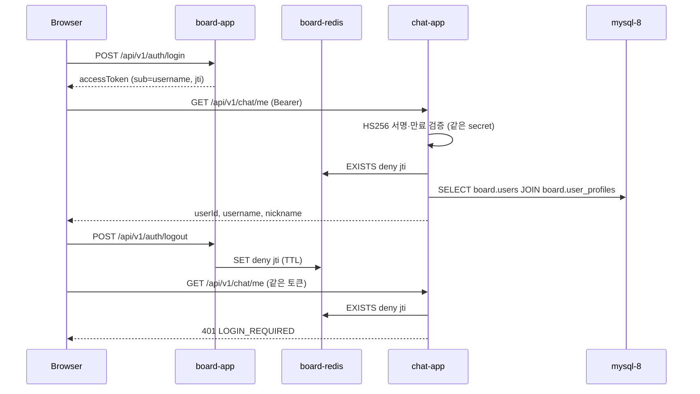
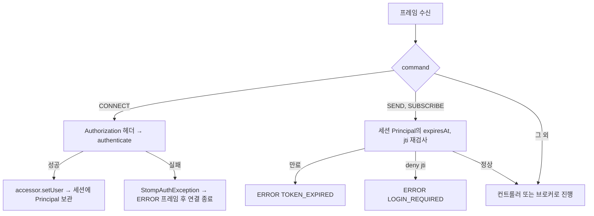

# 1일차 따라하기 — board 인증 연동 + STOMP CONNECT

> 전제: board 프로젝트(`../board`)가 로컬 도커로 떠 있고(`mysql-8`, `board-redis`, `board-app`, `board-caddy`), `board-db-net` 네트워크가 존재한다. board 강의 단계 2(JWT), 5(httpOnly 쿠키), 15(Redis denylist)를 마친 상태를 가정한다. 기준 코드: 이 저장소 `feature/day1-auth-stomp` 브랜치(2026-09-12).

board가 발급한 access token을 chat 서버가 **board 서버를 호출하지 않고** 독립 검증하고, 같은 검증 로직으로 WebSocket(STOMP) 연결까지 인증하는 4시간 과정이다. 설계 전체는 `docs/design/2026-09-12-stomp-chat-design.md`, 작업 단위는 `docs/plans/2026-09-12-day1-auth-stomp.md`에 있다.

---

## 1. 핵심 요약

| 항목 | 내용 |
|---|---|
| 만드는 것 | `GET /api/v1/chat/me`(REST 인증) + `ws://.../ws` STOMP CONNECT 인증 + `/app/echo` 브로드캐스트 |
| 재사용하는 것 | board의 JWT(HS256, `sub`=username, `jti`), Redis `deny:{jti}`, `board.users`·`board.user_profiles` |
| 새로 만드는 것 | `JwtTokenProvider`(검증 전용), `BearerTokenAuthenticator`, `ChatPrincipal`, `JwtAuthenticationFilter`, `StompAuthChannelInterceptor`, `StompErrorHandler` |
| 검증 방법 | JUnit 43개(H2 + InMemory denylist) → 도커 기동 → curl `/me` → 콘솔 페이지에서 CONNECT/SEND |
| 스택 | Spring Boot 4.1.1, Java 21, jjwt 0.12.6, Spring Security 7, Jackson 3 |

**board와 다른 점 세 가지**

| 구분 | board | chat |
|---|---|---|
| 토큰 | 발급 + 검증 | **검증만** (`createToken` 없음) |
| HTTP 필터 | 막지 않는다 (공개 엔드포인트가 있어서) | 같다. 단 STOMP CONNECT는 **막는다** (공개 프레임이 없어서) |
| 사용자 로딩 | `UserDetailsService` + JPA `User` 엔티티 | `JdbcClient`로 board 스키마 **읽기 전용** (엔티티 매핑 안 함) |

**4시간 배분**

| 시간 | 단계 | 산출물 | 확인 |
|---|---|---|---|
| 0:00–0:30 | 2절 준비 확인 + 3절 복습 | `.env`, `chat` DB | 앱 기동 |
| 0:30–1:30 | 4절 REST 인증 | `JwtTokenProvider` → 필터 → `SecurityConfig` | curl 401/200 |
| 1:30–2:15 | 5절 denylist + 사용자 조회 | `RedisTokenDenylist`, `BoardUserReader`, `ChatPrincipal`, `/me` | 로그아웃 후 401 |
| 2:15–2:45 | 6절 테스트 | H2 픽스처, `TestJwtFactory` | `./gradlew test` |
| 2:45–4:00 | 7절 STOMP | `WebSocketConfig`, 인터셉터, `StompErrorHandler`, echo | 콘솔 CONNECT/SEND |

> [!IMPORTANT]
> `JWT_SECRET`은 board의 `application.yaml`에 있는 `jwt.secret` 값과 **바이트 단위로 같아야** 한다. 값이 다르면 chat의 모든 요청이 401이며, 로그에는 `invalid jwt: JWT signature does not match`만 남는다.

---

## 2. 사전 준비 (강사, 수업 전 1~2시간)

| 준비 | 명령 / 위치 | 이유 |
|---|---|---|
| jjwt 호환 확인 | `./gradlew test` (Task 1 상태) | Boot 4는 Jackson 3인데 jjwt-jackson은 Jackson 2 의존. 실측 결과 둘이 공존해 정상 동작 |
| `.env` | `cp .env.example .env` 후 `JWT_SECRET`, `DB_PASSWORD` 채움 | 비밀값은 yaml 기본값을 두지 않는다 |
| `chat` DB | `set -a; source .env; set +a; scripts/init_db.sh` | Hibernate `ddl-auto: update`는 DB 자체는 만들지 못한다 |
| 예외 계층 | `global/exception/*` 미리 복사 | board와 같은 코드라 학습 가치가 낮다. "board와 같다"로 넘어간다 |
| Redis 경로 | `scripts/dev_redis_proxy.sh` 또는 compose | `board-redis`는 호스트 포트를 열지 않는다 (아래 함정 표 참고) |

**Boot 4에서 이동한 패키지** (컴파일 오류의 대부분이 여기서 난다)

| 클래스 | Boot 3.x | Boot 4.1 |
|---|---|---|
| `@AutoConfigureMockMvc` | `org.springframework.boot.test.autoconfigure.web.servlet` | `org.springframework.boot.webmvc.test.autoconfigure` |
| `ObjectMapper` | `com.fasterxml.jackson.databind` | `tools.jackson.databind` (Jackson 3) |
| JSON 메시지 컨버터 | `MappingJackson2MessageConverter` | `JacksonJsonMessageConverter` |
| `@JsonInclude` | `com.fasterxml.jackson.annotation` | 그대로 (annotations 모듈은 2.x 패키지 유지) |
| 테스트 스타터 | `spring-boot-starter-test` 하나 | `spring-boot-starter-webmvc-test` 등 모듈별 |

---

## 3. board 인증 복습 (0:00–0:30)

chat이 의존하는 사실만 추린다. 원문은 `docs/reference/board-analysis.md` 2절.

| 사실 | chat에 미치는 영향 |
|---|---|
| access token claims = `sub`(username), `jti`, `iat`, `exp` | userId·nickname이 없다 → board 스키마를 읽어야 한다 |
| 서명 = HS256, Base64 secret | secret만 공유하면 chat이 독립 검증 |
| 로그아웃 시 Redis `deny:{jti}` 등록(TTL = 잔여 수명) | chat도 이 키를 읽으면 로그아웃이 즉시 반영된다 |
| refresh 쿠키 `Path=/api/v1/auth` | WebSocket 핸드셰이크에 쿠키가 안 실린다 → CONNECT 헤더로 access 전달 |
| board-app은 CORS 없음, nginx same-origin | chat도 프록시 전략을 따른다 (1일차엔 무관) |



로컬 board는 호스트 8090을 열지 않는다. 토큰은 caddy 경유 `http://localhost`에서 받는다.

```bash
curl -s -X POST http://localhost/api/v1/auth/login \
  -H 'Content-Type: application/json' \
  -d '{"username":"admin","password":"admin1234"}'
```

---

## 4. REST 인증 (0:30–1:30)

### 4.1 설정 — `application.yaml`

```yaml
server:
  port: 8092
  forward-headers-strategy: framework

spring:
  config:
    import: optional:file:.env[.properties]
  datasource:
    url: jdbc:mysql://${DB_HOST:localhost}:${DB_PORT:3306}/${DB_NAME:chat}?serverTimezone=Asia/Seoul&characterEncoding=UTF-8
    username: ${DB_USERNAME:root}
    password: ${DB_PASSWORD}
  data:
    redis:
      host: ${REDIS_HOST:localhost}
      port: ${REDIS_PORT:6379}

jwt:
  secret: ${JWT_SECRET}

app:
  board:
    schema: ${APP_BOARD_SCHEMA:board}
  ws:
    allowed-origin-patterns: ${APP_WS_ALLOWED_ORIGINS:http://localhost:*}
```

`jwt.secret`과 `DB_PASSWORD`에 기본값이 없다. 비어 있으면 `Could not resolve placeholder 'JWT_SECRET'`로 기동이 실패하는데, 이것이 의도한 fail-fast다.

### 4.2 `JwtTokenProvider` — 검증 전용

board 것에서 `createToken`을 빼고, 세 번 파싱하던 `getUsername/getJti/getRemainingSeconds`를 한 번 파싱하는 `parse`로 합쳤다.

```java
@Slf4j
@Component
public class JwtTokenProvider {

  private final SecretKey key;

  public JwtTokenProvider(@Value("${jwt.secret}") String base64Secret) {
    this.key = Keys.hmacShaKeyFor(Decoders.BASE64.decode(base64Secret));
  }

  public Optional<TokenClaims> parse(String token) {
    try {
      Claims claims = Jwts.parser().verifyWith(key).build().parseSignedClaims(token).getPayload();
      if (claims.getId() == null || claims.getSubject() == null || claims.getExpiration() == null) {
        return Optional.empty();
      }
      return Optional.of(new TokenClaims(
          claims.getSubject(), claims.getId(), claims.getExpiration().toInstant()));
    } catch (JwtException | IllegalArgumentException e) {
      log.debug("invalid jwt: {}", e.getMessage());
      return Optional.empty();
    }
  }

  public boolean isExpired(String token) {
    try {
      Jwts.parser().verifyWith(key).build().parseSignedClaims(token);
      return false;
    } catch (ExpiredJwtException e) {
      return true;
    } catch (JwtException | IllegalArgumentException e) {
      return false;
    }
  }
}
```

```java
public record TokenClaims(String username, String jti, Instant expiresAt) {
}
```

> 강의 포인트: `catch`가 `JwtException | IllegalArgumentException`으로 좁은 이유는 board 단계 2와 같다. 키 로딩 실패 같은 내부 오류를 "인증 실패"로 둔갑시키지 않는다. `isExpired`는 클라이언트에 "재발급하면 된다"(TOKEN_EXPIRED)와 "다시 로그인해라"(LOGIN_REQUIRED)를 구분해 주기 위해 있다.

### 4.3 `JwtAuthenticationFilter` — 심기만 하고 막지 않는다

```java
@Override
protected void doFilterInternal(HttpServletRequest request, HttpServletResponse response,
    FilterChain filterChain) throws ServletException, IOException {
  try {
    Optional<String> token =
        BearerTokenAuthenticator.extractToken(request.getHeader(HttpHeaders.AUTHORIZATION));
    if (token.isPresent()) {
      authenticator.authenticate(token.get()).ifPresent(principal -> {
        UsernamePasswordAuthenticationToken authentication =
            (UsernamePasswordAuthenticationToken) principal.toAuthentication();
        authentication.setDetails(new WebAuthenticationDetailsSource().buildDetails(request));
        SecurityContextHolder.getContext().setAuthentication(authentication);
      });
    }
  } catch (Exception e) {
    SecurityContextHolder.clearContext();
    handlerExceptionResolver.resolveException(request, response, null, e);
    return;
  }
  filterChain.doFilter(request, response);
}
```

board의 3분기(인증 실패 / 내부 오류 / 정상)가 2분기가 된 이유: `authenticator.authenticate`가 실패를 예외가 아니라 `Optional.empty()`로 돌려주므로 "인증 실패" 분기가 `ifPresent`에 흡수된다. 내부 오류 분기(500)는 그대로 남는다.

### 4.4 `SecurityConfig`

```java
http
    .csrf(AbstractHttpConfigurer::disable)
    .formLogin(AbstractHttpConfigurer::disable)
    .httpBasic(AbstractHttpConfigurer::disable)
    .sessionManagement(session -> session.sessionCreationPolicy(SessionCreationPolicy.STATELESS))
    .authorizeHttpRequests(auth -> auth
        .requestMatchers("/ws/**").permitAll()
        .requestMatchers("/actuator/health").permitAll()
        .requestMatchers(HttpMethod.GET, "/", "/index.html").permitAll()
        .anyRequest().authenticated())
    .exceptionHandling(e -> e
        .authenticationEntryPoint(authenticationEntryPoint)
        .accessDeniedHandler(accessDeniedHandler))
    .addFilterBefore(jwtAuthenticationFilter, UsernamePasswordAuthenticationFilter.class);
```

`/ws/**`가 공개인 것이 처음엔 이상해 보인다. WebSocket 핸드셰이크는 브라우저 `WebSocket` API가 보내는 GET 요청이라 `Authorization` 헤더를 붙일 수 없다. 그래서 핸드셰이크는 통과시키고 **STOMP CONNECT 프레임**에서 인증한다(7절).

`RestAuthenticationEntryPoint`는 board와 같고 `ObjectMapper`만 `tools.jackson.databind.ObjectMapper`다.

### 4.5 확인

```bash
curl -s -w "\nHTTP %{http_code}\n" http://localhost:8092/api/v1/chat/me
# {"code":"LOGIN_REQUIRED","message":"로그인이 필요합니다.","timestamp":"..."} HTTP 401
```

이 시점엔 `/me` 컨트롤러가 아직 없어도 401이 먼저 난다. 인가가 컨트롤러보다 앞에 있다는 것을 보여주는 좋은 순간이다.

---

## 5. denylist + 사용자 조회 + `/me` (1:30–2:15)

### 5.1 `TokenDenylist` — 읽기만

```java
public interface TokenDenylist {
  boolean isDenied(String jti);
}

@Component
@RequiredArgsConstructor
public class RedisTokenDenylist implements TokenDenylist {
  private static final String KEY_PREFIX = "deny:";
  private final StringRedisTemplate redis;

  @Override
  public boolean isDenied(String jti) {
    return Boolean.TRUE.equals(redis.hasKey(KEY_PREFIX + jti));
  }
}
```

board의 `deny(jti, ttl)`는 없다. chat은 `board-redis`에 **쓰지 않는다**. `board-redis`는 `maxmemory 64mb` + `noeviction`이라, chat이 키를 쌓으면 board의 refresh token 저장이 거부되어 로그인이 깨진다.

### 5.2 `BoardUserReader` — 엔티티 없이 스키마 읽기

```java
public BoardUserReader(JdbcClient jdbcClient, @Value("${app.board.schema}") String schema) {
  if (!SAFE_SCHEMA.matcher(schema).matches()) {
    throw new IllegalArgumentException("invalid board schema name: " + schema);
  }
  this.jdbcClient = jdbcClient;
  this.sql = """
      SELECT u.id, u.username, p.nickname
      FROM %1$s.users u
      JOIN %1$s.user_profiles p ON p.user_id = u.id
      WHERE u.username = :username
      """.formatted(schema);
}

public Optional<BoardUser> findByUsername(String username) {
  return jdbcClient.sql(sql)
      .param("username", username)
      .query((rs, rowNum) -> new BoardUser(
          rs.getLong("id"), rs.getString("username"), rs.getString("nickname")))
      .optional();
}
```

| 질문 | 답 |
|---|---|
| 왜 JPA `User` 엔티티를 안 만드나 | chat의 `ddl-auto: update`가 board 테이블을 검증·변경하려 든다. 읽기 전용 경계를 코드로 강제한다 |
| 왜 `board.users`처럼 스키마를 붙이나 | chat 커넥션은 `chat` DB에 붙어 있다. 같은 MySQL 인스턴스라 스키마 한정으로 조인이 된다 |
| 왜 스키마 이름을 정규식 검사하나 | SQL 문자열에 설정값을 끼워 넣으므로, 설정 오염 시 인젝션이 되지 않게 |
| 프로필이 없는 사용자는 | `JOIN`이라 empty → 401. board는 가입 시 프로필을 반드시 만들므로 정상 데이터엔 없다 |

### 5.3 `ChatPrincipal` — REST와 STOMP가 공유하는 사용자 타입

```java
public record ChatPrincipal(Long userId, String username, String nickname, String jti,
    Instant expiresAt) implements Principal {

  @Override
  public String getName() {
    return username;
  }

  public boolean isExpired(Instant now) {
    return !now.isBefore(expiresAt);
  }

  public Authentication toAuthentication() {
    return UsernamePasswordAuthenticationToken.authenticated(
        this, null, List.of(new SimpleGrantedAuthority("ROLE_USER")));
  }

  public static Optional<ChatPrincipal> from(Principal user) {
    if (user instanceof Authentication authentication
        && authentication.getPrincipal() instanceof ChatPrincipal principal) {
      return Optional.of(principal);
    }
    return Optional.empty();
  }
}
```

`jti`와 `expiresAt`을 들고 다니는 이유는 7절에서 드러난다. WebSocket 세션은 몇 시간을 살기 때문에 프레임마다 "아직 유효한가"를 물어야 하는데, 토큰 원문을 다시 파싱하지 않고 이 두 값으로 답한다.

### 5.4 `BearerTokenAuthenticator` — 필터와 인터셉터의 공용 부품

```java
public Optional<ChatPrincipal> authenticate(String token) {
  Optional<TokenClaims> parsed = tokenProvider.parse(token);
  if (parsed.isEmpty()) {
    return Optional.empty();
  }
  TokenClaims claims = parsed.get();
  if (tokenDenylist.isDenied(claims.jti())) {
    return Optional.empty();
  }
  return boardUserReader.findByUsername(claims.username())
      .map(user -> new ChatPrincipal(
          user.id(), user.username(), user.nickname(), claims.jti(), claims.expiresAt()));
}
```

순서가 중요하다. 서명 검증(CPU) → Redis `EXISTS`(네트워크 1회) → DB 조인(가장 비쌈). 위조 토큰은 첫 단계에서 떨어지므로 DB에 닿지 않는다.

### 5.5 `MeController`

```java
@RestController
@RequestMapping("/api/v1/chat")
public class MeController {

  @GetMapping("/me")
  public MeResponse me(@AuthenticationPrincipal ChatPrincipal principal) {
    return MeResponse.from(principal);
  }
}
```

### 5.6 확인 — 로그아웃이 즉시 반영되는가

```bash
TOKEN=$(curl -s -X POST http://localhost/api/v1/auth/login -H 'Content-Type: application/json' \
  -d '{"username":"admin","password":"admin1234"}' | python3 -c 'import json,sys;print(json.load(sys.stdin)["accessToken"])')

curl -s http://localhost:8092/api/v1/chat/me -H "Authorization: Bearer $TOKEN"
# {"userId":1,"username":"admin","nickname":"관리자"}

curl -s -X POST http://localhost/api/v1/auth/logout -H "Authorization: Bearer $TOKEN"

curl -s -w "\nHTTP %{http_code}\n" http://localhost:8092/api/v1/chat/me -H "Authorization: Bearer $TOKEN"
# {"code":"LOGIN_REQUIRED",...} HTTP 401
```

`docker exec board-redis redis-cli keys 'deny:*'`로 키가 생긴 것을 함께 보여주면 "서버 간 호출 없이 로그아웃이 전파된다"는 문장이 실감난다.

---

## 6. 테스트 (2:15–2:45)

| 지원 파일 | 역할 |
|---|---|
| `src/test/resources/application.yaml` | H2 `MODE=MySQL`, `spring.sql.init.schema-locations: classpath:schema-board.sql`, 테스트 전용 `jwt.secret` |
| `src/test/resources/schema-board.sql` | `CREATE SCHEMA board` + `users`·`user_profiles` + 시드(`alice`=id 1 닉네임 앨리스, `noprofile`=프로필 없음) |
| `support/TestJwtFactory` | board `createToken`과 같은 claims로 토큰 발급. `expiredToken`, `tokenSignedWithOtherKey`, `tokenWithJti` |
| `support/InMemoryTokenDenylist` + `TestTokenStoreConfig` | Redis 없이 `@Primary`로 대체. `@BeforeEach clear()` 필수 (트랜잭션 롤백이 Map을 되돌리지 못한다) |

`schema-board.sql`의 핵심은 `MERGE INTO ... KEY (id)`다. `DB_CLOSE_DELAY=-1`로 컨텍스트가 여러 번 떠도 시드가 중복되지 않는다.

**테스트 계층**

| 테스트 | 계층 | 검증 |
|---|---|---|
| `JwtTokenProviderTest` | 단위 | 정상·만료·다른 키·쓰레기·null |
| `RedisTokenDenylistTest` | 단위(mock) | 키 접두어 `deny:` |
| `BoardUserReaderTest` | `@SpringBootTest` + H2 | 조인 결과, 미존재, 프로필 없음, 스키마명 검증 |
| `ChatPrincipalTest`, `BearerTokenAuthenticatorTest` | 단위 | 변환 왕복, 실패 시 뒤 단계 호출 안 함 |
| `MeControllerTest` | MockMvc | 401 JSON 포맷, 200, 만료, denylist, 미존재 사용자, health 공개 |
| `StompAuthChannelInterceptorTest` | 단위 | CONNECT 3분기, SEND/SUBSCRIBE 재검사 |
| `StompAuthIntegrationTest` | `RANDOM_PORT` + `WebSocketStompClient` | CONNECT 성공·echo 왕복, ERROR `code` 헤더 3종, 연결 중 로그아웃 |

```bash
./gradlew test
# BUILD SUCCESSFUL, 43 tests
```

---

## 7. STOMP (2:45–4:00)

### 7.1 `WebSocketConfig`

```java
@Configuration
@EnableWebSocketMessageBroker
public class WebSocketConfig implements WebSocketMessageBrokerConfigurer {

  @Override
  public void registerStompEndpoints(StompEndpointRegistry registry) {
    registry.setErrorHandler(errorHandler);
    registry.addEndpoint("/ws").setAllowedOriginPatterns(allowedOriginPatterns);
  }

  @Override
  public void configureMessageBroker(MessageBrokerRegistry registry) {
    registry.enableSimpleBroker("/topic", "/queue");
    registry.setApplicationDestinationPrefixes("/app");
    registry.setUserDestinationPrefix("/user");
  }

  @Override
  public void configureClientInboundChannel(ChannelRegistration registration) {
    registration.interceptors(authInterceptor);
  }
}
```

| prefix | 방향 | 누가 처리 |
|---|---|---|
| `/app/**` | 클라이언트 → 서버 | `@MessageMapping` 컨트롤러 |
| `/topic/**`, `/queue/**` | 서버 → 클라이언트 | simple broker가 구독자에게 배달 |
| `/user/**` | 서버 → 특정 사용자 | `convertAndSendToUser(username, ...)` (2일차) |

### 7.2 `StompAuthChannelInterceptor` — CONNECT는 막는다

```java
@Override
public Message<?> preSend(Message<?> message, MessageChannel channel) {
  StompHeaderAccessor accessor = MessageHeaderAccessor.getAccessor(message, StompHeaderAccessor.class);
  if (accessor == null || accessor.getCommand() == null) {
    return message;
  }
  switch (accessor.getCommand()) {
    case CONNECT -> authenticateConnect(accessor);
    case SEND, SUBSCRIBE -> requireLivePrincipal(accessor);
    default -> {
    }
  }
  return message;
}

private void authenticateConnect(StompHeaderAccessor accessor) {
  String token = BearerTokenAuthenticator
      .extractToken(accessor.getFirstNativeHeader(HttpHeaders.AUTHORIZATION))
      .orElseThrow(() -> new StompAuthException(ErrorCode.LOGIN_REQUIRED));
  ChatPrincipal principal = authenticator.authenticate(token)
      .orElseThrow(() -> new StompAuthException(
          tokenProvider.isExpired(token) ? ErrorCode.TOKEN_EXPIRED : ErrorCode.LOGIN_REQUIRED));
  accessor.setUser(principal.toAuthentication());
}

private void requireLivePrincipal(StompHeaderAccessor accessor) {
  ChatPrincipal principal = ChatPrincipal.from(accessor.getUser())
      .orElseThrow(() -> new StompAuthException(ErrorCode.LOGIN_REQUIRED));
  if (principal.isExpired(Instant.now())) {
    throw new StompAuthException(ErrorCode.TOKEN_EXPIRED);
  }
  if (tokenDenylist.isDenied(principal.jti())) {
    throw new StompAuthException(ErrorCode.LOGIN_REQUIRED);
  }
}
```



| 질문 | 답 |
|---|---|
| 왜 HTTP 필터는 통과시키고 여기선 막나 | HTTP에는 공개 엔드포인트가 있어 뒤의 `AuthorizationFilter`가 판단한다. STOMP에는 그런 뒷단이 없다 |
| `accessor.setUser`가 왜 세션에 남나 | `StompSubProtocolHandler`가 CONNECT 처리 후 user를 세션에 저장하고, 이후 프레임에 자동으로 붙여 준다 |
| SEND마다 Redis를 보는 비용은 | `EXISTS` 1회. 메시지 한 건당 DB 저장(2일차)보다 훨씬 싸다 |
| 왜 SEND 재검사에서 토큰을 다시 파싱하지 않나 | `ChatPrincipal`이 `expiresAt`·`jti`를 들고 있어 파싱 없이 답한다 |

### 7.3 `StompErrorHandler` — ERROR 프레임에 `code` 헤더

```java
@Override
public Message<byte[]> handleClientMessageProcessingError(Message<byte[]> clientMessage, Throwable ex) {
  ErrorCode errorCode = findErrorCode(ex);
  StompHeaderAccessor accessor = StompHeaderAccessor.create(StompCommand.ERROR);
  accessor.setMessage(errorCode.getMessage());
  accessor.setNativeHeader("code", errorCode.name());
  accessor.setContentType(MimeTypeUtils.TEXT_PLAIN);
  accessor.setLeaveMutable(true);
  StompHeaderAccessor clientAccessor = clientMessage == null ? null
      : MessageHeaderAccessor.getAccessor(clientMessage, StompHeaderAccessor.class);
  return handleInternal(accessor, errorCode.getMessage().getBytes(StandardCharsets.UTF_8), ex, clientAccessor);
}
```

`@RestControllerAdvice`는 STOMP 경로를 보지 못한다. 인터셉터가 던진 예외는 `StompSubProtocolHandler`가 잡아 이 핸들러로 넘기고, 여기서 `code` 헤더를 붙인 ERROR 프레임을 만들면 클라이언트가 분기할 수 있다. `findErrorCode`는 cause 체인을 따라 `StompAuthException`을 찾고, 없으면 `INTERNAL_ERROR`로 숨긴다.

### 7.4 `EchoController`

```java
@Controller
public class EchoController {

  @MessageMapping("/echo")
  @SendTo("/topic/echo")
  public EchoResponse echo(EchoRequest request, Principal principal) {
    return new EchoResponse(principal.getName(), request.content(), Instant.now());
  }
}
```

`Principal` 인자는 CONNECT에서 심은 `Authentication`이다. `getName()`이 username을 돌려주는 것은 `ChatPrincipal.getName()` 덕분이다.

### 7.5 콘솔로 확인

`http://localhost:8092/index.html`(`src/main/resources/static/index.html`, `@stomp/stompjs` CDN 사용)에서:

1. board 토큰을 붙여 넣고 CONNECT → 로그에 `CONNECTED`
2. SUBSCRIBE → SEND → `MESSAGE {"sender":"admin","content":"hello",...}`
3. 다른 터미널에서 board 로그아웃 → SEND → `ERROR code=LOGIN_REQUIRED` 후 `websocket closed`
4. 토큰 없이 CONNECT → `ERROR code=LOGIN_REQUIRED`

라이브러리 없이도 확인할 수 있다. Node 22+ 내장 `WebSocket`으로 원시 프레임을 보내면 된다.

```text
CONNECT
accept-version:1.2
Authorization:Bearer <token>

^@
```

---

## 8. 자주 나오는 질문과 함정

| 증상 | 원인 | 해결 |
|---|---|---|
| 모든 요청이 401, 로그에 `JWT signature does not match` | `JWT_SECRET`이 board와 다름 | board `application.yaml`의 `jwt.secret` 값을 `.env`에 복사 |
| 로그아웃했는데 chat이 계속 200 | chat이 다른 Redis를 보고 있다 (호스트 6379의 `my-redis` 등) | compose 실행 또는 `scripts/dev_redis_proxy.sh` + `REDIS_PORT=6380` |
| `/me`가 401인데 토큰은 유효 | `board.users`에 없거나 프로필이 없는 사용자 | `docker exec mysql-8 mysql -e "SELECT u.username, p.nickname FROM board.users u LEFT JOIN board.user_profiles p ON p.user_id=u.id"` |
| WebSocket 핸드셰이크 403 | Origin 불일치 (Vite dev 5173 등) | `APP_WS_ALLOWED_ORIGINS=http://localhost:*` (기본값) 또는 운영 도메인 |
| `Could not resolve placeholder 'JWT_SECRET'` | `.env` 없음 | `cp .env.example .env` 후 채움. 의도된 fail-fast |
| 인증 API가 500 | Redis 다운 (fail-closed) | `docker ps` 로 `board-redis` 확인. 우회하지 않는다 |
| 컴파일 오류 `AutoConfigureMockMvc` 못 찾음 | Boot 4 패키지 이동 | 2절 표 참고 |
| `SUBSCRIBE` 직후 `SEND`했는데 메시지가 안 옴 | 인바운드 채널이 비동기라 구독 등록 전에 전송됨 | 테스트에선 300ms 대기, 실제 클라이언트는 구독 콜백 후 전송 |

---

## 9. 다음 수업과 실무 기준

**2일차 예고**: `EchoController`를 `ChatMessageController`로 바꾸고, `chat_rooms`·`room_members`·`chat_messages`를 JPA로 만든다. 인터셉터의 `SUBSCRIBE` 분기에 방 멤버십 검사가 추가되고, `RoomPresenceTracker`가 세션 이벤트로 입장·퇴장 시스템 메시지를 낸다. 설계 문서 5.5절과 6절.

**언제 이 방식을 쓰나**

| 상황 | 선택 |
|---|---|
| 인증 서버와 같은 팀, secret 공유 가능, 서비스 2~3개 | 이 방식 (HS256 secret 공유 + denylist 읽기). 가장 단순하고 호출 지연이 없다 |
| 서비스가 많아지거나 외부 팀이 검증해야 함 | RS256/ES256 + JWKS 엔드포인트. 공개키만 배포하면 secret 유출 면적이 사라진다 |
| 토큰에 userId·role을 넣을 수 있음 | claims에 넣고 DB 조회를 없앤다. board 무수정 원칙 때문에 이번엔 못 했다 |
| 인스턴스가 2대 이상 | simple broker 대신 Redis pub/sub 백플레인. `WebSocketConfig`와 publisher만 교체 |
| 로그아웃 즉시 반영이 필요 없음 | SEND 재검사를 빼고 CONNECT 1회 검사로 단순화 |
