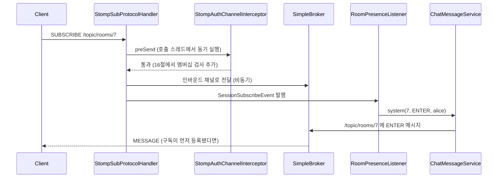

# 2일차 따라하기 — 채팅방 도메인, 메시지 영속화, 입장·퇴장 presence

> 전제: 1일차(`day1_auth_stomp_walkthrough.md`)를 마쳐 `GET /api/v1/chat/me`와 STOMP CONNECT 인증이 동작한다. 로컬에 board 스택(`mysql-8`, `board-redis`)이 떠 있고 `.env`가 채워져 있다. 기준 코드: 이 저장소 `feature/day2-rooms-messages` 브랜치(2026-09-12). **이 문서의 절 순서 = 실제 파일을 만든 순서 = 커밋 순서**다. 각 절이 끝날 때마다 컴파일과 테스트가 통과한다.

1일차의 echo를 진짜 채팅으로 바꾼다. 방을 만들고(REST), 입장하고, 방 토픽을 구독하면 입장 메시지가 퍼지고, 보낸 메시지는 DB에 남아 이력으로 다시 읽힌다. 설계는 `docs/design/2026-09-12-stomp-chat-design.md` 3~7절, 작업 단위는 `docs/plans/2026-09-12-day2-rooms-messages.md`.

---

## 1. 핵심 요약

| 항목 | 내용 |
|---|---|
| 만드는 것 | 방 REST 8개(`/api/v1/chat/rooms/**`), STOMP `SEND /app/rooms/{id}/messages`, `/topic/rooms/{id}` 브로드캐스트, `/topic/rooms` 로비 이벤트, `/user/queue/errors` 개인 에러, ENTER/LEAVE 시스템 메시지, keyset 이력 |
| 새 테이블 | `chat_rooms`, `room_members`, `chat_messages` (전부 `chat` DB, board 스키마 무변경) |
| 새 패키지 | `room`, `presence`, `message`(1일차 echo 대체), `global/entity` |
| 1일차에서 그대로 쓰는 것 | `ChatPrincipal`, `StompAuthException`, `StompAuthChannelInterceptor`(수정), `ErrorCode`(확장), `BusinessException` 계열, `TestJwtFactory`, `InMemoryTokenDenylist`, `schema-board.sql`(시드 추가) |
| 검증 | JUnit 89개 → 도커 기동 → 콘솔에서 방 생성·입장·전송 |

**작업 순서 (= 이 문서의 절 순서)**

| 절 | 만드는 파일 | 그 시점에 가능해지는 것 |
|---|---|---|
| 3 | `ErrorCode` 확장 | 방·메시지 에러 코드 |
| 4 | `BaseTimeEntity`, `JpaAuditingConfig` | 생성·수정 시각 자동 기록 |
| 5 | `ChatRoom`, `ChatRoomRepository` | 방 저장·조회 |
| 6 | `RoomMember`, `RoomMemberRepository` | 멤버십 저장·조회 |
| 7 | `MessageType`, `ChatMessage`, `ChatMessageRepository` | 메시지 저장·keyset 조회 |
| 8 | `RoomPresenceTracker` | 접속자 집계 (메모리) |
| 9 | DTO 8개 | 요청·응답·이벤트 형태 확정 |
| 10 | `ChatMessagePublisher` | 브로커로 보내는 통로 |
| 11 | `ChatRoomService` | 방 유스케이스 |
| 12 | `RoomSecurity`, `ChatRoomController` | 방 REST |
| 13 | `ChatMessageService` | 전송·시스템 메시지·이력 |
| 14 | `ChatMessageController`, `MessageHistoryController` | STOMP 수신·이력 REST |
| 15 | `RoomPresenceListener` | 입장·퇴장 자동 감지 |
| 16 | `SubscriptionAuthorizer`, `RoomSubscriptionAuthorizer`, 인터셉터 수정 | 비멤버 구독 차단 |
| 17 | 통합 테스트, 콘솔, echo 제거 | 전 구간 확인 |

순서의 원칙은 **의존 방향**이다. 엔티티는 아무것도 의존하지 않고, 리포지토리는 엔티티를, 서비스는 리포지토리와 publisher를, 컨트롤러는 서비스를 의존한다. 그래서 아래에서 위로 쌓으면 어느 절에서 멈춰도 컴파일이 된다.

**클래스 출처 범례** (각 절의 표에서 쓰는 값)

| 출처 | 뜻 |
|---|---|
| Spring Framework | `spring-context`, `spring-messaging`, `spring-web`, `spring-tx` 등 프레임워크 코어 |
| Spring Data JPA / Spring Data Commons | `@CreatedDate`, `JpaRepository`, `Pageable`, `PagedModel` 등 |
| Spring Security | `@PreAuthorize`, `@AuthenticationPrincipal`, `Authentication` |
| Spring WebSocket | `SessionSubscribeEvent` 등 STOMP 세션 이벤트 |
| Jakarta Persistence / Jakarta Validation | `@Entity`, `@Column`, `@NotBlank` 등 표준 애노테이션 |
| Lombok | `@Getter`, `@RequiredArgsConstructor`, `@Slf4j` |
| 테스트 라이브러리 | JUnit, AssertJ, Mockito, Spring Test |
| 1일차 | 1일차에 이 프로젝트에서 만든 클래스 |
| N절 | 이 문서의 N절에서 만든 클래스 |
| 이 절 | 지금 만드는 클래스 |

**4시간 배분**

| 시간 | 절 | 확인 |
|---|---|---|
| 0:00–0:20 | 2 (1일차 복습, 이번 목표) | 앱 기동 |
| 0:20–1:10 | 3~8 (에러 코드, Auditing, 엔티티 3종, tracker) | 리포지토리 테스트 |
| 1:10–2:10 | 9~12 (DTO, publisher, 방 서비스·REST) | curl로 방 생성·입장 |
| 2:10–3:10 | 13~14 (메시지 서비스, STOMP 수신, 이력) | 콘솔에서 SEND → MESSAGE |
| 3:10–4:00 | 15~17 (presence, 구독 인가, 통합 테스트) | 두 브라우저 입장·퇴장 |

---

## 2. 시작 전 — 1일차에서 가져오는 것

이번 절에서 만드는 파일은 없다. 2일차 코드가 참조하는 1일차 클래스를 먼저 확인한다. 아래 표에 없는 `com.example.chat.*` 클래스가 코드에 나오면 그것은 2일차의 어느 절에서 만든 것이고, 그 절 번호를 해당 코드의 표에 적어 두었다.

| 클래스 (패키지) | 역할 | 2일차에서 쓰는 곳 |
|---|---|---|
| `ChatPrincipal` (`auth`) | 인증된 사용자. `userId`, `username`, `nickname`, `jti`, `expiresAt`. `toAuthentication()`, `from(Principal)` | 서비스 인자, 컨트롤러 `@AuthenticationPrincipal`, presence |
| `StompAuthException` (`auth`) | 인터셉터에서 던지면 ERROR 프레임이 되는 예외 | 구독 인가 실패 |
| `StompAuthChannelInterceptor` (`auth`) | CONNECT 인증, SEND/SUBSCRIBE 재검사 | 16절에서 SUBSCRIBE 인가 추가 |
| `ErrorCode`, `ErrorResponse`, `BusinessException`, `NotFoundException`, `DuplicateException`, `ForbiddenException` (`global.exception`) | 에러 코드 단일 권위와 예외 라벨 | 서비스에서 throw, `@MessageExceptionHandler` |
| `GlobalExceptionHandler` | REST 예외 → JSON | 그대로 동작 (수정 없음) |
| `TokenDenylist`, `JwtTokenProvider`, `BearerTokenAuthenticator` (`auth`) | 토큰 검증 | 인터셉터 생성자 (수정 없음) |
| `WebSocketConfig`, `StompErrorHandler` (`global.config`) | `/ws`, simple broker, ERROR 프레임 | 수정 없음 |
| `TestJwtFactory`, `InMemoryTokenDenylist`, `TestTokenStoreConfig` (`src/test/.../support`) | 테스트 토큰, Redis 대체 | 모든 통합 테스트 |
| `src/test/resources/schema-board.sql` | H2에 board 스키마 흉내 (`alice`=1, `noprofile`=2) | 12절에서 `bob`=3 추가 |

```bash
git log --oneline | head -3   # 531a21e docs: 1일차 ... 가 보이면 정상
./gradlew --no-daemon -q test # 43 tests, BUILD SUCCESSFUL
git checkout -b feature/day2-rooms-messages
```

---

## 3. ErrorCode 확장

**왜 지금**: 이후 모든 서비스가 `ROOM_NOT_FOUND` 같은 코드를 던진다. 코드가 먼저 있어야 나머지가 컴파일된다.

`src/main/java/com/example/chat/global/exception/ErrorCode.java` (1일차 파일에 4줄 추가. 전체는 다음과 같다)

```java
package com.example.chat.global.exception;

import lombok.Getter;
import lombok.RequiredArgsConstructor;
import org.springframework.http.HttpStatus;

// HTTP 상태의 단일 권위. 하위 예외 클래스는 라벨일 뿐 상태는 여기서만 정한다 (board와 동일).
@Getter
@RequiredArgsConstructor
public enum ErrorCode {

  LOGIN_REQUIRED(HttpStatus.UNAUTHORIZED, "로그인이 필요합니다."),
  TOKEN_EXPIRED(HttpStatus.UNAUTHORIZED, "access token이 만료되었습니다. 재발급 후 다시 연결하세요."),
  ACCESS_DENIED(HttpStatus.FORBIDDEN, "접근 권한이 없습니다."),

  USER_NOT_FOUND(HttpStatus.NOT_FOUND, "사용자를 찾을 수 없습니다."),
  ROOM_NOT_FOUND(HttpStatus.NOT_FOUND, "채팅방을 찾을 수 없습니다."),
  RESOURCE_NOT_FOUND(HttpStatus.NOT_FOUND, "요청한 경로를 찾을 수 없습니다."),

  DUPLICATE_ROOM_NAME(HttpStatus.CONFLICT, "이미 존재하는 채팅방 이름입니다."),
  NOT_ROOM_MEMBER(HttpStatus.FORBIDDEN, "채팅방 멤버가 아닙니다. 먼저 입장하세요."),

  INVALID_INPUT(HttpStatus.BAD_REQUEST, "입력값이 올바르지 않습니다."),
  MALFORMED_REQUEST(HttpStatus.BAD_REQUEST, "요청 본문(JSON)을 읽을 수 없습니다."),
  MESSAGE_TOO_LONG(HttpStatus.BAD_REQUEST, "메시지는 1000자 이하여야 합니다."),

  INTERNAL_ERROR(HttpStatus.INTERNAL_SERVER_ERROR, "서버 내부 오류가 발생했습니다.");

  private final HttpStatus status;
  private final String message;
}
```

| 클래스 | 출처 | 역할 |
|---|---|---|
| `HttpStatus` | Spring Framework | 상태 코드 enum |
| `@Getter`, `@RequiredArgsConstructor` | Lombok | 필드 getter, 생성자 |

새 코드 4개: `ROOM_NOT_FOUND`(404), `DUPLICATE_ROOM_NAME`(409), `NOT_ROOM_MEMBER`(403), `MESSAGE_TOO_LONG`(400). 상태를 여기서만 정하므로 뒤의 서비스는 "어떤 코드를 던질지"만 고민한다.

```bash
./gradlew --no-daemon -q compileJava
git commit -am "feat: ErrorCode — 방·메시지 코드 4개 추가"
```

---

## 4. JPA Auditing — `BaseTimeEntity`, `JpaAuditingConfig`

**왜 지금**: 다음 절의 엔티티가 `createdAt`을 자동으로 채우려면 Auditing이 먼저 켜져 있어야 한다. 엔티티 생성자에서 `LocalDateTime.now()`를 부르는 방식은 테스트에서 시각을 통제하기 어렵고 DB 정밀도와 어긋나는 문제가 있어 쓰지 않는다.

`src/main/java/com/example/chat/global/entity/BaseTimeEntity.java`

```java
package com.example.chat.global.entity;

import jakarta.persistence.Column;
import jakarta.persistence.EntityListeners;
import jakarta.persistence.MappedSuperclass;
import java.time.LocalDateTime;
import lombok.Getter;
import org.springframework.data.annotation.CreatedDate;
import org.springframework.data.annotation.LastModifiedDate;
import org.springframework.data.jpa.domain.support.AuditingEntityListener;

// 생성·수정 시각을 JPA Auditing이 자동으로 채운다. 엔티티 생성자에서 now()를 부르지 않는다.
@Getter
@MappedSuperclass
@EntityListeners(AuditingEntityListener.class)
public abstract class BaseTimeEntity {

  @CreatedDate
  @Column(nullable = false, updatable = false)
  private LocalDateTime createdAt;

  @LastModifiedDate
  @Column(nullable = false)
  private LocalDateTime updatedAt;
}
```

`src/main/java/com/example/chat/global/config/JpaAuditingConfig.java`

```java
package com.example.chat.global.config;

import java.time.LocalDateTime;
import java.time.temporal.ChronoUnit;
import java.util.Optional;
import org.springframework.context.annotation.Bean;
import org.springframework.context.annotation.Configuration;
import org.springframework.data.auditing.DateTimeProvider;
import org.springframework.data.jpa.repository.config.EnableJpaAuditing;

// Auditing 시각을 DB 정밀도(마이크로초)로 절단한다. JDK의 now()는 나노초까지 주므로
// 절단 없이는 "메모리 엔티티의 createdAt ≠ DB에 저장된 createdAt"가 된다 (board 단계 16의 버그).
@Configuration
@EnableJpaAuditing(dateTimeProviderRef = "auditingDateTimeProvider")
public class JpaAuditingConfig {

  @Bean
  public DateTimeProvider auditingDateTimeProvider() {
    return () -> Optional.of(LocalDateTime.now().truncatedTo(ChronoUnit.MICROS));
  }
}
```

| 클래스 | 출처 | 역할 |
|---|---|---|
| `@MappedSuperclass` | Jakarta Persistence | 테이블은 없고 컬럼만 자식에게 물려주는 부모 |
| `@EntityListeners`, `AuditingEntityListener` | Jakarta Persistence / Spring Data JPA | 저장·수정 직전에 시각을 채우는 콜백 |
| `@CreatedDate`, `@LastModifiedDate` | Spring Data Commons | 어느 필드를 채울지 표시 |
| `@EnableJpaAuditing` | Spring Data JPA | Auditing 기능 켜기. `dateTimeProviderRef`로 시각 공급자 지정 |
| `DateTimeProvider` | Spring Data Commons | "지금"을 돌려주는 함수형 인터페이스 |
| `@Configuration`, `@Bean` | Spring Framework | 설정 클래스와 빈 등록 |

> 주의: `@EnableJpaAuditing`이 없으면 `@CreatedDate` 필드가 null인 채 INSERT되어 `NOT NULL` 위반으로 터진다. 증상이 "Auditing이 안 켜졌다"가 아니라 "제약 위반"으로 보이므로 헷갈리기 쉽다.

```bash
./gradlew --no-daemon -q test     # 43개 그대로 통과
git add src/main/java/com/example/chat/global && git commit -m "feat: JPA Auditing — BaseTimeEntity + 마이크로초 절단"
```

---

## 5. `ChatRoom` 엔티티 + `ChatRoomRepository`

**왜 지금**: 방이 가장 위에 있는 애그리거트다. 멤버와 메시지가 모두 방을 참조하므로 방이 먼저다.

`src/main/java/com/example/chat/room/ChatRoom.java`

```java
package com.example.chat.room;

import com.example.chat.global.entity.BaseTimeEntity;
import jakarta.persistence.Column;
import jakarta.persistence.Entity;
import jakarta.persistence.GeneratedValue;
import jakarta.persistence.GenerationType;
import jakarta.persistence.Id;
import jakarta.persistence.Table;
import lombok.AccessLevel;
import lombok.Getter;
import lombok.NoArgsConstructor;

// board 사용자와는 FK 없이 id·username 스냅샷만 둔다 (board 스키마 무수정, 읽기 전용 경계).
@Entity
@Table(name = "chat_rooms")
@Getter
@NoArgsConstructor(access = AccessLevel.PROTECTED)
public class ChatRoom extends BaseTimeEntity {

  @Id
  @GeneratedValue(strategy = GenerationType.IDENTITY)
  private Long id;

  @Column(nullable = false, unique = true, length = 50)
  private String name;

  @Column(length = 200)
  private String description;

  @Column(name = "owner_user_id", nullable = false)
  private Long ownerUserId;

  @Column(name = "owner_username", nullable = false, length = 50)
  private String ownerUsername;

  public ChatRoom(String name, String description, Long ownerUserId, String ownerUsername) {
    this.name = name;
    this.description = description;
    this.ownerUserId = ownerUserId;
    this.ownerUsername = ownerUsername;
  }

  public boolean isOwnedBy(Long userId) {
    return ownerUserId.equals(userId);
  }
}
```

`src/main/java/com/example/chat/room/ChatRoomRepository.java`

```java
package com.example.chat.room;

import org.springframework.data.domain.Page;
import org.springframework.data.domain.Pageable;
import org.springframework.data.jpa.repository.JpaRepository;

public interface ChatRoomRepository extends JpaRepository<ChatRoom, Long> {

  boolean existsByName(String name);

  Page<ChatRoom> findAllByOrderByCreatedAtDesc(Pageable pageable);
}
```

| 클래스 | 출처 | 역할 |
|---|---|---|
| `BaseTimeEntity` | 4절 | `createdAt`, `updatedAt` 상속 |
| `@Entity`, `@Table`, `@Id`, `@GeneratedValue`, `@Column` | Jakarta Persistence | 테이블 매핑 |
| `@NoArgsConstructor(access = PROTECTED)` | Lombok | JPA가 요구하는 기본 생성자를 외부에 숨김 |
| `JpaRepository` | Spring Data JPA | CRUD 메서드 제공. `existsByName`처럼 이름 규칙으로 쿼리 파생 |
| `Page`, `Pageable` | Spring Data Commons | 페이징 요청·결과 |

`ownerUserId`는 board `users.id`지만 FK를 걸지 않는다. chat의 `ddl-auto: update`가 board 테이블에 제약을 추가하려 드는 것을 막기 위해서다. `isOwnedBy`는 12절의 소유자 인가에서 쓴다.

**테스트** `src/test/java/com/example/chat/room/ChatRoomRepositoryTest.java`

```java
package com.example.chat.room;

import static org.assertj.core.api.Assertions.assertThat;

import org.junit.jupiter.api.Test;
import org.springframework.beans.factory.annotation.Autowired;
import org.springframework.boot.test.context.SpringBootTest;
import org.springframework.data.domain.PageRequest;
import org.springframework.transaction.annotation.Transactional;

@SpringBootTest
@Transactional
class ChatRoomRepositoryTest {

  @Autowired ChatRoomRepository chatRoomRepository;

  @Test
  void savesWithAuditingTimestamps() {
    ChatRoom room = chatRoomRepository.save(new ChatRoom("general", "잡담", 1L, "alice"));

    assertThat(room.getId()).isNotNull();
    assertThat(room.getCreatedAt()).isNotNull();
    assertThat(room.getUpdatedAt()).isNotNull();
    assertThat(chatRoomRepository.existsByName("general")).isTrue();
    assertThat(chatRoomRepository.existsByName("nope")).isFalse();
  }

  @Test
  void listsNewestFirst() {
    chatRoomRepository.save(new ChatRoom("first", null, 1L, "alice"));
    chatRoomRepository.save(new ChatRoom("second", null, 1L, "alice"));

    var page = chatRoomRepository.findAllByOrderByCreatedAtDesc(PageRequest.of(0, 10));

    assertThat(page.getContent()).extracting(ChatRoom::getName).containsSubsequence("second", "first");
  }
}
```

| 클래스 | 출처 | 역할 |
|---|---|---|
| `@SpringBootTest` | Spring Boot Test | 전체 컨텍스트로 테스트 (H2는 `src/test/resources/application.yaml`) |
| `@Transactional` (테스트 클래스) | Spring Framework | 테스트마다 롤백 → 테스트 간 데이터 격리 |
| `PageRequest` | Spring Data Commons | `Pageable` 구현체 |

> 팁: `@DataJpaTest` 슬라이스를 쓰면 더 가볍지만 `JpaAuditingConfig` 같은 `@Configuration`이 슬라이스에 포함되지 않아 `@Import`가 필요하다. 수업에서는 혼란을 줄이려고 `@SpringBootTest` + `@Transactional`로 통일한다.

```bash
./gradlew --no-daemon -q test --tests 'com.example.chat.room.*'
git add src/main/java/com/example/chat/room src/test/java/com/example/chat/room && git commit -m "feat: ChatRoom 엔티티 + 리포지토리"
```

---

## 6. `RoomMember` 엔티티 + `RoomMemberRepository`

**왜 지금**: "누가 어느 방에 입장했는가"는 영속 상태다. 메시지 전송·이력 조회·구독 인가가 모두 이 테이블을 본다.

`src/main/java/com/example/chat/room/RoomMember.java`

```java
package com.example.chat.room;

import jakarta.persistence.Column;
import jakarta.persistence.Entity;
import jakarta.persistence.EntityListeners;
import jakarta.persistence.FetchType;
import jakarta.persistence.GeneratedValue;
import jakarta.persistence.GenerationType;
import jakarta.persistence.Id;
import jakarta.persistence.JoinColumn;
import jakarta.persistence.ManyToOne;
import jakarta.persistence.Table;
import jakarta.persistence.UniqueConstraint;
import java.time.LocalDateTime;
import lombok.AccessLevel;
import lombok.Getter;
import lombok.NoArgsConstructor;
import org.springframework.data.annotation.CreatedDate;
import org.springframework.data.jpa.domain.support.AuditingEntityListener;

// "입장한 상태"를 영속화한다. 접속 여부(온라인)는 RoomPresenceTracker가 메모리로 따로 관리한다.
@Entity
@Table(name = "room_members", uniqueConstraints = @UniqueConstraint(
    name = "uk_room_members_room_user", columnNames = {"room_id", "user_id"}))
@EntityListeners(AuditingEntityListener.class)
@Getter
@NoArgsConstructor(access = AccessLevel.PROTECTED)
public class RoomMember {

  @Id
  @GeneratedValue(strategy = GenerationType.IDENTITY)
  private Long id;

  @ManyToOne(fetch = FetchType.LAZY)
  @JoinColumn(name = "room_id", nullable = false)
  private ChatRoom room;

  @Column(name = "user_id", nullable = false)
  private Long userId;

  @Column(nullable = false, length = 50)
  private String username;

  @CreatedDate
  @Column(name = "joined_at", nullable = false, updatable = false)
  private LocalDateTime joinedAt;

  public RoomMember(ChatRoom room, Long userId, String username) {
    this.room = room;
    this.userId = userId;
    this.username = username;
  }
}
```

`src/main/java/com/example/chat/room/RoomMemberRepository.java`

```java
package com.example.chat.room;

import java.util.List;
import org.springframework.data.jpa.repository.JpaRepository;

public interface RoomMemberRepository extends JpaRepository<RoomMember, Long> {

  boolean existsByRoomIdAndUserId(Long roomId, Long userId);

  long countByRoomId(Long roomId);

  List<RoomMember> findAllByRoomIdOrderByJoinedAtAsc(Long roomId);

  void deleteByRoomIdAndUserId(Long roomId, Long userId);

  void deleteByRoomId(Long roomId);
}
```

| 클래스 | 출처 | 역할 |
|---|---|---|
| `ChatRoom` | 5절 | 소속 방 |
| `@ManyToOne(fetch = LAZY)`, `@JoinColumn` | Jakarta Persistence | 단방향 N:1. 방 객체는 실제로 쓸 때만 로딩 |
| `@UniqueConstraint` | Jakarta Persistence | (room_id, user_id) 중복 금지 → 입장 멱등의 안전핀 |
| `@EntityListeners` + `@CreatedDate` | Jakarta Persistence / Spring Data Commons | `BaseTimeEntity`를 상속하지 않고 `joinedAt` 하나만 Auditing |

`existsByRoomIdAndUserId`처럼 `RoomId`라고 쓰면 Spring Data가 `room.id`로 풀어 조인 없이 FK 컬럼을 비교한다. 이 프로젝트에서 가장 자주 호출되는 쿼리라 인덱스(UNIQUE 제약이 곧 인덱스)에 정확히 얹힌다.

**테스트** `src/test/java/com/example/chat/room/RoomMemberRepositoryTest.java`

```java
package com.example.chat.room;

import static org.assertj.core.api.Assertions.assertThat;
import static org.assertj.core.api.Assertions.assertThatThrownBy;

import org.junit.jupiter.api.BeforeEach;
import org.junit.jupiter.api.Test;
import org.springframework.beans.factory.annotation.Autowired;
import org.springframework.boot.test.context.SpringBootTest;
import org.springframework.dao.DataIntegrityViolationException;
import org.springframework.transaction.annotation.Transactional;

@SpringBootTest
@Transactional
class RoomMemberRepositoryTest {

  @Autowired ChatRoomRepository chatRoomRepository;
  @Autowired RoomMemberRepository roomMemberRepository;

  private ChatRoom room;

  @BeforeEach
  void setUp() {
    room = chatRoomRepository.save(new ChatRoom("members", null, 1L, "alice"));
  }

  @Test
  void tracksMembershipPerRoom() {
    roomMemberRepository.save(new RoomMember(room, 1L, "alice"));
    roomMemberRepository.save(new RoomMember(room, 3L, "bob"));

    assertThat(roomMemberRepository.existsByRoomIdAndUserId(room.getId(), 1L)).isTrue();
    assertThat(roomMemberRepository.existsByRoomIdAndUserId(room.getId(), 99L)).isFalse();
    assertThat(roomMemberRepository.countByRoomId(room.getId())).isEqualTo(2);
    assertThat(roomMemberRepository.findAllByRoomIdOrderByJoinedAtAsc(room.getId()))
        .extracting(RoomMember::getUsername).containsExactly("alice", "bob");
  }

  @Test
  void rejectsDuplicateMembership() {
    roomMemberRepository.saveAndFlush(new RoomMember(room, 1L, "alice"));

    assertThatThrownBy(() -> roomMemberRepository.saveAndFlush(new RoomMember(room, 1L, "alice")))
        .isInstanceOf(DataIntegrityViolationException.class);
  }

  @Test
  void deletesByRoomAndUser() {
    roomMemberRepository.save(new RoomMember(room, 1L, "alice"));

    roomMemberRepository.deleteByRoomIdAndUserId(room.getId(), 1L);

    assertThat(roomMemberRepository.countByRoomId(room.getId())).isZero();
  }
}
```

| 클래스 | 출처 | 역할 |
|---|---|---|
| `DataIntegrityViolationException` | Spring Framework (spring-tx) | UNIQUE 위반 등 DB 제약 오류의 Spring 번역 |
| `saveAndFlush` | Spring Data JPA | 즉시 INSERT를 날려 제약 위반을 그 자리에서 확인 |

```bash
./gradlew --no-daemon -q test --tests 'com.example.chat.room.*'
git add src/main/java/com/example/chat/room src/test/java/com/example/chat/room && git commit -m "feat: RoomMember 엔티티 + 리포지토리"
```

---

## 7. `MessageType`, `ChatMessage`, `ChatMessageRepository`

**왜 지금**: 메시지는 방을 참조한다(5절 필요). 서비스보다 먼저 만들어야 "이력 조회" 쿼리를 리포지토리 테스트로 먼저 검증할 수 있다.

`src/main/java/com/example/chat/message/MessageType.java`

```java
package com.example.chat.message;

public enum MessageType {
  TALK, ENTER, LEAVE
}
```

`src/main/java/com/example/chat/message/ChatMessage.java`

```java
package com.example.chat.message;

import com.example.chat.room.ChatRoom;
import jakarta.persistence.Column;
import jakarta.persistence.Entity;
import jakarta.persistence.EntityListeners;
import jakarta.persistence.EnumType;
import jakarta.persistence.Enumerated;
import jakarta.persistence.FetchType;
import jakarta.persistence.GeneratedValue;
import jakarta.persistence.GenerationType;
import jakarta.persistence.Id;
import jakarta.persistence.Index;
import jakarta.persistence.JoinColumn;
import jakarta.persistence.ManyToOne;
import jakarta.persistence.Table;
import java.time.LocalDateTime;
import lombok.AccessLevel;
import lombok.Getter;
import lombok.NoArgsConstructor;
import org.springframework.data.annotation.CreatedDate;
import org.springframework.data.jpa.domain.support.AuditingEntityListener;

// 발신자 정보는 발신 당시 스냅샷(닉네임 변경에 영향받지 않음). 수정이 없으므로 updatedAt이 없다.
// (room_id, id) 인덱스는 keyset 페이징(WHERE room_id=? AND id<? ORDER BY id DESC)을 위한 것.
@Entity
@Table(name = "chat_messages", indexes = @Index(
    name = "idx_chat_messages_room_id_id", columnList = "room_id, id"))
@EntityListeners(AuditingEntityListener.class)
@Getter
@NoArgsConstructor(access = AccessLevel.PROTECTED)
public class ChatMessage {

  @Id
  @GeneratedValue(strategy = GenerationType.IDENTITY)
  private Long id;

  @ManyToOne(fetch = FetchType.LAZY)
  @JoinColumn(name = "room_id", nullable = false)
  private ChatRoom room;

  @Column(name = "sender_user_id")
  private Long senderUserId;

  @Column(name = "sender_username", nullable = false, length = 50)
  private String senderUsername;

  @Column(name = "sender_nickname", nullable = false, length = 50)
  private String senderNickname;

  @Enumerated(EnumType.STRING)
  @Column(nullable = false, length = 10)
  private MessageType type;

  @Column(nullable = false, length = 1000)
  private String content;

  @CreatedDate
  @Column(name = "created_at", nullable = false, updatable = false)
  private LocalDateTime createdAt;

  public ChatMessage(ChatRoom room, MessageType type, Long senderUserId,
      String senderUsername, String senderNickname, String content) {
    this.room = room;
    this.type = type;
    this.senderUserId = senderUserId;
    this.senderUsername = senderUsername;
    this.senderNickname = senderNickname;
    this.content = content;
  }
}
```

`src/main/java/com/example/chat/message/ChatMessageRepository.java`

```java
package com.example.chat.message;

import java.util.List;
import org.springframework.data.domain.Pageable;
import org.springframework.data.jpa.repository.JpaRepository;

public interface ChatMessageRepository extends JpaRepository<ChatMessage, Long> {

  // 최신부터 size개 (첫 페이지)
  List<ChatMessage> findByRoomIdOrderByIdDesc(Long roomId, Pageable pageable);

  // before(id)보다 오래된 것부터 size개 (다음 페이지, keyset)
  List<ChatMessage> findByRoomIdAndIdLessThanOrderByIdDesc(Long roomId, Long before, Pageable pageable);

  void deleteByRoomId(Long roomId);
}
```

| 클래스 | 출처 | 역할 |
|---|---|---|
| `ChatRoom` | 5절 | 소속 방 |
| `MessageType` | 이 절 | TALK(사용자 발언), ENTER/LEAVE(시스템) |
| `@Enumerated(EnumType.STRING)` | Jakarta Persistence | enum을 이름 문자열로 저장 (순서 번호 저장은 enum 추가 시 깨진다) |
| `@Index` | Jakarta Persistence | 복합 인덱스 선언 (`ddl-auto`가 만든다) |
| `Pageable` + `List` 반환 | Spring Data | `Page`가 아니라 `List`를 받으면 count 쿼리를 안 날린다 (keyset엔 총 개수가 필요 없다) |

**keyset 페이징이란**: `OFFSET 10000`은 앞의 1만 건을 읽고 버린다. 대신 "마지막으로 본 id보다 작은 것"을 조건으로 걸면 인덱스에서 바로 시작한다. 채팅 이력은 항상 "더 오래된 것"만 필요하므로 keyset이 정확히 맞는다. board 단계 16과 같은 원리다.

**테스트** `src/test/java/com/example/chat/message/ChatMessageRepositoryTest.java`

```java
package com.example.chat.message;

import static org.assertj.core.api.Assertions.assertThat;

import com.example.chat.room.ChatRoom;
import com.example.chat.room.ChatRoomRepository;
import java.util.List;
import org.junit.jupiter.api.BeforeEach;
import org.junit.jupiter.api.Test;
import org.springframework.beans.factory.annotation.Autowired;
import org.springframework.boot.test.context.SpringBootTest;
import org.springframework.data.domain.PageRequest;
import org.springframework.transaction.annotation.Transactional;

@SpringBootTest
@Transactional
class ChatMessageRepositoryTest {

  @Autowired ChatRoomRepository chatRoomRepository;
  @Autowired ChatMessageRepository chatMessageRepository;

  private ChatRoom room;

  @BeforeEach
  void setUp() {
    room = chatRoomRepository.save(new ChatRoom("history", null, 1L, "alice"));
    for (int i = 1; i <= 5; i++) {
      chatMessageRepository.save(
          new ChatMessage(room, MessageType.TALK, 1L, "alice", "앨리스", "m" + i));
    }
  }

  @Test
  void firstPageIsNewestFirst() {
    List<ChatMessage> page =
        chatMessageRepository.findByRoomIdOrderByIdDesc(room.getId(), PageRequest.of(0, 2));

    assertThat(page).extracting(ChatMessage::getContent).containsExactly("m5", "m4");
    assertThat(page.get(0).getCreatedAt()).isNotNull();
  }

  @Test
  void keysetPageContinuesBelowCursor() {
    List<ChatMessage> first =
        chatMessageRepository.findByRoomIdOrderByIdDesc(room.getId(), PageRequest.of(0, 2));
    Long cursor = first.get(1).getId();

    List<ChatMessage> next = chatMessageRepository
        .findByRoomIdAndIdLessThanOrderByIdDesc(room.getId(), cursor, PageRequest.of(0, 2));

    assertThat(next).extracting(ChatMessage::getContent).containsExactly("m3", "m2");
  }
}
```

```bash
./gradlew --no-daemon -q test --tests 'com.example.chat.message.*'
git add src/main/java/com/example/chat/message src/test/java/com/example/chat/message && git commit -m "feat: ChatMessage 엔티티 + keyset 조회 리포지토리"
```

---

## 8. `RoomPresenceTracker` — 접속자 집계 (메모리)

**왜 지금**: 11절의 `RoomResponse.onlineCount`와 `MemberResponse.online`이 이 값을 읽는다. Spring에 의존하지 않는 순수 자료구조라 먼저 만들고 단위 테스트로 굳혀 둔다.

**멤버십과 presence의 차이**: 멤버십(6절)은 DB에 남는 "입장했다"이고, presence는 "지금 이 방 토픽을 구독 중이다"라는 휘발 상태다. 브라우저를 닫으면 presence만 사라지고 멤버십은 남는다.

`src/main/java/com/example/chat/presence/RoomPresenceTracker.java`

```java
package com.example.chat.presence;

import java.util.ArrayList;
import java.util.HashMap;
import java.util.List;
import java.util.Map;
import java.util.Optional;
import org.springframework.stereotype.Component;

// "지금 방을 보고 있는가"를 세션·구독 단위로 센다 (메모리, 휘발). 영속 멤버십(RoomMember)과 다르다.
// 같은 사용자가 탭 두 개로 들어오면 세션은 2, 사용자는 1 — ENTER/LEAVE 시스템 메시지는 사용자 단위로 한 번만.
@Component
public class RoomPresenceTracker {

  public record Presence(Long roomId, String username, boolean lastForUser) {
  }

  private record Subscription(Long roomId, String username) {
  }

  // sessionId -> (subscriptionId -> 구독)  : UNSUBSCRIBE/DISCONNECT 때 어느 방이었는지 찾기 위함
  private final Map<String, Map<String, Subscription>> bySession = new HashMap<>();
  // roomId -> (username -> 열려 있는 구독 수)
  private final Map<Long, Map<String, Integer>> byRoom = new HashMap<>();

  // 반환값: 이 사용자가 이 방에 "처음" 나타났는가 (ENTER 메시지 발행 기준)
  public synchronized boolean subscribe(
      String sessionId, String subscriptionId, Long roomId, String username) {
    bySession.computeIfAbsent(sessionId, k -> new HashMap<>())
        .put(subscriptionId, new Subscription(roomId, username));
    Map<String, Integer> users = byRoom.computeIfAbsent(roomId, k -> new HashMap<>());
    int count = users.merge(username, 1, Integer::sum);
    return count == 1;
  }

  public synchronized Optional<Presence> unsubscribe(String sessionId, String subscriptionId) {
    Map<String, Subscription> subs = bySession.get(sessionId);
    if (subs == null) {
      return Optional.empty();
    }
    Subscription sub = subs.remove(subscriptionId);
    if (subs.isEmpty()) {
      bySession.remove(sessionId);
    }
    return sub == null ? Optional.empty() : Optional.of(release(sub));
  }

  public synchronized List<Presence> disconnect(String sessionId) {
    Map<String, Subscription> subs = bySession.remove(sessionId);
    List<Presence> released = new ArrayList<>();
    if (subs != null) {
      subs.values().forEach(sub -> released.add(release(sub)));
    }
    return released;
  }

  public synchronized int onlineCount(Long roomId) {
    Map<String, Integer> users = byRoom.get(roomId);
    return users == null ? 0 : users.size();
  }

  public synchronized boolean isOnline(Long roomId, String username) {
    Map<String, Integer> users = byRoom.get(roomId);
    return users != null && users.containsKey(username);
  }

  private Presence release(Subscription sub) {
    Map<String, Integer> users = byRoom.get(sub.roomId());
    boolean last = false;
    if (users != null) {
      Integer remaining = users.merge(sub.username(), -1, Integer::sum);
      if (remaining == null || remaining <= 0) {
        users.remove(sub.username());
        last = true;
      }
      if (users.isEmpty()) {
        byRoom.remove(sub.roomId());
      }
    }
    return new Presence(sub.roomId(), sub.username(), last);
  }
}
```

| 클래스 | 출처 | 역할 |
|---|---|---|
| `@Component` | Spring Framework | 싱글턴 빈. 서버 프로세스당 하나의 집계표 |
| `record Presence` | 이 절 | 구독 해제 결과: 어느 방, 누구, 그 사용자의 마지막 구독이었는가 |

두 개의 맵이 필요한 이유: STOMP `UNSUBSCRIBE` 프레임에는 destination이 없고 **subscription id**만 있다. 그래서 구독할 때 `(sessionId, subscriptionId) → roomId`를 기억해 두어야 해제 때 어느 방인지 알 수 있다. 15절의 리스너가 이 사정을 그대로 반영한다.

**테스트** `src/test/java/com/example/chat/presence/RoomPresenceTrackerTest.java`

```java
package com.example.chat.presence;

import static org.assertj.core.api.Assertions.assertThat;
import static org.assertj.core.groups.Tuple.tuple;

import org.junit.jupiter.api.Test;

class RoomPresenceTrackerTest {

  private final RoomPresenceTracker tracker = new RoomPresenceTracker();

  @Test
  void firstSubscriptionOfUserIsEnter() {
    assertThat(tracker.subscribe("s1", "sub-1", 10L, "alice")).isTrue();
    assertThat(tracker.subscribe("s2", "sub-1", 10L, "alice")).isFalse(); // 두 번째 탭
    assertThat(tracker.onlineCount(10L)).isEqualTo(1);
    assertThat(tracker.isOnline(10L, "alice")).isTrue();
  }

  @Test
  void lastUnsubscribeOfUserIsLeave() {
    tracker.subscribe("s1", "sub-1", 10L, "alice");
    tracker.subscribe("s2", "sub-1", 10L, "alice");

    assertThat(tracker.unsubscribe("s1", "sub-1")).get().extracting("lastForUser").isEqualTo(false);
    assertThat(tracker.unsubscribe("s2", "sub-1")).get().extracting("lastForUser").isEqualTo(true);
    assertThat(tracker.onlineCount(10L)).isZero();
    assertThat(tracker.unsubscribe("s2", "sub-1")).isEmpty();
  }

  @Test
  void disconnectReleasesEveryRoomOfSession() {
    tracker.subscribe("s1", "sub-1", 10L, "alice");
    tracker.subscribe("s1", "sub-2", 20L, "alice");
    tracker.subscribe("s9", "sub-1", 20L, "bob");

    var released = tracker.disconnect("s1");

    assertThat(released).extracting("roomId", "lastForUser")
        .containsExactlyInAnyOrder(tuple(10L, true), tuple(20L, true));
    assertThat(tracker.onlineCount(20L)).isEqualTo(1);
    assertThat(tracker.disconnect("s1")).isEmpty();
  }
}
```

```bash
./gradlew --no-daemon -q test --tests 'com.example.chat.presence.*'
git add src/main/java/com/example/chat/presence src/test/java/com/example/chat/presence && git commit -m "feat: RoomPresenceTracker — 세션·구독 단위 접속자 집계"
```

---

## 9. DTO 8개

**왜 지금**: 서비스가 반환할 형태와 브로커로 보낼 형태를 먼저 정해 두면 서비스·컨트롤러·publisher가 같은 타입을 쓴다. 엔티티를 API에 직접 노출하지 않는다(LAZY 프록시 직렬화 문제, 스키마 노출).

`src/main/java/com/example/chat/room/dto/RoomCreateRequest.java`

```java
package com.example.chat.room.dto;

import jakarta.validation.constraints.NotBlank;
import jakarta.validation.constraints.Size;

public record RoomCreateRequest(
    @NotBlank @Size(max = 50) String name,
    @Size(max = 200) String description
) {
}
```

`src/main/java/com/example/chat/room/dto/RoomResponse.java`

```java
package com.example.chat.room.dto;

import com.example.chat.room.ChatRoom;
import java.time.LocalDateTime;

public record RoomResponse(
    Long id,
    String name,
    String description,
    String ownerUsername,
    long memberCount,
    int onlineCount,
    LocalDateTime createdAt
) {

  public static RoomResponse of(ChatRoom room, long memberCount, int onlineCount) {
    return new RoomResponse(room.getId(), room.getName(), room.getDescription(),
        room.getOwnerUsername(), memberCount, onlineCount, room.getCreatedAt());
  }
}
```

`src/main/java/com/example/chat/room/dto/MemberResponse.java`

```java
package com.example.chat.room.dto;

import com.example.chat.room.RoomMember;
import java.time.LocalDateTime;

public record MemberResponse(Long userId, String username, boolean online, LocalDateTime joinedAt) {

  public static MemberResponse of(RoomMember member, boolean online) {
    return new MemberResponse(member.getUserId(), member.getUsername(), online, member.getJoinedAt());
  }
}
```

`src/main/java/com/example/chat/message/dto/SendMessageRequest.java`

```java
package com.example.chat.message.dto;

public record SendMessageRequest(String content) {
}
```

`src/main/java/com/example/chat/message/dto/MessageResponse.java`

```java
package com.example.chat.message.dto;

import com.example.chat.message.ChatMessage;
import com.example.chat.message.MessageType;
import java.time.LocalDateTime;

public record MessageResponse(
    Long id,
    Long roomId,
    MessageType type,
    Long senderUserId,
    String senderUsername,
    String senderNickname,
    String content,
    LocalDateTime createdAt
) {

  public static MessageResponse from(ChatMessage message) {
    return new MessageResponse(message.getId(), message.getRoom().getId(), message.getType(),
        message.getSenderUserId(), message.getSenderUsername(), message.getSenderNickname(),
        message.getContent(), message.getCreatedAt());
  }
}
```

`src/main/java/com/example/chat/message/dto/MessagePageResponse.java`

```java
package com.example.chat.message.dto;

import java.util.List;

// messages는 오래된 순. nextBefore는 다음 페이지 요청의 ?before= 값 (가장 오래된 id).
public record MessagePageResponse(List<MessageResponse> messages, boolean hasMore, Long nextBefore) {
}
```

`src/main/java/com/example/chat/message/dto/RoomEventType.java`

```java
package com.example.chat.message.dto;

public enum RoomEventType {
  ROOM_CREATED, ROOM_DELETED, MEMBER_COUNT
}
```

`src/main/java/com/example/chat/message/dto/RoomEvent.java`

```java
package com.example.chat.message.dto;

import com.example.chat.room.dto.RoomResponse;

// 로비(/topic/rooms) 구독자에게 보내는 방 목록 변화 알림
public record RoomEvent(RoomEventType type, RoomResponse room) {
}
```

| 클래스 | 출처 | 역할 |
|---|---|---|
| `@NotBlank`, `@Size` | Jakarta Validation | 컨트롤러의 `@Valid`가 검사. 실패는 1일차 `GlobalExceptionHandler`가 400 `INVALID_INPUT`으로 |
| `ChatRoom`, `RoomMember`, `ChatMessage`, `MessageType` | 5·6·7절 | `of`/`from` 정적 팩토리의 입력 |

`MessageResponse.from`의 `message.getRoom().getId()`는 LAZY 프록시여도 추가 SELECT 없이 id만 돌려준다(프록시가 id는 알고 있다). 프록시의 다른 필드를 건드리면 그때 로딩된다.

`SendMessageRequest`에는 검증 애노테이션이 없다. STOMP `@MessageMapping`에서도 `@Valid`가 동작하지만, 실패 시 예외 타입이 REST와 달라 처리 경로가 둘로 갈린다. 13절 서비스에서 한 번에 검증한다.

```bash
./gradlew --no-daemon -q compileJava
git add src/main/java/com/example/chat/room/dto src/main/java/com/example/chat/message/dto && git commit -m "feat: 방·메시지 DTO"
```

---

## 10. `ChatMessagePublisher` — 브로커로 보내는 통로

**왜 지금**: 11절 `ChatRoomService`가 로비 이벤트를 보내고 13절 `ChatMessageService`가 메시지를 보낸다. 둘 다 이 클래스를 거친다. 브로커 접근을 한 곳에 모으면 나중에 Redis 백플레인으로 바꿀 때 서비스는 손대지 않는다.

`src/main/java/com/example/chat/message/ChatMessagePublisher.java`

```java
package com.example.chat.message;

import com.example.chat.message.dto.MessageResponse;
import com.example.chat.message.dto.RoomEvent;
import lombok.RequiredArgsConstructor;
import org.springframework.messaging.simp.SimpMessagingTemplate;
import org.springframework.stereotype.Component;

// 브로커에 쓰는 유일한 곳. 나중에 Redis 백플레인으로 바꿔도 서비스 코드는 손대지 않는다.
@Component
@RequiredArgsConstructor
public class ChatMessagePublisher {

  public static final String LOBBY_TOPIC = "/topic/rooms";

  private final SimpMessagingTemplate messagingTemplate;

  public static String roomTopic(Long roomId) {
    return "/topic/rooms/" + roomId;
  }

  public void publishMessage(MessageResponse message) {
    messagingTemplate.convertAndSend(roomTopic(message.roomId()), message);
  }

  public void publishRoomEvent(RoomEvent event) {
    messagingTemplate.convertAndSend(LOBBY_TOPIC, event);
  }
}
```

| 클래스 | 출처 | 역할 |
|---|---|---|
| `SimpMessagingTemplate` | Spring Framework (spring-messaging) | 1일차 `@EnableWebSocketMessageBroker`가 자동 등록한 빈. 서버 코드에서 브로커로 메시지를 보내는 API. `convertAndSend`가 객체를 JSON으로 바꿔 destination에 넣는다 |
| `MessageResponse`, `RoomEvent` | 9절 | 보낼 페이로드 |

> 주의: `SimpMessagingTemplate`은 WebSocket 설정(`WebSocketConfig`)이 만든 빈이다. 이 사실이 16절의 순환 참조 함정과 직결된다.

**테스트** `src/test/java/com/example/chat/message/ChatMessagePublisherTest.java`

```java
package com.example.chat.message;

import static org.mockito.Mockito.verify;

import com.example.chat.message.dto.MessageResponse;
import com.example.chat.message.dto.RoomEvent;
import com.example.chat.message.dto.RoomEventType;
import com.example.chat.room.dto.RoomResponse;
import java.time.LocalDateTime;
import org.junit.jupiter.api.Test;
import org.junit.jupiter.api.extension.ExtendWith;
import org.mockito.Mock;
import org.mockito.junit.jupiter.MockitoExtension;
import org.springframework.messaging.simp.SimpMessagingTemplate;

@ExtendWith(MockitoExtension.class)
class ChatMessagePublisherTest {

  @Mock SimpMessagingTemplate messagingTemplate;

  @Test
  void publishesMessageToRoomTopic() {
    MessageResponse message = new MessageResponse(1L, 7L, MessageType.TALK, 1L, "alice", "앨리스",
        "hi", LocalDateTime.now());

    new ChatMessagePublisher(messagingTemplate).publishMessage(message);

    verify(messagingTemplate).convertAndSend("/topic/rooms/7", message);
  }

  @Test
  void publishesRoomEventToLobby() {
    RoomEvent event = new RoomEvent(RoomEventType.ROOM_CREATED,
        new RoomResponse(7L, "general", null, "alice", 1, 0, LocalDateTime.now()));

    new ChatMessagePublisher(messagingTemplate).publishRoomEvent(event);

    verify(messagingTemplate).convertAndSend("/topic/rooms", event);
  }
}
```

| 클래스 | 출처 | 역할 |
|---|---|---|
| `@ExtendWith(MockitoExtension.class)`, `@Mock`, `verify` | Mockito | Spring 없이 협력 객체를 가짜로 두고 호출을 검증 |

```bash
./gradlew --no-daemon -q test --tests 'com.example.chat.message.*'
git add src/main/java/com/example/chat/message/ChatMessagePublisher.java src/test/java/com/example/chat/message/ChatMessagePublisherTest.java && git commit -m "feat: ChatMessagePublisher — 브로커 접근 단일 지점"
```

---

## 11. `ChatRoomService` — 방 유스케이스

**왜 지금**: 리포지토리(5·6·7절), tracker(8절), DTO(9절), publisher(10절)가 모두 준비됐다. 이제 "방을 만들면 만든 사람이 멤버가 되고 로비에 알린다" 같은 규칙을 한 곳에 쓴다.

`src/main/java/com/example/chat/room/ChatRoomService.java`

```java
package com.example.chat.room;

import com.example.chat.auth.ChatPrincipal;
import com.example.chat.global.exception.DuplicateException;
import com.example.chat.global.exception.ErrorCode;
import com.example.chat.global.exception.ForbiddenException;
import com.example.chat.global.exception.NotFoundException;
import com.example.chat.message.ChatMessagePublisher;
import com.example.chat.message.ChatMessageRepository;
import com.example.chat.message.dto.RoomEvent;
import com.example.chat.message.dto.RoomEventType;
import com.example.chat.presence.RoomPresenceTracker;
import com.example.chat.room.dto.MemberResponse;
import com.example.chat.room.dto.RoomCreateRequest;
import com.example.chat.room.dto.RoomResponse;
import java.util.List;
import lombok.RequiredArgsConstructor;
import org.springframework.data.domain.Page;
import org.springframework.data.domain.Pageable;
import org.springframework.stereotype.Service;
import org.springframework.transaction.annotation.Transactional;

@Service
@RequiredArgsConstructor
public class ChatRoomService {

  private final ChatRoomRepository chatRoomRepository;
  private final RoomMemberRepository roomMemberRepository;
  private final ChatMessageRepository chatMessageRepository;
  private final RoomPresenceTracker presenceTracker;
  private final ChatMessagePublisher publisher;

  // 만든 사람은 자동 입장. 로비에 ROOM_CREATED 알림.
  @Transactional
  public RoomResponse create(RoomCreateRequest request, ChatPrincipal principal) {
    if (chatRoomRepository.existsByName(request.name())) {
      throw new DuplicateException(ErrorCode.DUPLICATE_ROOM_NAME);
    }
    ChatRoom room = chatRoomRepository.save(new ChatRoom(
        request.name(), request.description(), principal.userId(), principal.username()));
    roomMemberRepository.save(new RoomMember(room, principal.userId(), principal.username()));
    RoomResponse response = toResponse(room);
    publisher.publishRoomEvent(new RoomEvent(RoomEventType.ROOM_CREATED, response));
    return response;
  }

  @Transactional(readOnly = true)
  public Page<RoomResponse> list(Pageable pageable) {
    return chatRoomRepository.findAllByOrderByCreatedAtDesc(pageable).map(this::toResponse);
  }

  @Transactional(readOnly = true)
  public RoomResponse get(Long roomId) {
    return toResponse(findRoom(roomId));
  }

  // 멱등: 이미 멤버면 그대로 200
  @Transactional
  public RoomResponse join(Long roomId, ChatPrincipal principal) {
    ChatRoom room = findRoom(roomId);
    if (!roomMemberRepository.existsByRoomIdAndUserId(roomId, principal.userId())) {
      roomMemberRepository.save(new RoomMember(room, principal.userId(), principal.username()));
      publisher.publishRoomEvent(new RoomEvent(RoomEventType.MEMBER_COUNT, toResponse(room)));
    }
    return toResponse(room);
  }

  @Transactional
  public void leave(Long roomId, ChatPrincipal principal) {
    ChatRoom room = findRoom(roomId);
    if (roomMemberRepository.existsByRoomIdAndUserId(roomId, principal.userId())) {
      roomMemberRepository.deleteByRoomIdAndUserId(roomId, principal.userId());
      publisher.publishRoomEvent(new RoomEvent(RoomEventType.MEMBER_COUNT, toResponse(room)));
    }
  }

  // 소유자 검사는 컨트롤러의 @PreAuthorize(RoomSecurity)가 한다. 자식(메시지·멤버)을 먼저 지운다 (cascade 없음).
  @Transactional
  public void delete(Long roomId) {
    ChatRoom room = findRoom(roomId);
    RoomResponse snapshot = toResponse(room);
    chatMessageRepository.deleteByRoomId(roomId);
    roomMemberRepository.deleteByRoomId(roomId);
    chatRoomRepository.delete(room);
    publisher.publishRoomEvent(new RoomEvent(RoomEventType.ROOM_DELETED, snapshot));
  }

  @Transactional(readOnly = true)
  public List<MemberResponse> members(Long roomId, ChatPrincipal principal) {
    findRoom(roomId);
    requireMember(roomId, principal.userId());
    return roomMemberRepository.findAllByRoomIdOrderByJoinedAtAsc(roomId).stream()
        .map(member -> MemberResponse.of(
            member, presenceTracker.isOnline(roomId, member.getUsername())))
        .toList();
  }

  private void requireMember(Long roomId, Long userId) {
    if (!roomMemberRepository.existsByRoomIdAndUserId(roomId, userId)) {
      throw new ForbiddenException(ErrorCode.NOT_ROOM_MEMBER);
    }
  }

  private ChatRoom findRoom(Long roomId) {
    return chatRoomRepository.findById(roomId)
        .orElseThrow(() -> new NotFoundException(ErrorCode.ROOM_NOT_FOUND));
  }

  private RoomResponse toResponse(ChatRoom room) {
    return RoomResponse.of(room,
        roomMemberRepository.countByRoomId(room.getId()),
        presenceTracker.onlineCount(room.getId()));
  }
}
```

| 클래스 | 출처 | 역할 |
|---|---|---|
| `ChatPrincipal` | 1일차 | 누가 요청했는가 (userId, username) |
| `DuplicateException`, `NotFoundException`, `ForbiddenException`, `ErrorCode` | 1일차 + 3절 | 실패를 코드로 표현. HTTP 상태는 `ErrorCode`가 정한다 |
| `ChatRoomRepository`, `RoomMemberRepository` | 5·6절 | 저장·조회 |
| `ChatMessageRepository` | 7절 | 방 삭제 시 메시지 정리 |
| `RoomPresenceTracker` | 8절 | `onlineCount`, `isOnline` |
| `RoomCreateRequest`, `RoomResponse`, `MemberResponse`, `RoomEvent`, `RoomEventType` | 9절 | 입출력 형태 |
| `ChatMessagePublisher` | 10절 | 로비 이벤트 발행 |
| `@Service`, `@Transactional` | Spring Framework | 빈 등록, 트랜잭션 경계. `readOnly = true`는 조회 최적화 힌트 |
| `Page.map` | Spring Data Commons | 엔티티 페이지를 DTO 페이지로 변환 (페이지 메타는 유지) |

| 결정 | 이유 |
|---|---|
| `join`·`leave`가 멱등 | 클라이언트가 재시도해도 409가 나지 않는다. 6절의 UNIQUE 제약은 마지막 안전핀 |
| `delete`가 자식을 직접 지운다 | 엔티티에 cascade를 걸지 않았다(설계 4절). 무엇이 지워지는지 서비스 코드에 드러난다 |
| 트랜잭션 안에서 `publisher` 호출 | 강의 단순화. 커밋 전에 이벤트가 나가므로 롤백되면 "유령 이벤트"가 될 수 있다. 실무에선 `TransactionSynchronization.afterCommit`이나 `@TransactionalEventListener`로 미룬다 (board 단계 12 패턴) |
| `toResponse`가 매번 count 쿼리 | 목록 20개면 count 20번. 강의에선 허용, 실무에선 group by 한 방으로 |

**테스트** `src/test/java/com/example/chat/room/ChatRoomServiceTest.java`

```java
package com.example.chat.room;

import static org.assertj.core.api.Assertions.assertThat;
import static org.assertj.core.api.Assertions.assertThatThrownBy;
import static org.mockito.ArgumentMatchers.argThat;
import static org.mockito.Mockito.times;
import static org.mockito.Mockito.verify;

import com.example.chat.auth.ChatPrincipal;
import com.example.chat.global.exception.DuplicateException;
import com.example.chat.global.exception.ForbiddenException;
import com.example.chat.global.exception.NotFoundException;
import com.example.chat.message.ChatMessagePublisher;
import com.example.chat.message.dto.RoomEventType;
import com.example.chat.room.dto.RoomCreateRequest;
import com.example.chat.room.dto.RoomResponse;
import java.time.Instant;
import org.junit.jupiter.api.Test;
import org.springframework.beans.factory.annotation.Autowired;
import org.springframework.boot.test.context.SpringBootTest;
import org.springframework.data.domain.PageRequest;
import org.springframework.test.context.bean.override.mockito.MockitoBean;
import org.springframework.transaction.annotation.Transactional;

@SpringBootTest
@Transactional
class ChatRoomServiceTest {

  @Autowired ChatRoomService chatRoomService;
  @Autowired RoomMemberRepository roomMemberRepository;
  @MockitoBean ChatMessagePublisher publisher;

  private final ChatPrincipal alice = new ChatPrincipal(1L, "alice", "앨리스", "jti-a", Instant.MAX);
  private final ChatPrincipal bob = new ChatPrincipal(3L, "bob", "밥", "jti-b", Instant.MAX);

  @Test
  void createAddsOwnerAsMemberAndPublishesEvent() {
    RoomResponse room = chatRoomService.create(new RoomCreateRequest("general", "잡담"), alice);

    assertThat(room.ownerUsername()).isEqualTo("alice");
    assertThat(room.memberCount()).isEqualTo(1);
    assertThat(roomMemberRepository.existsByRoomIdAndUserId(room.id(), 1L)).isTrue();
    verify(publisher).publishRoomEvent(argThat(e -> e.type() == RoomEventType.ROOM_CREATED));
  }

  @Test
  void createRejectsDuplicateName() {
    chatRoomService.create(new RoomCreateRequest("dup", null), alice);

    assertThatThrownBy(() -> chatRoomService.create(new RoomCreateRequest("dup", null), bob))
        .isInstanceOf(DuplicateException.class);
  }

  @Test
  void joinIsIdempotentAndPublishesOnce() {
    RoomResponse room = chatRoomService.create(new RoomCreateRequest("join", null), alice);

    chatRoomService.join(room.id(), bob);
    RoomResponse again = chatRoomService.join(room.id(), bob);

    assertThat(again.memberCount()).isEqualTo(2);
    verify(publisher, times(1))
        .publishRoomEvent(argThat(e -> e.type() == RoomEventType.MEMBER_COUNT));
  }

  @Test
  void leaveRemovesMembership() {
    RoomResponse room = chatRoomService.create(new RoomCreateRequest("leave", null), alice);
    chatRoomService.join(room.id(), bob);

    chatRoomService.leave(room.id(), bob);
    chatRoomService.leave(room.id(), bob); // 멱등

    assertThat(chatRoomService.get(room.id()).memberCount()).isEqualTo(1);
  }

  @Test
  void membersRequiresMembership() {
    RoomResponse room = chatRoomService.create(new RoomCreateRequest("members", null), alice);

    assertThat(chatRoomService.members(room.id(), alice))
        .extracting("username").containsExactly("alice");
    assertThatThrownBy(() -> chatRoomService.members(room.id(), bob))
        .isInstanceOf(ForbiddenException.class);
  }

  @Test
  void deleteRemovesRoomAndPublishes() {
    RoomResponse room = chatRoomService.create(new RoomCreateRequest("delete", null), alice);

    chatRoomService.delete(room.id());

    assertThatThrownBy(() -> chatRoomService.get(room.id())).isInstanceOf(NotFoundException.class);
    assertThat(roomMemberRepository.countByRoomId(room.id())).isZero();
    verify(publisher).publishRoomEvent(argThat(e -> e.type() == RoomEventType.ROOM_DELETED));
  }

  @Test
  void listIsNewestFirst() {
    chatRoomService.create(new RoomCreateRequest("older", null), alice);
    chatRoomService.create(new RoomCreateRequest("newer", null), alice);

    assertThat(chatRoomService.list(PageRequest.of(0, 10)).getContent())
        .extracting(RoomResponse::name).containsSubsequence("newer", "older");
  }
}
```

| 클래스 | 출처 | 역할 |
|---|---|---|
| `@MockitoBean` | Spring Framework (spring-test, 6.2+) | 컨텍스트의 진짜 빈을 Mockito mock으로 교체. 여기선 브로커로 실제 전송을 막고 "발행했는가"만 검증 |
| `argThat`, `times` | Mockito | 인자 조건, 호출 횟수 |

`ChatPrincipal`을 테스트에서 직접 `new`로 만든다. 토큰 검증은 1일차에서 끝났으니 서비스 테스트는 "이미 인증된 사용자"에서 시작하면 된다.

```bash
./gradlew --no-daemon -q test --tests 'com.example.chat.room.*'
git add src/main/java/com/example/chat/room/ChatRoomService.java src/test/java/com/example/chat/room/ChatRoomServiceTest.java && git commit -m "feat: ChatRoomService — 생성·목록·입장·퇴장·삭제·멤버 + 로비 이벤트"
```

---

## 12. `RoomSecurity` + `ChatRoomController` — 방 REST

**왜 지금**: 서비스가 있으니 HTTP로 노출한다. 삭제만 "소유자" 조건이 붙는데, 이걸 서비스 안에 `if`로 쓰지 않고 Spring Security의 메서드 보안(`@PreAuthorize`)으로 선언한다(board 단계 6 패턴).

먼저 테스트 시드에 두 번째 사용자를 추가한다. `src/test/resources/schema-board.sql`의 MERGE 두 개를 다음처럼 바꾼다.

```sql
MERGE INTO board.users (id, username, email, password, role, provider, created_at, updated_at)
  KEY (id) VALUES
  (1, 'alice', 'alice@example.com', 'x', 'USER', 'LOCAL', NOW(), NOW()),
  (2, 'noprofile', 'noprofile@example.com', 'x', 'USER', 'LOCAL', NOW(), NOW()),
  (3, 'bob', 'bob@example.com', 'x', 'USER', 'LOCAL', NOW(), NOW());

MERGE INTO board.user_profiles (id, user_id, nickname, created_at, updated_at)
  KEY (id) VALUES
  (1, 1, '앨리스', NOW(), NOW()),
  (2, 3, '밥', NOW(), NOW());
```

`src/main/java/com/example/chat/room/RoomSecurity.java`

```java
package com.example.chat.room;

import com.example.chat.auth.ChatPrincipal;
import lombok.RequiredArgsConstructor;
import org.springframework.stereotype.Component;

// @PreAuthorize("@roomSecurity.isOwner(#id, principal)") 에서 SpEL로 호출되는 빈.
// 방이 없으면 true를 돌려 서비스가 404를 내게 한다 (403보다 정확한 응답).
@Component("roomSecurity")
@RequiredArgsConstructor
public class RoomSecurity {

  private final ChatRoomRepository chatRoomRepository;

  public boolean isOwner(Long roomId, ChatPrincipal principal) {
    return chatRoomRepository.findById(roomId)
        .map(room -> room.isOwnedBy(principal.userId()))
        .orElse(true);
  }
}
```

`src/main/java/com/example/chat/room/ChatRoomController.java`

```java
package com.example.chat.room;

import com.example.chat.auth.ChatPrincipal;
import com.example.chat.room.dto.MemberResponse;
import com.example.chat.room.dto.RoomCreateRequest;
import com.example.chat.room.dto.RoomResponse;
import jakarta.validation.Valid;
import java.util.List;
import lombok.RequiredArgsConstructor;
import org.springframework.data.domain.Pageable;
import org.springframework.data.web.PageableDefault;
import org.springframework.data.web.PagedModel;
import org.springframework.http.HttpStatus;
import org.springframework.security.access.prepost.PreAuthorize;
import org.springframework.security.core.annotation.AuthenticationPrincipal;
import org.springframework.web.bind.annotation.DeleteMapping;
import org.springframework.web.bind.annotation.GetMapping;
import org.springframework.web.bind.annotation.PathVariable;
import org.springframework.web.bind.annotation.PostMapping;
import org.springframework.web.bind.annotation.RequestBody;
import org.springframework.web.bind.annotation.RequestMapping;
import org.springframework.web.bind.annotation.ResponseStatus;
import org.springframework.web.bind.annotation.RestController;

@RestController
@RequestMapping("/api/v1/chat/rooms")
@RequiredArgsConstructor
public class ChatRoomController {

  private final ChatRoomService chatRoomService;

  @GetMapping
  public PagedModel<RoomResponse> list(@PageableDefault(size = 20) Pageable pageable) {
    return new PagedModel<>(chatRoomService.list(pageable));
  }

  @PostMapping
  @ResponseStatus(HttpStatus.CREATED)
  public RoomResponse create(
      @Valid @RequestBody RoomCreateRequest request,
      @AuthenticationPrincipal ChatPrincipal principal) {
    return chatRoomService.create(request, principal);
  }

  @GetMapping("/{id}")
  public RoomResponse get(@PathVariable Long id) {
    return chatRoomService.get(id);
  }

  @DeleteMapping("/{id}")
  @PreAuthorize("@roomSecurity.isOwner(#id, principal)")
  @ResponseStatus(HttpStatus.NO_CONTENT)
  public void delete(@PathVariable Long id) {
    chatRoomService.delete(id);
  }

  @PostMapping("/{id}/join")
  public RoomResponse join(@PathVariable Long id, @AuthenticationPrincipal ChatPrincipal principal) {
    return chatRoomService.join(id, principal);
  }

  @DeleteMapping("/{id}/leave")
  @ResponseStatus(HttpStatus.NO_CONTENT)
  public void leave(@PathVariable Long id, @AuthenticationPrincipal ChatPrincipal principal) {
    chatRoomService.leave(id, principal);
  }

  @GetMapping("/{id}/members")
  public List<MemberResponse> members(
      @PathVariable Long id, @AuthenticationPrincipal ChatPrincipal principal) {
    return chatRoomService.members(id, principal);
  }
}
```

| 클래스 | 출처 | 역할 |
|---|---|---|
| `ChatRoomService` | 11절 | 실제 일 |
| `RoomSecurity` | 이 절 | SpEL에서 `@roomSecurity`로 참조되는 빈 (이름을 명시한 이유) |
| `@PreAuthorize` | Spring Security | 메서드 진입 전 SpEL 평가. `principal`은 `Authentication.getPrincipal()` = 1일차 `ChatPrincipal`, `#id`는 파라미터 이름(`-parameters` 컴파일 옵션이 있어야 바인딩된다. 1일차 `build.gradle`에 이미 있다) |
| `@AuthenticationPrincipal` | Spring Security | `SecurityContext`의 principal을 인자로 |
| `@Valid` | Jakarta Validation | `RoomCreateRequest`의 제약 검사 |
| `Pageable`, `@PageableDefault` | Spring Data Commons | `?page=&size=` 쿼리를 객체로 (Boot가 자동 구성) |
| `PagedModel` | Spring Data Commons | `Page`를 `{content, page:{size,number,totalElements,totalPages}}` 형태로 직렬화하는 래퍼. `Page`를 그대로 반환하면 구조가 불안정하다는 경고가 뜬다 |
| `@ResponseStatus` | Spring Framework | 201/204 지정 |

`@PreAuthorize` 거부는 `AccessDeniedException`이 되어 1일차 `GlobalExceptionHandler.handleAccessDenied`가 403 `ACCESS_DENIED`로 응답한다. 컨트롤러엔 소유자 검사 코드가 한 줄도 없다.

**테스트** `src/test/java/com/example/chat/room/ChatRoomControllerTest.java`

```java
package com.example.chat.room;

import static org.springframework.test.web.servlet.request.MockMvcRequestBuilders.delete;
import static org.springframework.test.web.servlet.request.MockMvcRequestBuilders.get;
import static org.springframework.test.web.servlet.request.MockMvcRequestBuilders.post;
import static org.springframework.test.web.servlet.result.MockMvcResultMatchers.jsonPath;
import static org.springframework.test.web.servlet.result.MockMvcResultMatchers.status;

import com.example.chat.support.TestJwtFactory;
import java.util.UUID;
import org.junit.jupiter.api.Test;
import org.springframework.beans.factory.annotation.Autowired;
import org.springframework.boot.test.context.SpringBootTest;
import org.springframework.boot.webmvc.test.autoconfigure.AutoConfigureMockMvc;
import org.springframework.http.HttpHeaders;
import org.springframework.http.MediaType;
import org.springframework.test.web.servlet.MockMvc;
import org.springframework.test.web.servlet.MvcResult;
import org.springframework.transaction.annotation.Transactional;
import tools.jackson.databind.ObjectMapper;

@SpringBootTest
@AutoConfigureMockMvc
@Transactional
class ChatRoomControllerTest {

  @Autowired MockMvc mockMvc;
  @Autowired ObjectMapper objectMapper;

  private final String alice = "Bearer " + TestJwtFactory.token("alice");
  private final String bob = "Bearer " + TestJwtFactory.token("bob");

  private long createRoom(String bearer, String name) throws Exception {
    MvcResult result = mockMvc.perform(post("/api/v1/chat/rooms")
            .header(HttpHeaders.AUTHORIZATION, bearer)
            .contentType(MediaType.APPLICATION_JSON)
            .content("{\"name\":\"" + name + "\",\"description\":\"d\"}"))
        .andExpect(status().isCreated())
        .andReturn();
    return objectMapper.readTree(result.getResponse().getContentAsString()).get("id").asLong();
  }

  private String uniqueName() {
    return "room-" + UUID.randomUUID().toString().substring(0, 8);
  }

  @Test
  void createsRoomWithOwnerAsFirstMember() throws Exception {
    mockMvc.perform(post("/api/v1/chat/rooms")
            .header(HttpHeaders.AUTHORIZATION, alice)
            .contentType(MediaType.APPLICATION_JSON)
            .content("{\"name\":\"" + uniqueName() + "\"}"))
        .andExpect(status().isCreated())
        .andExpect(jsonPath("$.ownerUsername").value("alice"))
        .andExpect(jsonPath("$.memberCount").value(1))
        .andExpect(jsonPath("$.onlineCount").value(0));
  }

  @Test
  void rejectsDuplicateNameAndBlankName() throws Exception {
    String name = uniqueName();
    createRoom(alice, name);

    mockMvc.perform(post("/api/v1/chat/rooms")
            .header(HttpHeaders.AUTHORIZATION, bob)
            .contentType(MediaType.APPLICATION_JSON)
            .content("{\"name\":\"" + name + "\"}"))
        .andExpect(status().isConflict())
        .andExpect(jsonPath("$.code").value("DUPLICATE_ROOM_NAME"));

    mockMvc.perform(post("/api/v1/chat/rooms")
            .header(HttpHeaders.AUTHORIZATION, alice)
            .contentType(MediaType.APPLICATION_JSON)
            .content("{\"name\":\"  \"}"))
        .andExpect(status().isBadRequest())
        .andExpect(jsonPath("$.code").value("INVALID_INPUT"))
        .andExpect(jsonPath("$.errors[0].field").value("name"));
  }

  @Test
  void listsRoomsAsPagedModel() throws Exception {
    String name = uniqueName();
    createRoom(alice, name);

    mockMvc.perform(get("/api/v1/chat/rooms").header(HttpHeaders.AUTHORIZATION, alice))
        .andExpect(status().isOk())
        .andExpect(jsonPath("$.content[0].name").value(name))
        .andExpect(jsonPath("$.page.size").value(20));
  }

  @Test
  void onlyOwnerCanDelete() throws Exception {
    long id = createRoom(alice, uniqueName());

    mockMvc.perform(delete("/api/v1/chat/rooms/" + id).header(HttpHeaders.AUTHORIZATION, bob))
        .andExpect(status().isForbidden())
        .andExpect(jsonPath("$.code").value("ACCESS_DENIED"));

    mockMvc.perform(delete("/api/v1/chat/rooms/" + id).header(HttpHeaders.AUTHORIZATION, alice))
        .andExpect(status().isNoContent());

    mockMvc.perform(get("/api/v1/chat/rooms/" + id).header(HttpHeaders.AUTHORIZATION, alice))
        .andExpect(status().isNotFound())
        .andExpect(jsonPath("$.code").value("ROOM_NOT_FOUND"));
  }

  @Test
  void membersRequireMembershipAndJoinGrantsIt() throws Exception {
    long id = createRoom(alice, uniqueName());

    mockMvc.perform(get("/api/v1/chat/rooms/" + id + "/members")
            .header(HttpHeaders.AUTHORIZATION, bob))
        .andExpect(status().isForbidden())
        .andExpect(jsonPath("$.code").value("NOT_ROOM_MEMBER"));

    mockMvc.perform(post("/api/v1/chat/rooms/" + id + "/join").header(HttpHeaders.AUTHORIZATION, bob))
        .andExpect(status().isOk())
        .andExpect(jsonPath("$.memberCount").value(2));

    mockMvc.perform(get("/api/v1/chat/rooms/" + id + "/members")
            .header(HttpHeaders.AUTHORIZATION, bob))
        .andExpect(status().isOk())
        .andExpect(jsonPath("$[0].username").value("alice"))
        .andExpect(jsonPath("$[1].username").value("bob"))
        .andExpect(jsonPath("$[1].online").value(false));

    mockMvc.perform(delete("/api/v1/chat/rooms/" + id + "/leave").header(HttpHeaders.AUTHORIZATION, bob))
        .andExpect(status().isNoContent());
  }
}
```

| 클래스 | 출처 | 역할 |
|---|---|---|
| `@AutoConfigureMockMvc`, `MockMvc` | Spring Boot Test / Spring Test | 서버를 띄우지 않고 필터 체인부터 컨트롤러까지 HTTP 흉내 |
| `TestJwtFactory` | 1일차 | alice/bob 토큰 (1일차 필터가 `board.users`에서 사용자를 찾는다 → `bob` 시드가 필요했던 이유) |
| `ObjectMapper` (`tools.jackson.databind`) | Jackson 3 | 응답 JSON에서 `id` 추출 |

**curl로 확인** (앱을 띄운 뒤. 토큰은 1일차 5.6절 방법으로)

```bash
curl -s -X POST http://localhost:8092/api/v1/chat/rooms -H "Authorization: Bearer $TOKEN" \
  -H 'Content-Type: application/json' -d '{"name":"general","description":"잡담"}'
# {"id":1,"name":"general",...,"memberCount":1,"onlineCount":0,...}
curl -s http://localhost:8092/api/v1/chat/rooms -H "Authorization: Bearer $TOKEN"
# {"content":[...],"page":{"size":20,"number":0,"totalElements":1,"totalPages":1}}
```

```bash
./gradlew --no-daemon -q test --tests 'com.example.chat.room.*'
git add src/test/resources/schema-board.sql src/main/java/com/example/chat/room src/test/java/com/example/chat/room && git commit -m "feat: 방 REST — ChatRoomController + RoomSecurity 소유자 인가"
```

---

## 13. `ChatMessageService` — 전송·시스템 메시지·이력

**왜 지금**: 방과 멤버십이 있어야 "멤버만 보낼 수 있다"를 검사할 수 있다. STOMP 컨트롤러(14절)와 presence 리스너(15절) 둘 다 이 서비스를 호출한다.

`src/main/java/com/example/chat/message/ChatMessageService.java`

```java
package com.example.chat.message;

import com.example.chat.auth.ChatPrincipal;
import com.example.chat.global.exception.BusinessException;
import com.example.chat.global.exception.ErrorCode;
import com.example.chat.global.exception.ForbiddenException;
import com.example.chat.global.exception.NotFoundException;
import com.example.chat.message.dto.MessagePageResponse;
import com.example.chat.message.dto.MessageResponse;
import com.example.chat.room.ChatRoom;
import com.example.chat.room.ChatRoomRepository;
import com.example.chat.room.RoomMemberRepository;
import java.util.ArrayList;
import java.util.Collections;
import java.util.List;
import lombok.RequiredArgsConstructor;
import org.springframework.data.domain.PageRequest;
import org.springframework.data.domain.Pageable;
import org.springframework.stereotype.Service;
import org.springframework.transaction.annotation.Transactional;

@Service
@RequiredArgsConstructor
public class ChatMessageService {

  public static final int MAX_CONTENT_LENGTH = 1000;
  public static final int MAX_PAGE_SIZE = 100;

  private final ChatRoomRepository chatRoomRepository;
  private final RoomMemberRepository roomMemberRepository;
  private final ChatMessageRepository chatMessageRepository;
  private final ChatMessagePublisher publisher;

  // 저장 후 브로드캐스트. 검증 순서: 내용 → 방 존재 → 멤버십 (싼 것부터).
  @Transactional
  public MessageResponse send(Long roomId, ChatPrincipal sender, String content) {
    String text = content == null ? "" : content.strip();
    if (text.isEmpty()) {
      throw new BusinessException(ErrorCode.INVALID_INPUT);
    }
    if (text.length() > MAX_CONTENT_LENGTH) {
      throw new BusinessException(ErrorCode.MESSAGE_TOO_LONG);
    }
    ChatRoom room = findRoom(roomId);
    requireMember(roomId, sender.userId());
    return saveAndPublish(new ChatMessage(room, MessageType.TALK, sender.userId(),
        sender.username(), sender.nickname(), text));
  }

  // ENTER/LEAVE — presence 리스너가 호출. 멤버십 검사는 구독 시점(인터셉터)에 이미 끝났다.
  @Transactional
  public MessageResponse system(Long roomId, MessageType type, ChatPrincipal user) {
    ChatRoom room = findRoom(roomId);
    String text = user.nickname()
        + (type == MessageType.ENTER ? "님이 입장했습니다." : "님이 퇴장했습니다.");
    return saveAndPublish(new ChatMessage(room, type, user.userId(),
        user.username(), user.nickname(), text));
  }

  // keyset: size+1개를 읽어 hasMore 판정, 응답은 오래된 순으로 뒤집는다.
  @Transactional(readOnly = true)
  public MessagePageResponse history(Long roomId, ChatPrincipal reader, Long before, int size) {
    findRoom(roomId);
    requireMember(roomId, reader.userId());
    int limit = Math.max(1, Math.min(size, MAX_PAGE_SIZE));
    Pageable page = PageRequest.of(0, limit + 1);
    List<ChatMessage> rows = before == null
        ? chatMessageRepository.findByRoomIdOrderByIdDesc(roomId, page)
        : chatMessageRepository.findByRoomIdAndIdLessThanOrderByIdDesc(roomId, before, page);
    boolean hasMore = rows.size() > limit;
    List<ChatMessage> window = hasMore ? rows.subList(0, limit) : rows;
    List<MessageResponse> ascending =
        new ArrayList<>(window.stream().map(MessageResponse::from).toList());
    Collections.reverse(ascending);
    Long nextBefore = ascending.isEmpty() ? null : ascending.get(0).id();
    return new MessagePageResponse(ascending, hasMore, nextBefore);
  }

  private MessageResponse saveAndPublish(ChatMessage message) {
    MessageResponse response = MessageResponse.from(chatMessageRepository.save(message));
    publisher.publishMessage(response);
    return response;
  }

  private void requireMember(Long roomId, Long userId) {
    if (!roomMemberRepository.existsByRoomIdAndUserId(roomId, userId)) {
      throw new ForbiddenException(ErrorCode.NOT_ROOM_MEMBER);
    }
  }

  private ChatRoom findRoom(Long roomId) {
    return chatRoomRepository.findById(roomId)
        .orElseThrow(() -> new NotFoundException(ErrorCode.ROOM_NOT_FOUND));
  }
}
```

| 클래스 | 출처 | 역할 |
|---|---|---|
| `ChatPrincipal` | 1일차 | 발신자 (id·username·nickname 스냅샷의 원천) |
| `BusinessException`, `ForbiddenException`, `NotFoundException`, `ErrorCode` | 1일차 + 3절 | 검증 실패 표현 |
| `ChatRoom`, `ChatRoomRepository`, `RoomMemberRepository` | 5·6절 | 방 존재·멤버십 |
| `ChatMessage`, `MessageType`, `ChatMessageRepository` | 7절 | 저장·조회 |
| `MessageResponse`, `MessagePageResponse` | 9절 | 출력 |
| `ChatMessagePublisher` | 10절 | 브로드캐스트 |
| `PageRequest` | Spring Data Commons | `limit + 1`개 요청 (hasMore 판정 트릭) |

`size + 1`을 읽는 이유: "다음 페이지가 있는가"를 count 쿼리 없이 알 수 있다. 하나 더 왔으면 hasMore, 아니면 마지막 페이지다. 응답을 오래된 순으로 뒤집는 이유: 화면은 위에서 아래로 시간순이고, 위로 스크롤하면 `nextBefore`로 더 오래된 페이지를 앞에 붙인다.

**테스트** `src/test/java/com/example/chat/message/ChatMessageServiceTest.java`

```java
package com.example.chat.message;

import static org.assertj.core.api.Assertions.assertThat;
import static org.assertj.core.api.Assertions.assertThatThrownBy;
import static org.mockito.ArgumentMatchers.any;
import static org.mockito.Mockito.verify;

import com.example.chat.auth.ChatPrincipal;
import com.example.chat.global.exception.BusinessException;
import com.example.chat.global.exception.ErrorCode;
import com.example.chat.global.exception.ForbiddenException;
import com.example.chat.global.exception.NotFoundException;
import com.example.chat.message.dto.MessagePageResponse;
import com.example.chat.message.dto.MessageResponse;
import com.example.chat.room.ChatRoomService;
import com.example.chat.room.dto.RoomCreateRequest;
import java.time.Instant;
import java.util.UUID;
import org.junit.jupiter.api.BeforeEach;
import org.junit.jupiter.api.Test;
import org.springframework.beans.factory.annotation.Autowired;
import org.springframework.boot.test.context.SpringBootTest;
import org.springframework.test.context.bean.override.mockito.MockitoBean;
import org.springframework.transaction.annotation.Transactional;

@SpringBootTest
@Transactional
class ChatMessageServiceTest {

  @Autowired ChatMessageService chatMessageService;
  @Autowired ChatRoomService chatRoomService;
  @MockitoBean ChatMessagePublisher publisher;

  private final ChatPrincipal alice = new ChatPrincipal(1L, "alice", "앨리스", "jti-a", Instant.MAX);
  private final ChatPrincipal bob = new ChatPrincipal(3L, "bob", "밥", "jti-b", Instant.MAX);

  private Long roomId;

  @BeforeEach
  void setUp() {
    roomId = chatRoomService.create(
        new RoomCreateRequest("svc-" + UUID.randomUUID().toString().substring(0, 8), null), alice).id();
  }

  @Test
  void sendSavesSnapshotAndPublishes() {
    MessageResponse response = chatMessageService.send(roomId, alice, "  hello  ");

    assertThat(response.id()).isNotNull();
    assertThat(response.roomId()).isEqualTo(roomId);
    assertThat(response.type()).isEqualTo(MessageType.TALK);
    assertThat(response.senderNickname()).isEqualTo("앨리스");
    assertThat(response.content()).isEqualTo("hello");
    assertThat(response.createdAt()).isNotNull();
    verify(publisher).publishMessage(any(MessageResponse.class));
  }

  @Test
  void sendRejectsBlankAndTooLong() {
    assertThatThrownBy(() -> chatMessageService.send(roomId, alice, "   "))
        .isInstanceOf(BusinessException.class)
        .extracting("errorCode").isEqualTo(ErrorCode.INVALID_INPUT);
    assertThatThrownBy(() -> chatMessageService.send(roomId, alice, "x".repeat(1001)))
        .isInstanceOf(BusinessException.class)
        .extracting("errorCode").isEqualTo(ErrorCode.MESSAGE_TOO_LONG);
  }

  @Test
  void sendRequiresMembershipAndExistingRoom() {
    assertThatThrownBy(() -> chatMessageService.send(roomId, bob, "hi"))
        .isInstanceOf(ForbiddenException.class);
    assertThatThrownBy(() -> chatMessageService.send(999_999L, alice, "hi"))
        .isInstanceOf(NotFoundException.class);
  }

  @Test
  void systemMessageRendersNickname() {
    MessageResponse enter = chatMessageService.system(roomId, MessageType.ENTER, alice);

    assertThat(enter.type()).isEqualTo(MessageType.ENTER);
    assertThat(enter.content()).isEqualTo("앨리스님이 입장했습니다.");
  }

  @Test
  void historyPagesByKeysetOldestFirst() {
    for (int i = 1; i <= 7; i++) {
      chatMessageService.send(roomId, alice, "m" + i);
    }

    MessagePageResponse first = chatMessageService.history(roomId, alice, null, 3);
    assertThat(first.messages()).extracting(MessageResponse::content).containsExactly("m5", "m6", "m7");
    assertThat(first.hasMore()).isTrue();
    assertThat(first.nextBefore()).isEqualTo(first.messages().get(0).id());

    MessagePageResponse second = chatMessageService.history(roomId, alice, first.nextBefore(), 3);
    assertThat(second.messages()).extracting(MessageResponse::content).containsExactly("m2", "m3", "m4");
    assertThat(second.hasMore()).isTrue();

    MessagePageResponse third = chatMessageService.history(roomId, alice, second.nextBefore(), 3);
    assertThat(third.messages()).extracting(MessageResponse::content).containsExactly("m1");
    assertThat(third.hasMore()).isFalse();
  }

  @Test
  void historyRequiresMembership() {
    assertThatThrownBy(() -> chatMessageService.history(roomId, bob, null, 10))
        .isInstanceOf(ForbiddenException.class);
  }
}
```

```bash
./gradlew --no-daemon -q test --tests 'com.example.chat.message.*'
git add src/main/java/com/example/chat/message/ChatMessageService.java src/test/java/com/example/chat/message/ChatMessageServiceTest.java && git commit -m "feat: ChatMessageService — 전송·시스템 메시지·keyset 이력"
```

---

## 14. `ChatMessageController`(STOMP) + `MessageHistoryController`(REST)

**왜 지금**: 서비스를 두 가지 입구에 연결한다. 실시간 전송은 STOMP `SEND`, 과거 이력은 HTTP GET. 같은 서비스를 다른 프로토콜에서 부르는 것을 보여 주는 절이다.

`src/main/java/com/example/chat/message/ChatMessageController.java`

```java
package com.example.chat.message;

import com.example.chat.auth.ChatPrincipal;
import com.example.chat.auth.StompAuthException;
import com.example.chat.global.exception.BusinessException;
import com.example.chat.global.exception.ErrorCode;
import com.example.chat.global.exception.ErrorResponse;
import com.example.chat.message.dto.SendMessageRequest;
import java.security.Principal;
import lombok.RequiredArgsConstructor;
import lombok.extern.slf4j.Slf4j;
import org.springframework.messaging.handler.annotation.DestinationVariable;
import org.springframework.messaging.handler.annotation.MessageExceptionHandler;
import org.springframework.messaging.handler.annotation.MessageMapping;
import org.springframework.messaging.handler.annotation.Payload;
import org.springframework.messaging.simp.annotation.SendToUser;
import org.springframework.stereotype.Controller;

// SEND /app/rooms/{roomId}/messages 를 받는다. 반환값이 없다 — 브로드캐스트는 서비스가 publisher로 한다.
// 검증·권한 실패는 연결을 끊지 않고 보낸 사람의 /user/queue/errors 로만 알린다 (인증 실패와 다른 처리).
@Slf4j
@Controller
@RequiredArgsConstructor
public class ChatMessageController {

  private final ChatMessageService chatMessageService;

  @MessageMapping("/rooms/{roomId}/messages")
  public void send(
      @DestinationVariable Long roomId,
      @Payload SendMessageRequest request,
      Principal principal) {
    ChatPrincipal sender = ChatPrincipal.from(principal)
        .orElseThrow(() -> new StompAuthException(ErrorCode.LOGIN_REQUIRED));
    chatMessageService.send(roomId, sender, request.content());
  }

  @MessageExceptionHandler(BusinessException.class)
  @SendToUser("/queue/errors")
  public ErrorResponse handleBusiness(BusinessException e) {
    log.warn("STOMP business error: {}", e.getErrorCode().name());
    return ErrorResponse.of(e.getErrorCode());
  }

  @MessageExceptionHandler(Exception.class)
  @SendToUser("/queue/errors")
  public ErrorResponse handleUnexpected(Exception e) {
    log.error("STOMP unexpected error", e);
    return ErrorResponse.of(ErrorCode.INTERNAL_ERROR);
  }
}
```

`src/main/java/com/example/chat/message/MessageHistoryController.java`

```java
package com.example.chat.message;

import com.example.chat.auth.ChatPrincipal;
import com.example.chat.message.dto.MessagePageResponse;
import lombok.RequiredArgsConstructor;
import org.springframework.security.core.annotation.AuthenticationPrincipal;
import org.springframework.web.bind.annotation.GetMapping;
import org.springframework.web.bind.annotation.PathVariable;
import org.springframework.web.bind.annotation.RequestMapping;
import org.springframework.web.bind.annotation.RequestParam;
import org.springframework.web.bind.annotation.RestController;

@RestController
@RequestMapping("/api/v1/chat/rooms/{roomId}/messages")
@RequiredArgsConstructor
public class MessageHistoryController {

  private final ChatMessageService chatMessageService;

  @GetMapping
  public MessagePageResponse history(
      @PathVariable Long roomId,
      @RequestParam(required = false) Long before,
      @RequestParam(defaultValue = "50") int size,
      @AuthenticationPrincipal ChatPrincipal principal) {
    return chatMessageService.history(roomId, principal, before, size);
  }
}
```

| 클래스 | 출처 | 역할 |
|---|---|---|
| `@Controller` (`@RestController` 아님) | Spring Framework | STOMP 핸들러는 HTTP 응답 본문이 없으므로 `@Controller` |
| `@MessageMapping` | Spring Framework (spring-messaging) | `/app` prefix 뒤 경로와 매칭. 1일차 `WebSocketConfig`의 `setApplicationDestinationPrefixes("/app")`가 접두어를 떼고 넘긴다 |
| `@DestinationVariable` | Spring Framework | destination의 `{roomId}` 추출 (HTTP의 `@PathVariable`에 해당) |
| `@Payload` | Spring Framework | 프레임 본문 JSON → `SendMessageRequest` (Jackson 3 컨버터가 자동) |
| `Principal` (java.security) | JDK | 1일차 인터셉터가 CONNECT에서 `accessor.setUser`로 심은 `Authentication`이 들어온다. `ChatPrincipal.from`으로 풀어낸다 |
| `@MessageExceptionHandler` | Spring Framework | 이 컨트롤러의 `@MessageMapping`에서 난 예외를 잡는다 (`@RestControllerAdvice`는 STOMP를 못 본다) |
| `@SendToUser("/queue/errors")` | Spring Framework | 반환값을 `/user/{username}/queue/errors`로. 클라이언트는 `/user/queue/errors`를 구독하면 자기 것만 받는다 |
| `StompAuthException` | 1일차 | Principal이 없을 때 (정상 흐름에선 인터셉터가 먼저 막는다) |
| `ErrorResponse`, `BusinessException`, `ErrorCode` | 1일차 + 3절 | 에러 페이로드 |
| `@RequestParam(required = false)` | Spring Framework | `before` 없으면 첫 페이지 |

**에러 처리 경로가 두 갈래인 이유**

| 상황 | 처리 | 결과 |
|---|---|---|
| 토큰 만료·로그아웃·비멤버 구독 (인증·인가) | 1일차 인터셉터 → `StompAuthException` → `StompErrorHandler` | ERROR 프레임 + **연결 종료** |
| 빈 메시지, 1000자 초과, 비멤버 전송 (비즈니스 검증) | 이 절의 `@MessageExceptionHandler` → `@SendToUser` | `/user/queue/errors`에 JSON, **연결 유지** |

입력 실수 때문에 연결을 끊으면 사용자는 재연결·재구독을 겪는다. 그래서 검증 실패는 개인 큐로만 알린다.

**테스트** `src/test/java/com/example/chat/message/MessageHistoryControllerTest.java` (STOMP 컨트롤러는 17절 통합 테스트에서)

```java
package com.example.chat.message;

import static org.springframework.test.web.servlet.request.MockMvcRequestBuilders.get;
import static org.springframework.test.web.servlet.result.MockMvcResultMatchers.jsonPath;
import static org.springframework.test.web.servlet.result.MockMvcResultMatchers.status;

import com.example.chat.auth.ChatPrincipal;
import com.example.chat.room.ChatRoomService;
import com.example.chat.room.dto.RoomCreateRequest;
import com.example.chat.support.TestJwtFactory;
import java.time.Instant;
import java.util.UUID;
import org.junit.jupiter.api.BeforeEach;
import org.junit.jupiter.api.Test;
import org.springframework.beans.factory.annotation.Autowired;
import org.springframework.boot.test.context.SpringBootTest;
import org.springframework.boot.webmvc.test.autoconfigure.AutoConfigureMockMvc;
import org.springframework.http.HttpHeaders;
import org.springframework.test.context.bean.override.mockito.MockitoBean;
import org.springframework.test.web.servlet.MockMvc;
import org.springframework.transaction.annotation.Transactional;

@SpringBootTest
@AutoConfigureMockMvc
@Transactional
class MessageHistoryControllerTest {

  @Autowired MockMvc mockMvc;
  @Autowired ChatRoomService chatRoomService;
  @Autowired ChatMessageService chatMessageService;
  @MockitoBean ChatMessagePublisher publisher;

  private final ChatPrincipal alicePrincipal =
      new ChatPrincipal(1L, "alice", "앨리스", "jti-a", Instant.MAX);
  private final String alice = "Bearer " + TestJwtFactory.token("alice");
  private final String bob = "Bearer " + TestJwtFactory.token("bob");

  private Long roomId;

  @BeforeEach
  void setUp() {
    roomId = chatRoomService.create(
        new RoomCreateRequest("hist-" + UUID.randomUUID().toString().substring(0, 8), null),
        alicePrincipal).id();
    for (int i = 1; i <= 3; i++) {
      chatMessageService.send(roomId, alicePrincipal, "m" + i);
    }
  }

  @Test
  void returnsHistoryOldestFirstForMember() throws Exception {
    mockMvc.perform(get("/api/v1/chat/rooms/" + roomId + "/messages")
            .header(HttpHeaders.AUTHORIZATION, alice))
        .andExpect(status().isOk())
        .andExpect(jsonPath("$.messages.length()").value(3))
        .andExpect(jsonPath("$.messages[0].content").value("m1"))
        .andExpect(jsonPath("$.messages[2].content").value("m3"))
        .andExpect(jsonPath("$.hasMore").value(false));
  }

  @Test
  void pagesWithSizeAndBefore() throws Exception {
    mockMvc.perform(get("/api/v1/chat/rooms/" + roomId + "/messages?size=2")
            .header(HttpHeaders.AUTHORIZATION, alice))
        .andExpect(status().isOk())
        .andExpect(jsonPath("$.messages.length()").value(2))
        .andExpect(jsonPath("$.messages[0].content").value("m2"))
        .andExpect(jsonPath("$.hasMore").value(true))
        .andExpect(jsonPath("$.nextBefore").isNumber());
  }

  @Test
  void rejectsNonMemberAndUnknownRoom() throws Exception {
    mockMvc.perform(get("/api/v1/chat/rooms/" + roomId + "/messages")
            .header(HttpHeaders.AUTHORIZATION, bob))
        .andExpect(status().isForbidden())
        .andExpect(jsonPath("$.code").value("NOT_ROOM_MEMBER"));

    mockMvc.perform(get("/api/v1/chat/rooms/999999/messages")
            .header(HttpHeaders.AUTHORIZATION, alice))
        .andExpect(status().isNotFound())
        .andExpect(jsonPath("$.code").value("ROOM_NOT_FOUND"));
  }
}
```

```bash
./gradlew --no-daemon -q test
git add src/main/java/com/example/chat/message src/test/java/com/example/chat/message && git commit -m "feat: STOMP 메시지 수신 컨트롤러 + /user/queue/errors + 이력 REST"
```

---

## 15. `RoomPresenceListener` — 입장·퇴장 자동 감지

**왜 지금**: 8절 tracker와 13절 `system()`을 잇는다. 클라이언트가 "입장 메시지를 보내 주세요"라고 요청하지 않는다. 방 토픽을 **구독하는 행위 자체**를 입장으로 본다. Spring이 SUBSCRIBE/UNSUBSCRIBE/DISCONNECT를 처리한 뒤 발행하는 이벤트를 듣는다.

`src/main/java/com/example/chat/presence/RoomPresenceListener.java`

```java
package com.example.chat.presence;

import com.example.chat.auth.ChatPrincipal;
import com.example.chat.message.ChatMessageService;
import com.example.chat.message.MessageType;
import java.security.Principal;
import java.util.Optional;
import java.util.regex.Matcher;
import java.util.regex.Pattern;
import lombok.RequiredArgsConstructor;
import lombok.extern.slf4j.Slf4j;
import org.springframework.context.event.EventListener;
import org.springframework.messaging.simp.stomp.StompHeaderAccessor;
import org.springframework.stereotype.Component;
import org.springframework.web.socket.messaging.SessionDisconnectEvent;
import org.springframework.web.socket.messaging.SessionSubscribeEvent;
import org.springframework.web.socket.messaging.SessionUnsubscribeEvent;

// Spring이 STOMP 프레임 처리 후 발행하는 세션 이벤트를 듣는다. 인터셉터에서 거부된 SUBSCRIBE는
// 이벤트가 발행되지 않으므로(preSend 예외 → send 실패) 여기서는 멤버십을 다시 검사하지 않는다.
@Slf4j
@Component
@RequiredArgsConstructor
public class RoomPresenceListener {

  private static final Pattern ROOM_TOPIC = Pattern.compile("^/topic/rooms/(\\d+)$");

  private final RoomPresenceTracker tracker;
  private final ChatMessageService chatMessageService;

  @EventListener
  public void onSubscribe(SessionSubscribeEvent event) {
    StompHeaderAccessor accessor = StompHeaderAccessor.wrap(event.getMessage());
    Optional<Long> roomId = roomIdOf(accessor.getDestination());
    Optional<ChatPrincipal> user = ChatPrincipal.from(event.getUser());
    if (roomId.isEmpty() || user.isEmpty()) {
      return;
    }
    boolean first = tracker.subscribe(
        accessor.getSessionId(), accessor.getSubscriptionId(), roomId.get(), user.get().username());
    if (first) {
      chatMessageService.system(roomId.get(), MessageType.ENTER, user.get());
    }
  }

  @EventListener
  public void onUnsubscribe(SessionUnsubscribeEvent event) {
    StompHeaderAccessor accessor = StompHeaderAccessor.wrap(event.getMessage());
    tracker.unsubscribe(accessor.getSessionId(), accessor.getSubscriptionId())
        .filter(RoomPresenceTracker.Presence::lastForUser)
        .ifPresent(presence -> leave(presence, event.getUser()));
  }

  @EventListener
  public void onDisconnect(SessionDisconnectEvent event) {
    tracker.disconnect(event.getSessionId()).stream()
        .filter(RoomPresenceTracker.Presence::lastForUser)
        .forEach(presence -> leave(presence, event.getUser()));
  }

  private void leave(RoomPresenceTracker.Presence presence, Principal user) {
    ChatPrincipal.from(user)
        .ifPresent(p -> chatMessageService.system(presence.roomId(), MessageType.LEAVE, p));
  }

  static Optional<Long> roomIdOf(String destination) {
    if (destination == null) {
      return Optional.empty();
    }
    Matcher m = ROOM_TOPIC.matcher(destination);
    return m.matches() ? Optional.of(Long.valueOf(m.group(1))) : Optional.empty();
  }
}
```

| 클래스 | 출처 | 역할 |
|---|---|---|
| `SessionSubscribeEvent`, `SessionUnsubscribeEvent`, `SessionDisconnectEvent` | Spring WebSocket | STOMP 프레임 처리 후 발행되는 `ApplicationEvent`. `getMessage()`로 원 프레임, `getUser()`로 세션 사용자 |
| `@EventListener` | Spring Framework | 빈 메서드를 이벤트 리스너로 등록 |
| `StompHeaderAccessor.wrap` | Spring Framework (spring-messaging) | 프레임 헤더(`sessionId`, `subscriptionId`, `destination`)를 읽는 뷰 |
| `RoomPresenceTracker` | 8절 | 집계 |
| `ChatMessageService`, `MessageType` | 13절, 7절 | ENTER/LEAVE 저장·발행 |
| `ChatPrincipal` | 1일차 | `event.getUser()`(`Authentication`)에서 꺼낸다 |



> 주의: 이벤트는 인바운드 채널로 프레임을 **넘긴 직후** 발행되고, 브로커가 구독을 등록하는 일은 다른 스레드에서 일어난다. 그래서 자기 자신의 ENTER는 못 받을 수 있다. 다른 사람의 ENTER는 항상 받는다(이미 구독 중이므로). 17절 통합 테스트가 두 사용자를 쓰는 이유다.

> 주의: 인터셉터가 SUBSCRIBE를 거부하면 `preSend`에서 예외가 나 `send()`가 실패하고 이벤트는 발행되지 않는다. 그래서 이 리스너는 멤버십을 다시 검사하지 않아도 안전하다.

**테스트** `src/test/java/com/example/chat/presence/RoomPresenceListenerTest.java`

```java
package com.example.chat.presence;

import static org.mockito.ArgumentMatchers.any;
import static org.mockito.ArgumentMatchers.eq;
import static org.mockito.Mockito.never;
import static org.mockito.Mockito.verify;

import com.example.chat.auth.ChatPrincipal;
import com.example.chat.message.ChatMessageService;
import com.example.chat.message.MessageType;
import java.time.Instant;
import org.junit.jupiter.api.Test;
import org.junit.jupiter.api.extension.ExtendWith;
import org.mockito.Mock;
import org.mockito.junit.jupiter.MockitoExtension;
import org.springframework.messaging.Message;
import org.springframework.messaging.simp.stomp.StompCommand;
import org.springframework.messaging.simp.stomp.StompHeaderAccessor;
import org.springframework.messaging.support.MessageBuilder;
import org.springframework.security.core.Authentication;
import org.springframework.web.socket.CloseStatus;
import org.springframework.web.socket.messaging.SessionDisconnectEvent;
import org.springframework.web.socket.messaging.SessionSubscribeEvent;
import org.springframework.web.socket.messaging.SessionUnsubscribeEvent;

@ExtendWith(MockitoExtension.class)
class RoomPresenceListenerTest {

  @Mock ChatMessageService chatMessageService;

  private final RoomPresenceTracker tracker = new RoomPresenceTracker();
  private final ChatPrincipal alice = new ChatPrincipal(1L, "alice", "앨리스", "jti", Instant.MAX);
  private final Authentication aliceAuth = alice.toAuthentication();

  private RoomPresenceListener listener() {
    return new RoomPresenceListener(tracker, chatMessageService);
  }

  private static Message<byte[]> frame(StompCommand command, String sessionId, String subId, String destination) {
    StompHeaderAccessor accessor = StompHeaderAccessor.create(command);
    accessor.setSessionId(sessionId);
    if (subId != null) {
      accessor.setSubscriptionId(subId);
    }
    if (destination != null) {
      accessor.setDestination(destination);
    }
    return MessageBuilder.createMessage(new byte[0], accessor.getMessageHeaders());
  }

  private SessionSubscribeEvent subscribe(String sessionId, String subId, String destination) {
    return new SessionSubscribeEvent(this, frame(StompCommand.SUBSCRIBE, sessionId, subId, destination), aliceAuth);
  }

  @Test
  void firstRoomSubscriptionSendsEnter() {
    listener().onSubscribe(subscribe("s1", "sub-1", "/topic/rooms/7"));

    verify(chatMessageService).system(7L, MessageType.ENTER, alice);
  }

  @Test
  void secondSessionOfSameUserDoesNotRepeatEnter() {
    RoomPresenceListener listener = listener();
    listener.onSubscribe(subscribe("s1", "sub-1", "/topic/rooms/7"));
    listener.onSubscribe(subscribe("s2", "sub-1", "/topic/rooms/7"));

    verify(chatMessageService).system(eq(7L), eq(MessageType.ENTER), any());
  }

  @Test
  void lobbyAndUserQueueSubscriptionsAreIgnored() {
    RoomPresenceListener listener = listener();
    listener.onSubscribe(subscribe("s1", "sub-1", "/topic/rooms"));
    listener.onSubscribe(subscribe("s1", "sub-2", "/user/queue/errors"));

    verify(chatMessageService, never()).system(any(), any(), any());
  }

  @Test
  void lastUnsubscribeSendsLeave() {
    RoomPresenceListener listener = listener();
    listener.onSubscribe(subscribe("s1", "sub-1", "/topic/rooms/7"));

    listener.onUnsubscribe(new SessionUnsubscribeEvent(
        this, frame(StompCommand.UNSUBSCRIBE, "s1", "sub-1", null), aliceAuth));

    verify(chatMessageService).system(7L, MessageType.LEAVE, alice);
  }

  @Test
  void disconnectSendsLeaveForEveryRoom() {
    RoomPresenceListener listener = listener();
    listener.onSubscribe(subscribe("s1", "sub-1", "/topic/rooms/7"));
    listener.onSubscribe(subscribe("s1", "sub-2", "/topic/rooms/8"));

    listener.onDisconnect(new SessionDisconnectEvent(
        this, frame(StompCommand.DISCONNECT, "s1", null, null), "s1", CloseStatus.NORMAL, aliceAuth));

    verify(chatMessageService).system(7L, MessageType.LEAVE, alice);
    verify(chatMessageService).system(8L, MessageType.LEAVE, alice);
  }
}
```

| 클래스 | 출처 | 역할 |
|---|---|---|
| `StompHeaderAccessor.create`, `MessageBuilder.createMessage` | Spring Framework (spring-messaging) | 테스트용 STOMP 프레임 조립 |
| `CloseStatus` | Spring WebSocket | DISCONNECT 이벤트 생성자 인자 |

```bash
./gradlew --no-daemon -q test --tests 'com.example.chat.presence.*'
git add src/main/java/com/example/chat/presence src/test/java/com/example/chat/presence && git commit -m "feat: RoomPresenceListener — 세션 이벤트로 입장·퇴장 시스템 메시지"
```

---

## 16. SUBSCRIBE 멤버십 검사 — `SubscriptionAuthorizer`와 인터셉터 수정

**왜 지금**: 지금까지는 인증만 되면 아무 방이나 구독할 수 있다. 1일차 인터셉터에 "이 destination을 구독해도 되는가"를 추가한다. 인터셉터는 `auth` 패키지에 있고 멤버십은 `room` 패키지에 있으므로, `auth`가 `room`을 직접 import하지 않도록 인터페이스를 `auth`에 두고 구현을 `room`에 둔다.

`src/main/java/com/example/chat/auth/SubscriptionAuthorizer.java`

```java
package com.example.chat.auth;

// SUBSCRIBE destination을 이 사용자가 구독해도 되는가. 구현은 room 패키지(auth → room 의존을 피한다).
public interface SubscriptionAuthorizer {

  boolean canSubscribe(String destination, ChatPrincipal principal);
}
```

`src/main/java/com/example/chat/room/RoomSubscriptionAuthorizer.java`

```java
package com.example.chat.room;

import com.example.chat.auth.ChatPrincipal;
import com.example.chat.auth.SubscriptionAuthorizer;
import java.util.regex.Matcher;
import java.util.regex.Pattern;
import lombok.RequiredArgsConstructor;
import org.springframework.stereotype.Component;

// /topic/rooms/{id} 는 멤버만. 그 외(/topic/rooms 로비, /user/queue/errors)는 인증만 되면 허용.
// ChatRoomService가 아니라 리포지토리를 직접 쓰는 이유: 서비스 → publisher → SimpMessagingTemplate →
// WebSocketConfig → 인터셉터 → 이 클래스로 이어지는 빈 순환 참조를 끊기 위해서다.
@Component
@RequiredArgsConstructor
public class RoomSubscriptionAuthorizer implements SubscriptionAuthorizer {

  private static final Pattern ROOM_TOPIC = Pattern.compile("^/topic/rooms/(\\d+)$");

  private final RoomMemberRepository roomMemberRepository;

  @Override
  public boolean canSubscribe(String destination, ChatPrincipal principal) {
    if (destination == null) {
      return true;
    }
    Matcher m = ROOM_TOPIC.matcher(destination);
    if (!m.matches()) {
      return true;
    }
    return roomMemberRepository.existsByRoomIdAndUserId(Long.valueOf(m.group(1)), principal.userId());
  }
}
```

> [!IMPORTANT]
> **순환 참조 함정.** 처음엔 `ChatRoomService`를 주입해 `isMember()`를 부르게 만들었는데, 컨텍스트가 뜨지 않았다. 고리는 이렇다: `WebSocketConfig`(1일차) → `StompAuthChannelInterceptor` → `RoomSubscriptionAuthorizer` → `ChatRoomService` → `ChatMessagePublisher` → `SimpMessagingTemplate` → 이 빈을 만드는 것이 `WebSocketConfig`. 인가기가 리포지토리를 직접 쓰면 고리가 끊긴다. 증상은 `UnsatisfiedDependencyException`이 인터셉터에서 시작해 여러 빈을 거치는 긴 스택이고, 그 뒤에 따라오는 "Table CHAT_ROOMS not found"류는 컨텍스트 실패의 2차 증상이니 첫 예외만 보면 된다.

**인터셉터 수정** `src/main/java/com/example/chat/auth/StompAuthChannelInterceptor.java`. 바뀌는 곳은 세 군데다.

| 위치 | 변경 전 | 변경 후 |
|---|---|---|
| 필드 | `authenticator`, `tokenProvider`, `tokenDenylist` | `SubscriptionAuthorizer subscriptionAuthorizer` 추가 |
| `preSend`의 switch | `case SEND, SUBSCRIBE -> requireLivePrincipal(accessor);` | `case SEND -> requireLivePrincipal(accessor);` `case SUBSCRIBE -> authorizeSubscribe(accessor);` |
| `requireLivePrincipal` | `void` | `ChatPrincipal`을 반환 (인가에 넘기기 위해) |

수정 후 전체 파일:

```java
package com.example.chat.auth;

import com.example.chat.global.exception.ErrorCode;
import java.time.Instant;
import lombok.RequiredArgsConstructor;
import lombok.extern.slf4j.Slf4j;
import org.springframework.http.HttpHeaders;
import org.springframework.messaging.Message;
import org.springframework.messaging.MessageChannel;
import org.springframework.messaging.simp.stomp.StompHeaderAccessor;
import org.springframework.messaging.support.ChannelInterceptor;
import org.springframework.messaging.support.MessageHeaderAccessor;
import org.springframework.stereotype.Component;

// HTTP 필터와 달리 STOMP에는 공개 엔드포인트가 없으므로 CONNECT를 "막는다" — board 패턴 이식의 유일한 의도적 차이.
// 이후 SEND/SUBSCRIBE마다 만료·denylist를 재검사해 로그아웃·만료가 장수명 연결에도 반영되게 한다.
@Slf4j
@Component
@RequiredArgsConstructor
public class StompAuthChannelInterceptor implements ChannelInterceptor {

  private final BearerTokenAuthenticator authenticator;
  private final JwtTokenProvider tokenProvider;
  private final TokenDenylist tokenDenylist;
  private final SubscriptionAuthorizer subscriptionAuthorizer;

  @Override
  public Message<?> preSend(Message<?> message, MessageChannel channel) {
    StompHeaderAccessor accessor =
        MessageHeaderAccessor.getAccessor(message, StompHeaderAccessor.class);
    if (accessor == null || accessor.getCommand() == null) {
      return message;
    }
    switch (accessor.getCommand()) {
      case CONNECT -> authenticateConnect(accessor);
      case SEND -> requireLivePrincipal(accessor);
      case SUBSCRIBE -> authorizeSubscribe(accessor);
      default -> {
      }
    }
    return message;
  }

  // 인증(살아 있는 토큰) 다음에 인가(이 destination을 구독해도 되는가)
  private void authorizeSubscribe(StompHeaderAccessor accessor) {
    ChatPrincipal principal = requireLivePrincipal(accessor);
    if (!subscriptionAuthorizer.canSubscribe(accessor.getDestination(), principal)) {
      throw new StompAuthException(ErrorCode.NOT_ROOM_MEMBER);
    }
  }

  private void authenticateConnect(StompHeaderAccessor accessor) {
    String token = BearerTokenAuthenticator
        .extractToken(accessor.getFirstNativeHeader(HttpHeaders.AUTHORIZATION))
        .orElseThrow(() -> new StompAuthException(ErrorCode.LOGIN_REQUIRED));
    ChatPrincipal principal = authenticator.authenticate(token)
        .orElseThrow(() -> new StompAuthException(
            tokenProvider.isExpired(token) ? ErrorCode.TOKEN_EXPIRED : ErrorCode.LOGIN_REQUIRED));
    accessor.setUser(principal.toAuthentication());
    log.debug("STOMP CONNECT authenticated: username={}", principal.username());
  }

  private ChatPrincipal requireLivePrincipal(StompHeaderAccessor accessor) {
    ChatPrincipal principal = ChatPrincipal.from(accessor.getUser())
        .orElseThrow(() -> new StompAuthException(ErrorCode.LOGIN_REQUIRED));
    if (principal.isExpired(Instant.now())) {
      throw new StompAuthException(ErrorCode.TOKEN_EXPIRED);
    }
    if (tokenDenylist.isDenied(principal.jti())) {
      throw new StompAuthException(ErrorCode.LOGIN_REQUIRED);
    }
    return principal;
  }
}
```

| 클래스 | 출처 | 역할 |
|---|---|---|
| `SubscriptionAuthorizer` | 이 절 (`auth`) | 인가 질문 |
| `RoomSubscriptionAuthorizer` | 이 절 (`room`) | 답. Spring이 인터페이스 타입으로 주입한다 |
| `RoomMemberRepository` | 6절 | 멤버십 조회 (서비스를 거치지 않는다) |
| `BearerTokenAuthenticator`, `JwtTokenProvider`, `TokenDenylist`, `ChatPrincipal`, `StompAuthException` | 1일차 | 그대로 |
| `ChannelInterceptor`, `StompHeaderAccessor`, `MessageHeaderAccessor` | Spring Framework (spring-messaging) | 1일차와 동일 |

**테스트 수정** `src/test/java/com/example/chat/auth/StompAuthChannelInterceptorTest.java`: `@Mock SubscriptionAuthorizer subscriptionAuthorizer;` 필드와 static import(`any`, `eq`)를 추가하고 두 케이스를 넣는다. 기존 `subscribeWithDeniedJtiIsRejected`는 denylist 검사가 인가보다 먼저라 stub이 필요 없다.

```java
  @Test
  void subscribeRoomTopicAsMemberPasses() {
    given(tokenDenylist.isDenied("jti-1")).willReturn(false);
    given(subscriptionAuthorizer.canSubscribe(eq("/topic/rooms/7"), any())).willReturn(true);
    StompHeaderAccessor accessor = accessor(StompCommand.SUBSCRIBE);
    accessor.setDestination("/topic/rooms/7");
    accessor.setUser(principal(Instant.now().plus(Duration.ofHours(1))).toAuthentication());

    assertThat(interceptor.preSend(message(accessor), channel)).isNotNull();
  }

  @Test
  void subscribeRoomTopicAsNonMemberIsRejected() {
    given(tokenDenylist.isDenied("jti-1")).willReturn(false);
    given(subscriptionAuthorizer.canSubscribe(eq("/topic/rooms/8"), any())).willReturn(false);
    StompHeaderAccessor accessor = accessor(StompCommand.SUBSCRIBE);
    accessor.setDestination("/topic/rooms/8");
    accessor.setUser(principal(Instant.now().plus(Duration.ofHours(1))).toAuthentication());

    assertThatThrownBy(() -> interceptor.preSend(message(accessor), channel))
        .isInstanceOf(StompAuthException.class)
        .extracting("errorCode").isEqualTo(ErrorCode.NOT_ROOM_MEMBER);
  }
```

**새 테스트** `src/test/java/com/example/chat/room/RoomSubscriptionAuthorizerTest.java`

```java
package com.example.chat.room;

import static org.assertj.core.api.Assertions.assertThat;
import static org.mockito.BDDMockito.given;

import com.example.chat.auth.ChatPrincipal;
import java.time.Instant;
import org.junit.jupiter.api.Test;
import org.junit.jupiter.api.extension.ExtendWith;
import org.mockito.InjectMocks;
import org.mockito.Mock;
import org.mockito.junit.jupiter.MockitoExtension;

@ExtendWith(MockitoExtension.class)
class RoomSubscriptionAuthorizerTest {

  @Mock RoomMemberRepository roomMemberRepository;
  @InjectMocks RoomSubscriptionAuthorizer authorizer;

  private final ChatPrincipal alice = new ChatPrincipal(1L, "alice", "앨리스", "jti", Instant.MAX);

  @Test
  void roomTopicRequiresMembership() {
    given(roomMemberRepository.existsByRoomIdAndUserId(7L, 1L)).willReturn(true);
    given(roomMemberRepository.existsByRoomIdAndUserId(8L, 1L)).willReturn(false);

    assertThat(authorizer.canSubscribe("/topic/rooms/7", alice)).isTrue();
    assertThat(authorizer.canSubscribe("/topic/rooms/8", alice)).isFalse();
  }

  @Test
  void otherDestinationsAreAllowed() {
    assertThat(authorizer.canSubscribe("/topic/rooms", alice)).isTrue();
    assertThat(authorizer.canSubscribe("/user/queue/errors", alice)).isTrue();
    assertThat(authorizer.canSubscribe(null, alice)).isTrue();
  }
}
```

```bash
./gradlew --no-daemon -q test
git add src/main/java/com/example/chat/auth src/main/java/com/example/chat/room src/test/java/com/example/chat && git commit -m "feat: SUBSCRIBE 멤버십 검사 — SubscriptionAuthorizer + 인터셉터 연결"
```

---

## 17. 전 구간 확인 — 통합 테스트, 콘솔, echo 정리

**왜 지금**: 부품이 다 모였다. 실제 서버를 띄우고 두 사용자가 STOMP로 대화하는 시나리오를 자동화한다. 1일차 echo 관련 파일(`EchoController`, `EchoRequest`, `EchoResponse`, `StompAuthIntegrationTest`)은 이 테스트가 대체하므로 제거한다.

**통합 테스트** `src/test/java/com/example/chat/message/RoomChatIntegrationTest.java`

```java
package com.example.chat.message;

import static org.assertj.core.api.Assertions.assertThat;

import com.example.chat.auth.ChatPrincipal;
import com.example.chat.global.exception.ErrorResponse;
import com.example.chat.message.dto.MessageResponse;
import com.example.chat.message.dto.SendMessageRequest;
import com.example.chat.room.ChatRoomService;
import com.example.chat.room.dto.RoomCreateRequest;
import com.example.chat.support.InMemoryTokenDenylist;
import com.example.chat.support.TestJwtFactory;
import java.lang.reflect.Type;
import java.time.Duration;
import java.time.Instant;
import java.util.ArrayList;
import java.util.List;
import java.util.UUID;
import java.util.concurrent.BlockingQueue;
import java.util.concurrent.CompletableFuture;
import java.util.concurrent.LinkedBlockingQueue;
import java.util.concurrent.TimeUnit;
import java.util.function.Predicate;
import org.junit.jupiter.api.AfterEach;
import org.junit.jupiter.api.BeforeEach;
import org.junit.jupiter.api.Test;
import org.springframework.beans.factory.annotation.Autowired;
import org.springframework.boot.test.context.SpringBootTest;
import org.springframework.boot.test.web.server.LocalServerPort;
import org.springframework.data.domain.PageRequest;
import org.springframework.messaging.converter.CompositeMessageConverter;
import org.springframework.messaging.converter.JacksonJsonMessageConverter;
import org.springframework.messaging.converter.StringMessageConverter;
import org.springframework.messaging.simp.stomp.StompFrameHandler;
import org.springframework.messaging.simp.stomp.StompHeaders;
import org.springframework.messaging.simp.stomp.StompSession;
import org.springframework.messaging.simp.stomp.StompSessionHandlerAdapter;
import org.springframework.web.socket.WebSocketHttpHeaders;
import org.springframework.web.socket.client.standard.StandardWebSocketClient;
import org.springframework.web.socket.messaging.WebSocketStompClient;

// 실제 서버를 띄우고 두 사용자(alice, bob)가 STOMP로 방에 들어와 대화하는 시나리오.
// 인증 거부 3종은 1일차 echo 테스트에서 옮겨 왔다.
@SpringBootTest(webEnvironment = SpringBootTest.WebEnvironment.RANDOM_PORT)
class RoomChatIntegrationTest {

  @LocalServerPort int port;
  @Autowired InMemoryTokenDenylist denylist;
  @Autowired ChatRoomService chatRoomService;
  @Autowired ChatMessageRepository chatMessageRepository;

  private final ChatPrincipal alicePrincipal =
      new ChatPrincipal(1L, "alice", "앨리스", "jti-a", Instant.MAX);
  private final ChatPrincipal bobPrincipal =
      new ChatPrincipal(3L, "bob", "밥", "jti-b", Instant.MAX);

  private WebSocketStompClient client;
  private final List<StompSession> sessions = new ArrayList<>();

  @BeforeEach
  void setUp() {
    denylist.clear();
    client = new WebSocketStompClient(new StandardWebSocketClient());
    client.setMessageConverter(new CompositeMessageConverter(
        List.of(new StringMessageConverter(), new JacksonJsonMessageConverter())));
  }

  @AfterEach
  void tearDown() {
    for (StompSession session : sessions) {
      if (session.isConnected()) {
        try {
          session.disconnect();
        } catch (RuntimeException e) {
          // 서버가 ERROR 후 먼저 닫은 세션 — 정리 목적이므로 무시
        }
      }
    }
  }

  private String url() {
    return "ws://localhost:" + port + "/ws";
  }

  private StompHeaders bearer(String token) {
    StompHeaders headers = new StompHeaders();
    headers.add("Authorization", "Bearer " + token);
    return headers;
  }

  private StompSession connect(String username, StompSessionHandlerAdapter handler) throws Exception {
    StompSession session = client.connectAsync(url(), new WebSocketHttpHeaders(),
        bearer(TestJwtFactory.token(username)), handler).get(5, TimeUnit.SECONDS);
    sessions.add(session);
    return session;
  }

  private Long newRoom() {
    return chatRoomService.create(
        new RoomCreateRequest("it-" + UUID.randomUUID().toString().substring(0, 8), null),
        alicePrincipal).id();
  }

  // 방 토픽 구독 → 받은 MessageResponse를 큐에 쌓는다
  private BlockingQueue<MessageResponse> subscribeRoom(StompSession session, Long roomId) throws Exception {
    BlockingQueue<MessageResponse> queue = new LinkedBlockingQueue<>();
    session.subscribe("/topic/rooms/" + roomId, new StompFrameHandler() {
      @Override
      public Type getPayloadType(StompHeaders headers) {
        return MessageResponse.class;
      }

      @Override
      public void handleFrame(StompHeaders headers, Object payload) {
        queue.offer((MessageResponse) payload);
      }
    });
    Thread.sleep(300); // 인바운드 채널이 SUBSCRIBE를 브로커에 등록할 시간
    return queue;
  }

  private static MessageResponse await(BlockingQueue<MessageResponse> queue,
      Predicate<MessageResponse> matcher) throws Exception {
    long deadline = System.currentTimeMillis() + 5000;
    while (System.currentTimeMillis() < deadline) {
      MessageResponse m = queue.poll(500, TimeUnit.MILLISECONDS);
      if (m != null && matcher.test(m)) {
        return m;
      }
    }
    throw new AssertionError("expected message did not arrive");
  }

  // CONNECTED 전후 ERROR 프레임을 잡는다
  static class ErrorCapture extends StompSessionHandlerAdapter {
    final CompletableFuture<StompHeaders> error = new CompletableFuture<>();

    @Override
    public void handleFrame(StompHeaders headers, Object payload) {
      error.complete(headers);
    }

    @Override
    public void handleTransportError(StompSession session, Throwable exception) {
    }
  }

  @Test
  void rejectsConnectWithoutTokenExpiredTokenAndDeniedToken() throws Exception {
    ErrorCapture noToken = new ErrorCapture();
    client.connectAsync(url(), new WebSocketHttpHeaders(), new StompHeaders(), noToken);
    assertThat(noToken.error.get(5, TimeUnit.SECONDS).getFirst("code")).isEqualTo("LOGIN_REQUIRED");

    ErrorCapture expired = new ErrorCapture();
    client.connectAsync(url(), new WebSocketHttpHeaders(),
        bearer(TestJwtFactory.expiredToken("alice")), expired);
    assertThat(expired.error.get(5, TimeUnit.SECONDS).getFirst("code")).isEqualTo("TOKEN_EXPIRED");

    denylist.deny("jti-ws-logout");
    ErrorCapture denied = new ErrorCapture();
    client.connectAsync(url(), new WebSocketHttpHeaders(),
        bearer(TestJwtFactory.tokenWithJti("alice", "jti-ws-logout", Duration.ofHours(1))), denied);
    assertThat(denied.error.get(5, TimeUnit.SECONDS).getFirst("code")).isEqualTo("LOGIN_REQUIRED");
  }

  @Test
  void memberSeesEnterTalkAndLeaveOfAnotherMember() throws Exception {
    Long roomId = newRoom();
    chatRoomService.join(roomId, bobPrincipal);

    StompSession alice = connect("alice", new StompSessionHandlerAdapter() {});
    BlockingQueue<MessageResponse> aliceInbox = subscribeRoom(alice, roomId);

    StompSession bob = connect("bob", new StompSessionHandlerAdapter() {});
    subscribeRoom(bob, roomId);

    MessageResponse enter = await(aliceInbox,
        m -> m.type() == MessageType.ENTER && m.senderUsername().equals("bob"));
    assertThat(enter.content()).isEqualTo("밥님이 입장했습니다.");

    bob.send("/app/rooms/" + roomId + "/messages", new SendMessageRequest("hi alice"));
    MessageResponse talk = await(aliceInbox, m -> m.type() == MessageType.TALK);
    assertThat(talk.senderNickname()).isEqualTo("밥");
    assertThat(talk.content()).isEqualTo("hi alice");
    assertThat(chatMessageRepository.findByRoomIdOrderByIdDesc(roomId, PageRequest.of(0, 10)))
        .extracting(ChatMessage::getContent).contains("hi alice", "밥님이 입장했습니다.");

    bob.disconnect();
    MessageResponse leave = await(aliceInbox, m -> m.type() == MessageType.LEAVE);
    assertThat(leave.senderUsername()).isEqualTo("bob");
  }

  @Test
  void nonMemberSubscriptionIsRejectedWithErrorFrame() throws Exception {
    Long roomId = newRoom(); // bob은 join하지 않았다
    ErrorCapture capture = new ErrorCapture();
    StompSession bob = connect("bob", capture);

    bob.subscribe("/topic/rooms/" + roomId, new StompFrameHandler() {
      @Override
      public Type getPayloadType(StompHeaders headers) {
        return String.class;
      }

      @Override
      public void handleFrame(StompHeaders headers, Object payload) {
      }
    });

    assertThat(capture.error.get(5, TimeUnit.SECONDS).getFirst("code")).isEqualTo("NOT_ROOM_MEMBER");
  }

  @Test
  void invalidMessageGoesToUserErrorQueueWithoutDisconnecting() throws Exception {
    Long roomId = newRoom();
    StompSession alice = connect("alice", new StompSessionHandlerAdapter() {});
    BlockingQueue<MessageResponse> inbox = subscribeRoom(alice, roomId);
    CompletableFuture<ErrorResponse> error = new CompletableFuture<>();
    alice.subscribe("/user/queue/errors", new StompFrameHandler() {
      @Override
      public Type getPayloadType(StompHeaders headers) {
        return ErrorResponse.class;
      }

      @Override
      public void handleFrame(StompHeaders headers, Object payload) {
        error.complete((ErrorResponse) payload);
      }
    });
    Thread.sleep(300);

    alice.send("/app/rooms/" + roomId + "/messages", new SendMessageRequest("   "));
    assertThat(error.get(5, TimeUnit.SECONDS).code()).isEqualTo("INVALID_INPUT");

    alice.send("/app/rooms/" + roomId + "/messages", new SendMessageRequest("still here"));
    assertThat(await(inbox, m -> m.type() == MessageType.TALK).content()).isEqualTo("still here");
  }
}
```

| 클래스 | 출처 | 역할 |
|---|---|---|
| `@SpringBootTest(RANDOM_PORT)`, `@LocalServerPort` | Spring Boot Test | 진짜 Tomcat을 임의 포트로 |
| `WebSocketStompClient`, `StandardWebSocketClient` | Spring WebSocket | 테스트용 STOMP 클라이언트 |
| `CompositeMessageConverter`, `StringMessageConverter`, `JacksonJsonMessageConverter` | Spring Framework (spring-messaging) | ERROR 프레임(text/plain)과 데이터(JSON)를 둘 다 받기 위한 조합 |
| `StompFrameHandler`, `StompSessionHandlerAdapter`, `StompHeaders`, `StompSession` | Spring Framework | 구독 콜백·세션 |
| `ChatRoomService`, `RoomCreateRequest` | 11·9절 | REST를 거치지 않고 방·멤버십 준비 (테스트 대상은 STOMP) |
| `InMemoryTokenDenylist`, `TestJwtFactory` | 1일차 | 로그아웃 흉내, 토큰 |
| `ErrorResponse` | 1일차 | `/user/queue/errors` 페이로드 |

시나리오 4개가 각각 검증하는 것:

| 테스트 | 검증 |
|---|---|
| `rejectsConnect...` | 1일차 인증 3종이 그대로 동작 |
| `memberSeesEnterTalkAndLeave...` | 15절 ENTER → 14절 SEND → 13절 저장 → 15절 LEAVE 전 구간 |
| `nonMemberSubscription...` | 16절 인가 → ERROR `NOT_ROOM_MEMBER` |
| `invalidMessageGoesToUserErrorQueue...` | 14절 `@MessageExceptionHandler` → 개인 큐, 연결 유지 |

**echo 제거**: `git rm src/main/java/com/example/chat/message/EchoController.java src/main/java/com/example/chat/message/dto/EchoRequest.java src/main/java/com/example/chat/message/dto/EchoResponse.java src/test/java/com/example/chat/message/StompAuthIntegrationTest.java`. 1일차의 인증 거부 테스트 3종은 위 통합 테스트로 옮겨졌다.

**콘솔** `src/main/resources/static/index.html`을 방 기반으로 바꾼다(전체 파일은 저장소 참고). 1일차 콘솔과의 차이는 다음과 같다.

| 1일차 | 2일차 |
|---|---|
| CONNECT 후 수동 SUBSCRIBE `/topic/echo` | CONNECT 시 `/topic/rooms`(로비)와 `/user/queue/errors` 자동 구독 |
| SEND `/app/echo` | CREATE ROOM / LIST / JOIN / MEMBERS / HISTORY (fetch + Bearer) 버튼, SUBSCRIBE `/topic/rooms/{id}`, SEND `/app/rooms/{id}/messages` |

**브라우저 두 개로 확인** (`http://localhost:8092/index.html`, 서로 다른 board 계정 토큰)

1. A: CONNECT → CREATE ROOM `general` → room id가 채워짐 → SUBSCRIBE. 로그에 `ROOM EVENT {"type":"ROOM_CREATED",...}`
2. B: CONNECT → room id 입력 → JOIN → SUBSCRIBE. A의 로그에 `MESSAGE {"type":"ENTER","senderNickname":"...","content":"...님이 입장했습니다."}`
3. B: SEND `hello` → A·B 모두 `MESSAGE {"type":"TALK",...}`
4. B: JOIN 없이 다른 방 id로 SUBSCRIBE → `ERROR code=NOT_ROOM_MEMBER` 후 `websocket closed`
5. A: message 칸을 비우고 SEND → `USER ERROR {"code":"INVALID_INPUT",...}`, 연결 유지
6. B: DISCONNECT → A에 `MESSAGE {"type":"LEAVE",...}`
7. A: HISTORY → `{"messages":[...],"hasMore":false,"nextBefore":...}`

```bash
./gradlew --no-daemon -q test      # 89 tests (echo 제거 전) → 제거 후 84
git add -A src/main/resources/static/index.html src/test/java/com/example/chat/message/RoomChatIntegrationTest.java && git commit -m "feat: 방 채팅 통합 테스트 + 콘솔 페이지를 방 기반으로 교체"
```

---

## 18. 자주 나오는 질문과 함정

| 증상 | 원인 | 해결 |
|---|---|---|
| 컨텍스트 기동 실패, `UnsatisfiedDependencyException`이 `stompAuthChannelInterceptor`에서 시작 | 빈 순환 참조 (16절) | 인가기가 서비스 대신 리포지토리를 쓴다. 첫 예외만 읽는다 |
| `NULL not allowed for column "CREATED_AT"` | `@EnableJpaAuditing` 누락 또는 `@EntityListeners` 누락 | 4절 확인. `BaseTimeEntity`를 상속하지 않는 엔티티(`RoomMember`, `ChatMessage`)는 `@EntityListeners`를 직접 붙인다 |
| 자기 ENTER 메시지가 안 보임 | 이벤트가 브로커 구독 등록보다 먼저 발행됨 (15절) | 정상. 다른 사용자의 ENTER는 항상 온다. UI는 자기 입장은 로컬에서 표시 |
| `UNSUBSCRIBE` 후 LEAVE가 안 나감 | 구독 id로만 식별되는데 tracker에 `(sessionId, subscriptionId)`가 없음 | 구독 시 `tracker.subscribe`가 불렸는지(destination 정규식 매칭) 확인 |
| 같은 이름 방 생성이 500 | 서비스의 `existsByName` 검사 전에 UNIQUE 위반 | 동시 요청 경합. 5절 UNIQUE 제약이 막고 `DataIntegrityViolationException`은 500으로 떨어진다. 실무에선 이 예외를 409로 번역하는 핸들러를 추가 |
| `/user/queue/errors`에 아무것도 안 옴 | 구독 전에 SEND했거나 `Principal.getName()`이 다름 | CONNECT 직후 구독. 이름은 1일차 `ChatPrincipal.getName()` = username |
| 테스트에서 `Table "CHAT_ROOMS" not found` | 앞선 컨텍스트 기동 실패의 2차 증상, 또는 `DB_CLOSE_DELAY=-1` 공유 DB에서 `create-drop`이 다른 컨텍스트의 테이블을 지움 | 첫 예외를 고친다. 그래도 나면 `@MockitoBean` 조합을 줄여 컨텍스트 수를 줄인다 |
| `@PreAuthorize`의 `#id`가 null | `-parameters` 컴파일 옵션 없음 | 1일차 `build.gradle`의 `compileJava` 설정 확인 |
| `Page`를 반환했더니 경고 로그 | Spring Data가 `Page` 직렬화를 불안정으로 취급 | `PagedModel`로 감싼다 (12절) |
| 메시지 전송이 되는데 DB에 없음 | `@Transactional` 서비스 밖에서 저장했거나 테스트가 롤백 | 통합 테스트는 `@Transactional`을 붙이지 않는다 (17절) |

---

## 19. 다음 수업과 실무 기준

**3일차 예고**: React 19 + Vite 클라이언트. board-frontend의 `client.js`(메모리 토큰 + 401 reissue)를 이식하고, `@stomp/stompjs`로 CONNECT·재연결(ERROR `TOKEN_EXPIRED` → reissue → 재연결)을 구현한다. 로비는 `/topic/rooms` 이벤트로 실시간 갱신, 방 화면은 `HISTORY` + `/topic/rooms/{id}`. Vite dev proxy 대상은 로컬 board가 `http://localhost`(caddy)라는 점을 반영한다.

**언제 이 설계를 쓰나**

| 상황 | 선택 |
|---|---|
| 단일 서버, 방 수십 개, 강의·소규모 | 이 설계 그대로 (simple broker + MySQL + 메모리 presence) |
| 서버 2대 이상 | presence를 Redis(SET)로, 브로커를 Redis pub/sub 백플레인으로. 10절 publisher와 8절 tracker만 교체 |
| 이벤트 정합성이 중요 | 서비스의 `publisher` 호출을 `TransactionSynchronization.afterCommit`으로 미뤄 롤백 시 유령 이벤트를 막는다 |
| 이력이 수백만 건 | (room_id, id) 인덱스는 이미 있다. 오래된 파티션 분리나 아카이브 테이블 |
| 비공개 방·초대 | `RoomMember`에 role(OWNER/MEMBER)·`ChatRoom`에 visibility 컬럼 추가. 인가는 `RoomSubscriptionAuthorizer`와 `RoomSecurity` 두 곳에만 손댄다 |
| 읽음 표시·타이핑 표시 | 저장 없이 `/topic/rooms/{id}/typing` 같은 별도 토픽으로. `ChatMessage`에 섞지 않는다 |
