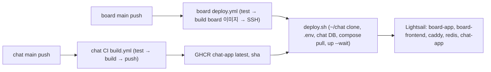

# 4일차 따라하기 — chat-app 이미지 CI와 board 스택 통합 배포

> 전제: 1~3일차가 끝나 chat 서버가 `main`에 있고(테스트 87개), board 프론트에 채팅 UI가 통합돼 로컬 E2E가 통과했다. board `docker-compose.yml`에는 이미 `include`로 chat을 끌어오는 설정과 nginx `/api/v1/chat/`·`/ws` 프록시가 있다(board `feature/chat-ui`). 이 문서의 절 순서 = 실제 작업 순서다. 3~5절은 chat 저장소(이 저장소, 2026-09-20 완료), 6~7절은 board 저장소와 서버(사용자 작업).

chat은 서버에서 **이미지 하나**로 존재한다. chat 저장소의 CI가 이미지를 GHCR에 올리고, board의 기존 배포 파이프라인이 `include`로 chat compose를 끌어와 함께 pull·기동한다. 계획은 `docs/plans/2026-09-20-day4-deploy.md`, 서버 검증 명령은 `docs/deploy/server_checklist.md`.

---

## 1. 핵심 요약

| 항목 | 내용 |
|---|---|
| 만드는 것 | chat CI(`build.yml`: test → 이미지 push), board 배포 반영(compose·deploy.sh·Secret), 서버 검증 |
| 배포 단위 | `ghcr.io/icesnake72/chat-app:latest` (+ 커밋 sha 태그) |
| 누가 기동하나 | board `deploy.sh`가 `~/chat` clone → `~/chat/.env` 생성 → `docker compose pull && up --wait` (include된 chat-app 포함) |
| 트래픽 | `caddy → board-frontend nginx → chat-app:8092` (`/api/v1/chat/`, `/ws`) |
| 결정한 것 | chat 저장소·GHCR 패키지 **public** (board 배포 토큰이 chat 자원에 접근할 필요가 없어짐) |
| `JWT_SECRET` | **기존 yaml 기본값 유지**로 결정(2026-09-20). Secret에 같은 값을 등록해 board·chat이 함께 읽는다. 주의: board 저장소가 public이라 이 값은 공개돼 있다 — 강의용으로 감수. 교체 절차는 9절 |

**배포 흐름**



**작업 순서 (= 이 문서의 절 순서)**

| 절 | 어디서 | 내용 | 그 시점에 가능해지는 것 |
|---|---|---|---|
| 3 | chat | 저장소 public 전환 | 서버가 인증 없이 clone·pull |
| 4 | chat | `.github/workflows/build.yml` | main push마다 이미지가 GHCR에 |
| 5 | chat | `docs/deploy/server_checklist.md`, 설계·README 갱신 | 검증 절차 확정 |
| 6 | board | compose·override·deploy.sh·deploy.yml·Secret | 서버가 chat을 함께 기동 |
| 7 | 서버 | 체크리스트 실행 | `https://sbs.alldayai.org`에서 채팅 |

**출처 범례**

| 출처 | 뜻 |
|---|---|
| GitHub Actions | 워크플로 문법, 공식 액션(`actions/*`, `docker/*`) |
| GHCR | GitHub Container Registry, `GITHUB_TOKEN` 권한 |
| Docker / Compose | `include`, `env_file`, `depends_on`, `pull` |
| board 저장소 | 이미 있는 board 파일(읽기 전용 참조) |
| 1~3일차 | 이 저장소에서 앞서 만든 것 |
| 이 절 | 지금 만드는 것 |

---

## 2. 시작 전 — 지금 상태

**chat 저장소**: `main`에 서버 코드·`Dockerfile`·`docker-compose.yml`(서비스명 `chat-app`, 이미지 `ghcr.io/icesnake72/chat-app:latest`, external 네트워크 `board-db-net`)·`docker-compose.local.yml`(127.0.0.1:8092)·`scripts/dev_up.sh`·`smoke_test.sh`. CI는 아직 없다.

**board 저장소** (`feature/chat-ui`, 다른 세션에서 작업됨 — 읽기만)

| 파일 | 상태 |
|---|---|
| `docker-compose.yml` | `include: [../chat/docker-compose.yml, ../chat/docker-compose.local.yml]` + `env_file: ../chat/.env`. `chat-app` 서비스에 `DB_NAME: chat`, `APP_WS_ALLOWED_ORIGINS: http://localhost,http://localhost:*` 오버라이드 |
| `frontend/nginx.conf` | `set $chat_backend chat-app:8092;`, `location /api/v1/chat/`, `location /ws`(Upgrade 헤더) |
| `frontend/vite.config.js` | `/api/v1/chat` → `:8092`, `/ws` → `ws://localhost:8092` |
| `scripts/deploy.sh`, `.github/workflows/deploy.yml` | chat 관련 내용 **없음** — 6절에서 추가 |

**서버**: `~/board`만 있다. `~/chat`은 없고, `chat` DB도 없다. board는 `JWT_SECRET`을 yaml 기본값으로 쓰고 있다(Secret 없음).

---

## 3. chat 저장소 public 전환

**왜 지금**: board `deploy.sh`는 board 저장소의 `GITHUB_TOKEN`으로 GHCR에 로그인하고 서버에서 `git clone`을 한다. 그 토큰은 chat 저장소·패키지에 권한이 없다. private로 두려면 패키지 접근 권한 부여나 별도 PAT가 필요한데, 강의 코드라 public이 단순하다.

```bash
gh repo edit icesnake72/chat --visibility public --accept-visibility-change-consequences
gh repo view icesnake72/chat --json visibility -q .visibility     # PUBLIC
```

| 항목 | 출처 | 역할 |
|---|---|---|
| `gh repo edit --visibility` | GitHub CLI | 저장소 가시성 변경 |
| 패키지 가시성 | GHCR | 워크플로의 `GITHUB_TOKEN`으로 처음 push된 컨테이너 패키지는 저장소와 연결되고, public 저장소면 **public**으로 생성된다(4절 끝에서 익명 pull로 확인) |

---

## 4. chat CI — `.github/workflows/build.yml`

**왜 지금**: board 배포가 `docker compose pull`로 chat 이미지를 받으려면 이미지가 먼저 GHCR에 있어야 한다. 6절(board 반영)보다 반드시 먼저 main에 들어가야 한다.

```yaml
# chat-app 이미지 빌드·push. 배포는 board 저장소의 deploy.yml이 한다 (이 이미지를 pull).
#   - main push: test → build → ghcr.io/icesnake72/chat-app:latest (+ sha 태그)
#   - PR: test 만
# 인증: 내장 GITHUB_TOKEN (permissions.packages: write). 별도 Secret 불필요.
name: Build chat-app

on:
  push:
    branches: ["main"]
    paths-ignore:
      - "docs/**"
      - "**/*.md"
  pull_request:
    branches: ["main"]
  workflow_dispatch:

permissions:
  contents: read
  packages: write

concurrency:
  group: build-chat-app-${{ github.ref }}
  cancel-in-progress: true

jobs:
  test:
    runs-on: ubuntu-latest
    steps:
      - uses: actions/checkout@v5
      - uses: actions/setup-java@v5
        with:
          distribution: temurin
          java-version: "21"
          cache: gradle
      - name: 테스트 (H2 + InMemory denylist, Redis 불필요)
        run: chmod +x ./gradlew && ./gradlew --no-daemon test

  build:
    needs: test
    if: github.event_name != 'pull_request'
    runs-on: ubuntu-latest
    steps:
      - uses: actions/checkout@v5
      - uses: docker/setup-buildx-action@v3
      - uses: docker/login-action@v3
        with:
          registry: ghcr.io
          username: ${{ github.actor }}
          password: ${{ secrets.GITHUB_TOKEN }}
      - uses: docker/build-push-action@v6
        with:
          context: .
          push: true
          tags: |
            ghcr.io/icesnake72/chat-app:latest
            ghcr.io/icesnake72/chat-app:${{ github.sha }}
          cache-from: type=gha,scope=chat-app
          cache-to: type=gha,mode=max,scope=chat-app
```

| 항목 | 출처 | 역할 |
|---|---|---|
| `on.push.paths-ignore` | GitHub Actions | 문서만 바뀐 커밋은 이미지를 다시 만들지 않는다. 바뀐 파일이 **전부** 패턴에 걸릴 때만 건너뛴다 |
| `on.pull_request` + `build.if: github.event_name != 'pull_request'` | GitHub Actions | PR에서는 test만 돌고 build는 skip. merge 후 main push에서 build |
| `permissions.packages: write` | GHCR | `GITHUB_TOKEN`으로 push하려면 필요. `contents: read`는 checkout용 |
| `concurrency` | GitHub Actions | 같은 브랜치의 이전 실행을 취소 (연속 push 시 낭비 방지) |
| `actions/setup-java@v5` `cache: gradle` | GitHub Actions | Gradle 캐시 복원 |
| `./gradlew --no-daemon test` | 1일차 | H2 + `InMemoryTokenDenylist` + `management.health.redis.enabled: false`라 러너에 Redis·MySQL이 없어도 통과 |
| `docker/setup-buildx-action@v3` | Docker | Buildx(멀티스테이지·캐시 export) |
| `docker/login-action@v3` | GHCR | `github.actor` + `GITHUB_TOKEN` 로그인 |
| `docker/build-push-action@v6` | Docker | 1일차 `Dockerfile`로 빌드, `latest`와 커밋 sha 두 태그로 push |
| `cache-from/to: type=gha` | GitHub Actions | 레이어 캐시를 Actions 캐시에 보관. `scope`로 다른 워크플로와 분리 |
| `Dockerfile`, `.dockerignore` | 1일차 | 그대로 사용(`-x test`로 이미지 안에서는 테스트를 건너뛴다 — 테스트는 이 워크플로의 test 잡이 한다) |

**적용과 확인** (실제로 한 순서)

```bash
git checkout -b feature/day4-ci
# build.yml 작성 후
git add .github/workflows/build.yml && git commit -m "ci: chat-app 이미지 빌드·push 워크플로"
git push -u origin feature/day4-ci
gh pr create --base main --head feature/day4-ci --title "ci: chat-app 이미지 빌드·push 워크플로"
gh run list --branch feature/day4-ci --workflow build.yml --limit 1        # PR run: test success, build skipped
gh pr merge <번호> --merge --delete-branch && git checkout main && git pull
gh run list --branch main --workflow build.yml --limit 1                   # main run: test success, build success
gh run watch <run id> --exit-status
```

이미지가 실제로 공개 pull 가능한지는 로그인 없이 확인한다(패키지가 private이면 401).

```bash
TOK=$(curl -s "https://ghcr.io/token?scope=repository:icesnake72/chat-app:pull" | python3 -c 'import json,sys;print(json.load(sys.stdin)["token"])')
curl -s -H "Authorization: Bearer $TOK" https://ghcr.io/v2/icesnake72/chat-app/tags/list
# {"name":"icesnake72/chat-app","tags":["latest","<sha>"]}
```

실측: PR run `test: success, build: skipped`, main run `test: success, build: success`, 태그 `latest`와 `069a30d…` 확인(2026-09-20).

---

## 5. 서버 체크리스트와 문서 갱신

**왜 지금**: 6절(board 반영)은 사용자가 board 저장소에서 하므로, 그 결과를 확인할 명령을 먼저 문서로 고정해 둔다.

- `docs/deploy/server_checklist.md`: Compose 버전 → `~/chat`·`.env` → `chat` DB → 컨테이너 → 내부 헬스 → 라우팅 401/101/403 → 인증 정합(`/me` 200) → E2E, 증상별 원인 표, 롤백. 7절에서 그대로 쓴다.
- 설계 문서 9절: 별도 서브도메인·chat-frontend·caddy 블록을 삭제하고 include 방식과 CI로 정정.
- README "배포" 절.

```bash
git add docs README.md && git commit -m "docs: 서버 체크리스트 + 배포 문서 갱신"
```

(실제로는 4절의 PR #4에 함께 넣어 merge했다.)

---

## 6. board 저장소 반영 (사용자 작업)

**왜 지금**: 이미지가 GHCR에 있으니 board 배포가 그것을 pull하게 만든다. 로컬에서 이미 되는 `include`를 서버에서도 그대로 쓰되, 서버에는 `../chat`이 없으므로 `deploy.sh`가 만들어 준다.

### 6.1 `docker-compose.yml` — local.yml 제외, 운영 Origin, 기동 순서

현재(로컬용) `include`에서 `docker-compose.local.yml`을 빼고, `chat-app` 오버라이드에 운영 도메인과 `depends_on`을 넣는다.

```yaml
include:
  - path:
      - ../chat/docker-compose.yml
    env_file: ../chat/.env

services:
  chat-app:
    depends_on:
      redis:
        condition: service_healthy   # denylist 조회가 fail-closed라 Redis 먼저
    environment:
      DB_NAME: chat
      # 브라우저는 80/443 포트를 Origin에서 생략한다. 로컬(caddy http://localhost)과 운영 도메인 둘 다.
      APP_WS_ALLOWED_ORIGINS: https://sbs.alldayai.org,http://localhost,http://localhost:*
```

| 항목 | 출처 | 역할 |
|---|---|---|
| `include.path` 한 개 | Compose | 서버에서 8092 포트를 열지 않는다(로컬 포트는 6.2로) |
| `include.env_file: ../chat/.env` | Compose | chat compose의 `${DB_NAME:-chat}` 치환을 chat `.env`로 고정. board `.env`(`DB_NAME=board`)가 오염하지 않게 |
| `services.chat-app` (오버라이드) | Compose | include된 서비스에 같은 이름으로 쓰면 병합된다(`app`처럼 이름이 겹치면 chat 정의가 사라지는 함정 — chat 서비스명이 `chat-app`인 이유) |
| `depends_on: redis: service_healthy` | Compose | board의 `redis`를 참조. 병합 후 같은 프로젝트라 가능 |
| `APP_WS_ALLOWED_ORIGINS` | 3일차 준비 | chat 기본값(`http://localhost,http://localhost:*`)에 운영 도메인을 더한 값 |

### 6.2 `docker-compose.override.yml` — 로컬 전용 포트

```yaml
services:
  chat-app:
    ports:
      - "127.0.0.1:8092:8092"
```

`.gitignore`에 `docker-compose.override.yml` 추가. Compose가 자동으로 합치므로 로컬은 그대로 `docker compose up`, 서버(git clone)에는 이 파일이 없어 포트가 열리지 않는다.

### 6.3 `scripts/deploy.sh` — `~/chat` 준비, `.env`, DB

board `.env` 생성 블록에 `JWT_SECRET=${JWT_SECRET}` 한 줄을 추가하고(board-app도 Secret 값을 쓰게), 그 블록 다음에:

```bash
echo "▶ chat 스택 준비 (compose include 대상)"
[ -d ~/chat/.git ] || git clone https://github.com/icesnake72/chat.git ~/chat
git -C ~/chat fetch --all && git -C ~/chat reset --hard origin/main
cat > ~/chat/.env <<EOF
JWT_SECRET=${JWT_SECRET}
DB_NAME=chat
DB_USERNAME=${DB_USERNAME}
DB_PASSWORD=${DB_PASSWORD}
EOF
```

DB 준비 블록의 `mysqladmin ping` 대기 뒤에:

```bash
docker exec mysql-8 mysql -uroot -p"${DB_PASSWORD}" \
  -e "CREATE DATABASE IF NOT EXISTS chat CHARACTER SET utf8mb4 COLLATE utf8mb4_unicode_ci;"
```

| 항목 | 출처 | 역할 |
|---|---|---|
| `git clone`/`reset --hard origin/main` | board 저장소 패턴 | board 자신을 준비하는 방식과 동일. public이라 인증 불필요 |
| `~/chat/.env` | 1일차 `.env.example` | chat compose의 `env_file`. `DB_HOST`·`REDIS_HOST`는 compose가 고정하므로 넣지 않는다 |
| `CREATE DATABASE IF NOT EXISTS chat` | 1일차 `scripts/init_db.sh`와 동일 | Hibernate `ddl-auto: update`는 DB 자체를 만들지 못한다 |
| `docker compose pull` / `up -d --no-build --wait --remove-orphans` | board `deploy.sh` 기존 줄 | 수정 없음. include된 chat-app도 함께 pull·기동·헬스 대기 |

### 6.4 `.github/workflows/deploy.yml` — Secret 전달

deploy 잡의 `env:`에 `JWT_SECRET: ${{ secrets.JWT_SECRET }}`, `with.envs:` 목록에 `JWT_SECRET` 추가.

### 6.5 GitHub Secrets (board 저장소)

| Secret | 값 | 비고 |
|---|---|---|
| `JWT_SECRET` | board `application.yaml`의 `jwt.secret` 기본값과 **같은 값** (결정됨) | 기존 refresh 세션이 유지된다. board `.env`에도 주입해 두면 나중에 값을 바꿀 때 yaml을 건드리지 않고 Secret만 바꾸면 된다 |

### 6.6 nginx — 변경 없음

`frontend/nginx.conf`의 `/api/v1/chat/`·`/ws` 규칙은 로컬과 운영 공용이다. heartbeat가 10초라 `proxy_read_timeout` 기본값(60초)으로도 유휴 끊김이 없지만, `/ws`에 `3600s`가 있으면 그대로 둔다.

```bash
# board 저장소에서
git add docker-compose.yml .gitignore scripts/deploy.sh .github/workflows/deploy.yml
git commit -m "feat: chat-app 통합 배포 — include 유지, ~/chat 준비, chat DB, JWT_SECRET Secret"
git push        # main push → deploy.yml 실행
```

---

## 7. 서버 검증

`docs/deploy/server_checklist.md`의 순서대로. 핵심만 옮기면:

```bash
docker compose version                                   # v2.20+ (include)
cd ~/board && docker compose ps                          # chat-app healthy, 0.0.0.0 포트 없음
docker exec chat-app curl -s http://localhost:8092/actuator/health   # UP
curl -s -o /dev/null -w "%{http_code}\n" https://sbs.alldayai.org/api/v1/chat/rooms   # 401
# WebSocket 101 / 외부 Origin 403 은 체크리스트 6번 명령
TOKEN=$(curl -s -X POST https://sbs.alldayai.org/api/v1/auth/login -H 'Content-Type: application/json' \
  -d '{"username":"admin","password":"admin1234"}' | python3 -c 'import json,sys;print(json.load(sys.stdin)["accessToken"])')
curl -s https://sbs.alldayai.org/api/v1/chat/me -H "Authorization: Bearer $TOKEN"     # 200, 관리자
```

마지막으로 브라우저 두 개(서로 다른 계정)로 방 생성 → 입장 → 대화 → 한쪽 로그아웃 후 전송 시 로그인 화면. 이것이 통과하면 4일차 끝이다.

---

## 8. 함정

| 증상 | 원인 | 해결 |
|---|---|---|
| main push했는데 워크플로가 안 돎 | 바뀐 파일이 전부 `docs/**`·`*.md` | 의도된 skip. 코드가 바뀐 push에서만 이미지 생성. 강제로 만들려면 Actions 탭 `Run workflow`(`workflow_dispatch`) |
| PR run에 build 잡이 skipped | `if: github.event_name != 'pull_request'` | 정상. merge 후 main run에서 build |
| 서버 `docker compose pull`이 chat-app에서 denied | 패키지가 private | 저장소 public이면 첫 push부터 public(4절 익명 pull로 확인). private로 만들었다면 패키지 설정에서 변경 |
| 서버에서 `include` 오류 | Compose v2.20 미만 | 플러그인 업데이트, 또는 chat 서비스 블록을 board compose에 직접 복사(`frontend_integration_scope.md` 4절) |
| chat-app 로그 `Could not resolve placeholder 'JWT_SECRET'` | `~/chat/.env` 없음 | 6.3 블록, Secret 등록 여부 |
| chat이 board DB에 붙음 | board `.env`의 `DB_NAME=board`가 chat 변수 치환을 오염 | `include.env_file: ../chat/.env` + `DB_NAME: chat` 리터럴 (6.1) |
| `/ws` 403 | 운영 Origin 누락 | `APP_WS_ALLOWED_ORIGINS`에 `https://sbs.alldayai.org` |
| `/me` 401인데 방금 로그인한 토큰 | `JWT_SECRET` 불일치 | board `.env`와 `~/chat/.env` 비교. board-app이 yaml 기본값을 쓰고 있으면 board `.env`에도 주입 |
| 인증 API 500 | Redis 연결 실패(fail-closed) | `depends_on: redis healthy`, `docker compose ps` |
| 배포 후 첫 요청이 느림 | 이미지 pull + JVM 기동 | `--wait`가 healthy까지 기다린 뒤 끝나므로 정상 |

---

## 9. 다음과 실무 기준

**끝난 것**: 인증 연동(1일차) → 방·메시지·presence(2일차) → board 프론트 통합(3일차) → 이미지 CI와 통합 배포(4일차). chat 저장소의 남은 작업은 없고, board 쪽 6절 반영과 7절 검증이 사용자 몫이다.

| 상황 | 선택 |
|---|---|
| 특정 버전으로 고정 배포 | `latest` 대신 sha 태그를 `~/chat/docker-compose.yml`의 `image:`에 지정. 롤백도 같은 방법 |
| 이미지 서명·취약점 검사 | CI에 `docker/scout-action` 또는 Trivy 단계 추가 |
| Secret 교체 | 현재 값은 public 저장소의 yaml 기본값이라 공개돼 있다. 교체 시: 새 Base64 값(32바이트 이상)을 Secret에 넣고 board·chat 동시 재배포 → 기존 access(1시간)·refresh(Redis `rt:*`)가 전부 무효 → 사용자 재로그인 공지. board yaml 기본값은 그대로 두어도 `.env`가 우선한다 |
| 무중단 | 현재는 `up`이 컨테이너를 교체하는 수 초간 WebSocket이 끊긴다. 클라이언트 재연결(3일차 UI)이 흡수한다. 진짜 무중단은 인스턴스 2대 + Redis 백플레인(설계 11절) |
| 서버 빌드 금지 유지 | `--no-build`가 안전핀. 2GB 무스왑 인스턴스에서 Gradle을 돌리지 않는다 |
