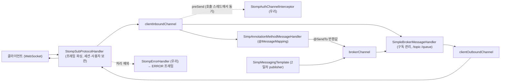
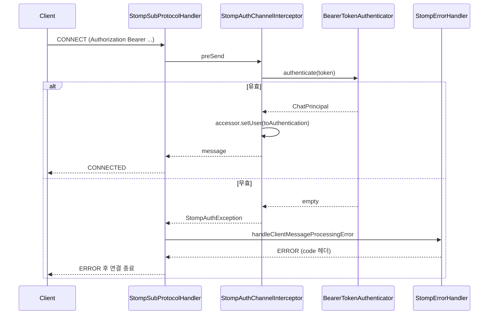

# STOMP 개념과 1일차 STOMP 구현에 쓰인 클래스·메서드

> 기준: chat 저장소 `main`(2026-09-19). 1일차(`day1_auth_stomp_walkthrough.md` 11~13절)에서 STOMP CONNECT 인증과 echo를 만들 때 등장한 것들을 "프로토콜 → Spring이 제공하는 부품 → 우리가 만든 부품" 순으로 설명한다. 2일차에서 추가된 부품은 마지막 절에 짧게만 잇는다.

WebSocket은 양방향으로 바이트를 주고받는 **통로**일 뿐, 그 안의 데이터가 무슨 뜻인지는 정하지 않는다. STOMP는 그 통로 위에서 "누가 어디로 무엇을 보내는가"를 정한 **텍스트 메시징 규약**이다. Spring은 STOMP 프레임을 해석해 컨트롤러 호출과 구독 배달을 대신해 준다.

---

## 1. 핵심 요약

| 질문 | 답 |
|---|---|
| STOMP가 뭔가 | Simple Text Oriented Messaging Protocol. HTTP처럼 "명령 줄 + 헤더 + 빈 줄 + 본문" 텍스트 프레임을 WebSocket 위로 주고받는다 |
| 왜 WebSocket만 쓰지 않나 | WebSocket에는 "구독", "목적지", "인증 헤더", "에러 응답" 개념이 없다. 직접 만들면 프로토콜을 발명하는 일이 된다 |
| 핵심 프레임 | 클라이언트 → 서버: `CONNECT`, `SUBSCRIBE`, `SEND`, `UNSUBSCRIBE`, `DISCONNECT`. 서버 → 클라이언트: `CONNECTED`, `MESSAGE`, `ERROR`, `RECEIPT` |
| Spring이 해 주는 것 | 프레임 파싱, `destination` 기준 라우팅(`/app/**` → 컨트롤러, `/topic/**` → 브로커), 구독 관리, 세션별 사용자 보관, ERROR 프레임 생성 |
| 우리가 만든 것 | CONNECT에서 JWT 검증(`StompAuthChannelInterceptor`), 거부 사유를 `code` 헤더로(`StompErrorHandler`), 엔드포인트·브로커 설정(`WebSocketConfig`), 검증용 echo |
| 인증 위치 | HTTP 핸드셰이크가 아니라 **CONNECT 프레임 헤더**. 브라우저 WebSocket API는 핸드셰이크에 `Authorization` 헤더를 붙일 수 없다 |

---

## 2. WebSocket과 STOMP의 관계

| 계층 | 담당 | 이 프로젝트에서 |
|---|---|---|
| HTTP 핸드셰이크 | `GET /ws` + `Upgrade: websocket` → `101 Switching Protocols` | `SecurityConfig`가 `/ws/**`를 permitAll. Origin 검사는 `WebSocketConfig.setAllowedOriginPatterns` |
| WebSocket | 텍스트/바이너리 메시지 양방향 전송, 연결 유지 | Tomcat 내장 WebSocket (`spring-boot-starter-websocket`) |
| STOMP | 프레임 형식, `destination`, 구독 id, 헤더, 에러 | Spring `spring-messaging` + `spring-websocket` |
| 애플리케이션 | `/app/echo`를 받아 `/topic/echo`로 응답 | `EchoController`(1일차) → `ChatMessageController`(2일차) |

한 WebSocket 연결 = 한 STOMP 세션이다. 세션 안에서 구독을 여러 개 열 수 있고, 각 구독은 `id` 헤더로 구분된다.

---

## 3. STOMP 프레임 형식과 종류

프레임은 `명령` 한 줄, `이름:값` 헤더 줄들, 빈 줄, 본문, 마지막에 NUL 문자(`\0`)다. HTTP와 거의 같지만 상태 줄 대신 명령 한 단어가 온다.

```text
SEND
destination:/app/echo
content-type:application/json

{"content":"hello"}
^@
```

**클라이언트 → 서버**

| 프레임 | 필수 헤더 | 뜻 | 서버 응답 |
|---|---|---|---|
| `CONNECT` | `accept-version` (+ 우리는 `Authorization`) | 세션 시작 | `CONNECTED` 또는 `ERROR` |
| `SUBSCRIBE` | `id`, `destination` | 이 destination의 메시지를 받겠다 | 없음 (이후 `MESSAGE`들) |
| `SEND` | `destination` | 서버(`/app`) 또는 브로커(`/topic`)로 메시지 | 없음 (컨트롤러가 결정) |
| `UNSUBSCRIBE` | `id` | 구독 해제. destination이 아니라 **id**로 지정 | 없음 |
| `DISCONNECT` | (선택 `receipt`) | 세션 종료 | (선택 `RECEIPT`) |

**서버 → 클라이언트**

| 프레임 | 주요 헤더 | 뜻 |
|---|---|---|
| `CONNECTED` | `version`, `heart-beat`, `user-name` | 세션 수립 |
| `MESSAGE` | `destination`, `subscription`, `message-id`, `content-type` | 구독한 destination에 온 메시지 |
| `ERROR` | `message` (+ 우리는 `code`) | 오류. STOMP 규약상 ERROR 뒤에는 연결이 닫힌다 |
| `RECEIPT` | `receipt-id` | 요청 처리 확인 (receipt 헤더를 붙였을 때만) |

**heartbeat**: `CONNECT`와 `CONNECTED`의 `heart-beat:cx,cy` 헤더로 양쪽이 "몇 ms마다 살아 있음을 보내겠다"를 협상한다. 값이 `0,0`이면 없음. 1·2일차 서버는 `0,0`이었고, 3일차 준비(`feature/day3-server-prep`)에서 `WebSocketConfig`에 `ThreadPoolTaskScheduler`를 붙여 `10000,10000`으로 켰다.

**destination 규칙** (`WebSocketConfig`에서 정한 것)

| prefix | 방향 | 처리자 |
|---|---|---|
| `/app/**` | 클라이언트 → 서버 | `@MessageMapping` 컨트롤러 (`/app`을 뗀 나머지로 매칭) |
| `/topic/**`, `/queue/**` | 서버 → 클라이언트 | simple broker가 구독자에게 배달 |
| `/user/**` | 서버 → 특정 사용자 | `UserDestinationMessageHandler`가 `/user/{name}/queue/x`로 변환 (2일차 `@SendToUser`) |

---

## 4. Spring의 STOMP 처리 구조



| 부품 | 출처 | 역할 |
|---|---|---|
| `StompSubProtocolHandler` | Spring WebSocket | WebSocket 텍스트를 STOMP 프레임으로 파싱해 `Message`로 바꾸고, CONNECT 처리 후 `accessor.setUser`로 심긴 사용자를 세션에 보관해 이후 프레임에 붙인다. 처리 중 예외가 나면 `StompSubProtocolErrorHandler`에 넘긴다 |
| `clientInboundChannel` | Spring Framework | 클라이언트 프레임이 지나는 채널. 실행기(스레드 풀) 기반이라 프레임 처리는 비동기지만, 등록된 `ChannelInterceptor.preSend`는 **채널에 넣기 전, 호출 스레드에서 동기로** 실행된다 |
| `SimpAnnotationMethodMessageHandler` | Spring Framework | `/app/**`를 `@MessageMapping` 메서드로 라우팅, `@Payload` JSON 변환, `Principal` 인자 주입, `@SendTo` 반환값 발행 |
| `SimpleBrokerMessageHandler` | Spring Framework | `enableSimpleBroker`가 만드는 메모리 브로커. SUBSCRIBE를 기억하고 `/topic/**` 메시지를 구독자 세션에 복사한다 |
| `brokerChannel`, `clientOutboundChannel` | Spring Framework | 서버 내부 → 브로커, 브로커 → 클라이언트 채널 |
| `SimpMessagingTemplate` | Spring Framework | 서버 코드에서 brokerChannel로 보내는 API. 1일차엔 안 썼고 2일차 `ChatMessagePublisher`가 쓴다 |

> 중요: 인터셉터 `preSend`가 예외를 던지면 프레임은 채널에 들어가지 않고, `StompSubProtocolHandler`가 그 예외를 에러 핸들러로 넘겨 ERROR 프레임을 만든 뒤 세션을 닫는다. "인증 실패 = 연결 종료"가 이 경로다.

---

## 5. 1일차에서 쓴 Spring 클래스·메서드

### 5.1 설정 — `WebSocketConfig`에서

| 클래스 / 메서드 | 패키지 | 쓰임 |
|---|---|---|
| `@EnableWebSocketMessageBroker` | `org.springframework.web.socket.config.annotation` | STOMP over WebSocket 전체 활성화. 채널·핸들러·`SimpMessagingTemplate` 빈을 만든다 |
| `WebSocketMessageBrokerConfigurer` | 같은 패키지 | 설정 훅 인터페이스. 아래 세 메서드를 오버라이드 |
| `registerStompEndpoints(StompEndpointRegistry)` | | 핸드셰이크 URL 등록 |
| `StompEndpointRegistry.addEndpoint("/ws")` | | 엔드포인트 추가. `.withSockJS()`를 붙이지 않았으므로 네이티브 WebSocket만 |
| `.setAllowedOriginPatterns(String...)` | | 핸드셰이크 `Origin` 허용 패턴. yaml `app.ws.allowed-origin-patterns` |
| `StompEndpointRegistry.setErrorHandler(StompSubProtocolErrorHandler)` | | 프레임 처리 예외 → ERROR 프레임 변환기 등록 (우리 `StompErrorHandler`) |
| `configureMessageBroker(MessageBrokerRegistry)` | | 브로커·prefix 설정 |
| `MessageBrokerRegistry.enableSimpleBroker("/topic", "/queue")` | | 메모리 브로커가 담당할 prefix |
| `.setApplicationDestinationPrefixes("/app")` | | 이 prefix로 오는 SEND는 컨트롤러로 |
| `.setUserDestinationPrefix("/user")` | | 개인 목적지 prefix (2일차에 실제 사용) |
| `configureClientInboundChannel(ChannelRegistration)` | | 인바운드 채널 인터셉터 등록 |
| `ChannelRegistration.interceptors(ChannelInterceptor...)` | `org.springframework.messaging.simp.config` | 우리 인터셉터를 끼운다 |

### 5.2 인터셉터 — `StompAuthChannelInterceptor`에서

| 클래스 / 메서드 | 패키지 | 쓰임 |
|---|---|---|
| `ChannelInterceptor` | `org.springframework.messaging.support` | 채널 훅 인터페이스. `preSend`만 구현 |
| `preSend(Message<?> message, MessageChannel channel)` | | 프레임이 채널에 들어가기 직전. 반환한 메시지가 들어가고, 예외를 던지면 거부 |
| `MessageHeaderAccessor.getAccessor(message, StompHeaderAccessor.class)` | `org.springframework.messaging.support` | 메시지 헤더를 STOMP 관점으로 읽는 accessor. 헤더가 mutable이면 원본 accessor를 그대로 돌려줘 `setUser`가 반영된다 |
| `StompHeaderAccessor` | `org.springframework.messaging.simp.stomp` | STOMP 헤더 뷰 |
| `.getCommand()` → `StompCommand` | | `CONNECT`, `SEND`, `SUBSCRIBE`, `DISCONNECT` 등 enum. heartbeat 프레임은 null |
| `.getFirstNativeHeader("Authorization")` | | 클라이언트가 프레임에 넣은 헤더 값 (네이티브 헤더 = STOMP 프레임의 원 헤더) |
| `.setUser(Principal)` | | 이 세션의 사용자. CONNECT에서 한 번 심으면 `StompSubProtocolHandler`가 세션에 저장한다 |
| `.getUser()` | | 이후 프레임에서 세션 사용자를 돌려준다. 우리는 `ChatPrincipal.from`으로 풀어낸다 |
| `StompCommand` | 같은 패키지 | 프레임 명령 enum. `switch`에 사용 |
| `HttpHeaders.AUTHORIZATION` | `org.springframework.http` | `"Authorization"` 상수 재사용 |
| `MessagingException` | `org.springframework.messaging` | STOMP 처리 예외의 부모. `StompAuthException`이 상속해 `preSend`에서 던진다 |

### 5.3 에러 핸들러 — `StompErrorHandler`에서

| 클래스 / 메서드 | 패키지 | 쓰임 |
|---|---|---|
| `StompSubProtocolErrorHandler` | `org.springframework.web.socket.messaging` | 기본 ERROR 프레임 생성기. 우리는 상속해 `code` 헤더를 추가 |
| `handleClientMessageProcessingError(Message<byte[]> clientMessage, Throwable ex)` | | 클라이언트 프레임 처리 중 예외가 났을 때 호출. 반환한 메시지가 ERROR 프레임으로 전송된다 |
| `handleInternal(StompHeaderAccessor, byte[] payload, Throwable, StompHeaderAccessor clientAccessor)` | (protected) | 클라이언트 프레임의 `receipt` 헤더를 ERROR에 옮기는 등 마무리. 오버라이드한 메서드 끝에서 호출 |
| `StompHeaderAccessor.create(StompCommand.ERROR)` | | 새 ERROR 프레임 헤더 만들기 |
| `.setMessage(String)` | | ERROR의 `message` 헤더 |
| `.setNativeHeader("code", ...)` | | 우리가 추가한 `code` 헤더 (클라이언트가 분기) |
| `.setContentType(MimeTypeUtils.TEXT_PLAIN)` | | 본문 타입 |
| `.setLeaveMutable(true)` | | 헤더를 불변으로 굳히지 않고 넘김 (Spring이 이후 수정 가능) |
| `Throwable.getCause()` 순회 | JDK | 인터셉터 예외는 `MessageDeliveryException`으로 감싸여 오므로 cause 체인에서 `StompAuthException`을 찾는다 |

### 5.4 컨트롤러 — `EchoController`에서 (2일차에 `ChatMessageController`로 대체)

| 클래스 / 메서드 | 패키지 | 쓰임 |
|---|---|---|
| `@Controller` | `org.springframework.stereotype` | STOMP 핸들러는 HTTP 응답 본문이 없어 `@RestController`가 아니다 |
| `@MessageMapping("/echo")` | `org.springframework.messaging.handler.annotation` | `SEND /app/echo`와 매칭 (`/app`은 prefix로 떼어짐) |
| `@SendTo("/topic/echo")` | 같은 패키지 | 반환값을 이 destination 구독자 전원에게 |
| `java.security.Principal` 인자 | JDK | 세션 사용자(`accessor.setUser`로 심은 `Authentication`)가 주입된다. `getName()` = username |
| (암묵) `@Payload` | 같은 패키지 | 첫 번째 일반 인자(`EchoRequest`)는 본문 JSON → record 변환. 생략해도 기본 적용, 2일차엔 명시 |

### 5.5 테스트 — `StompAuthIntegrationTest`(1일차) / `RoomChatIntegrationTest`(2일차)에서

| 클래스 / 메서드 | 패키지 | 쓰임 |
|---|---|---|
| `WebSocketStompClient` | `org.springframework.web.socket.messaging` | 서버 쪽 라이브러리로 만든 STOMP 클라이언트. 테스트에서 진짜 서버에 접속 |
| `StandardWebSocketClient` | `org.springframework.web.socket.client.standard` | JSR-356(Tomcat) WebSocket 클라이언트 |
| `.setMessageConverter(MessageConverter)` | | 본문 변환기. `CompositeMessageConverter(StringMessageConverter, JacksonJsonMessageConverter)`로 text/plain(ERROR)과 JSON을 모두 받는다 |
| `.connectAsync(url, WebSocketHttpHeaders, StompHeaders, StompSessionHandler)` | | 핸드셰이크 헤더와 CONNECT 헤더를 따로 받는다. 우리는 CONNECT 헤더(`StompHeaders`)에 `Authorization` |
| `StompSession` | `org.springframework.messaging.simp.stomp` | 연결된 세션. `subscribe(destination, StompFrameHandler)`, `send(destination, payload)`, `disconnect()`, `isConnected()` |
| `StompSessionHandlerAdapter` | 같은 패키지 | 세션 콜백 기본 구현. `handleFrame`(ERROR 프레임이 여기로 온다), `afterConnected(session, connectedHeaders)`, `handleTransportError` |
| `StompFrameHandler` | 같은 패키지 | 구독 콜백. `getPayloadType(headers)`로 변환 타입, `handleFrame(headers, payload)`로 수신 |
| `StompHeaders` | 같은 패키지 | 프레임 헤더 맵. `getFirst("code")` |
| `JacksonJsonMessageConverter`, `StringMessageConverter`, `CompositeMessageConverter` | `org.springframework.messaging.converter` | Boot 4(Jackson 3)에서는 `MappingJackson2MessageConverter`가 아니라 `JacksonJsonMessageConverter` |
| `StompHeaderAccessor.create(command)` + `MessageBuilder.createMessage(payload, headers)` | | 단위 테스트에서 프레임을 손으로 조립 (`StompAuthChannelInterceptorTest`) |

---

## 6. 1일차에서 만든 우리 클래스

| 클래스 | 위치 | 메서드 | 하는 일 |
|---|---|---|---|
| `WebSocketConfig` | `global.config` | `registerStompEndpoints`, `configureMessageBroker`, `configureClientInboundChannel` | `/ws` 엔드포인트, prefix, 인터셉터·에러 핸들러 등록 |
| `StompAuthException` | `auth` | 생성자 `(ErrorCode)`, `getErrorCode()` | 인터셉터가 던지는 예외. `MessagingException` 상속 |
| `StompAuthChannelInterceptor` | `auth` | `preSend` | 명령별 분기 |
| | | `authenticateConnect(accessor)` | `Authorization` 헤더 → `BearerTokenAuthenticator.authenticate` → `accessor.setUser(principal.toAuthentication())`. 실패 시 `TOKEN_EXPIRED`/`LOGIN_REQUIRED` |
| | | `requireLivePrincipal(accessor)` | SEND/SUBSCRIBE마다 세션 사용자의 `expiresAt`·`jti`(denylist) 재검사 |
| `StompErrorHandler` | `global.config` | `handleClientMessageProcessingError`, `findErrorCode` | 예외 → `code` 헤더가 붙은 ERROR 프레임 |
| `ChatPrincipal` | `auth` | `toAuthentication()`, `from(Principal)` | Spring이 세션에 넣는 `Authentication` 봉투에 우리 사용자 정보를 넣고 꺼낸다 |
| `EchoController` | `message` (2일차에 삭제) | `echo(EchoRequest, Principal)` | `/app/echo` → `/topic/echo` |

**CONNECT 인증 흐름**



**echo 흐름 (1일차)**: `SEND /app/echo` → 인터셉터 `requireLivePrincipal` → `SimpAnnotationMethodMessageHandler` → `EchoController.echo` → `@SendTo("/topic/echo")` → brokerChannel → `SimpleBrokerMessageHandler` → `/topic/echo` 구독자 전원에게 `MESSAGE`.

---

## 7. 2일차에서 이어진 부품 (참고)

| 부품 | 출처 | 역할 | 문서 |
|---|---|---|---|
| `SimpMessagingTemplate.convertAndSend` | Spring Framework | 서비스 코드에서 브로커로 발행 (`ChatMessagePublisher`) | day2 10절 |
| `@DestinationVariable`, `@Payload` | Spring Framework | `/app/rooms/{roomId}/messages`의 변수, 본문 | day2 14절 |
| `@MessageExceptionHandler`, `@SendToUser("/queue/errors")` | Spring Framework | 컨트롤러 예외를 보낸 사람의 개인 큐로 | day2 14절 |
| `SessionSubscribeEvent`, `SessionUnsubscribeEvent`, `SessionDisconnectEvent` | Spring WebSocket | 프레임 처리 후 발행되는 이벤트 → presence | day2 15절 |
| `SubscriptionAuthorizer` | 우리 | SUBSCRIBE 인가(멤버십) | day2 16절 |

---

## 8. 자주 하는 질문

| 질문 | 답 |
|---|---|
| 핸드셰이크에서 인증하면 안 되나 | 브라우저 `WebSocket` API는 커스텀 헤더를 못 붙인다. 쿼리 문자열에 토큰을 넣으면 접근 로그에 남는다. 그래서 CONNECT 프레임 헤더가 표준적 위치다 |
| `preSend`에서 예외를 던지면 어떻게 되나 | 프레임이 채널에 안 들어가고, `StompSubProtocolHandler`가 예외를 `StompErrorHandler`로 넘겨 ERROR 프레임을 보낸 뒤 **연결을 닫는다**. STOMP 규약이 그렇다 |
| `accessor.setUser`가 왜 다음 프레임에서도 보이나 | CONNECT 처리 후 `StompSubProtocolHandler`가 세션 맵에 사용자를 저장하고, 이후 프레임의 헤더에 자동으로 붙인다 |
| SUBSCRIBE 직후 SEND한 메시지를 왜 못 받나 | 인바운드 채널이 비동기라 구독 등록이 끝나기 전에 SEND가 처리될 수 있다. 실제 클라이언트는 구독 콜백 이후에 보내고, 테스트는 잠깐 기다린다 |
| SockJS는 왜 안 쓰나 | 대상 브라우저가 전부 네이티브 WebSocket을 지원하고, nginx 설정이 단순해진다. 필요하면 `addEndpoint("/ws").withSockJS()` 한 줄 |
| simple broker의 한계는 | 서버 인스턴스 1대에서만 구독을 안다. 2대 이상이면 Redis pub/sub 백플레인이나 RabbitMQ STOMP relay(`enableStompBrokerRelay`)로 교체 |
| ERROR 프레임의 `code`는 표준인가 | 아니다. 표준 헤더는 `message`뿐이고 `code`는 우리가 정한 확장 헤더다. 클라이언트도 우리 것이라 합의하면 된다 |

---

## 9. 더 읽을 것

| 자료 | 내용 |
|---|---|
| STOMP 1.2 명세 (stomp.github.io/stomp-specification-1.2.html) | 프레임·헤더·heartbeat 규칙 원문 |
| Spring Framework Reference › WebSocket › STOMP | 채널 구조 그림, `@MessageMapping`, 사용자 목적지, 인터셉터·이벤트 |
| `docs/reference/board-analysis.md` 11.3절 | board `JwtAuthenticationFilter` 로직을 인터셉터로 옮기는 스케치 (이 프로젝트 설계의 출발점) |
| `docs/lecture/day1_auth_stomp_walkthrough.md` 11~13절 | 위 클래스들의 전체 코드와 테스트 |
